<div align="center">
  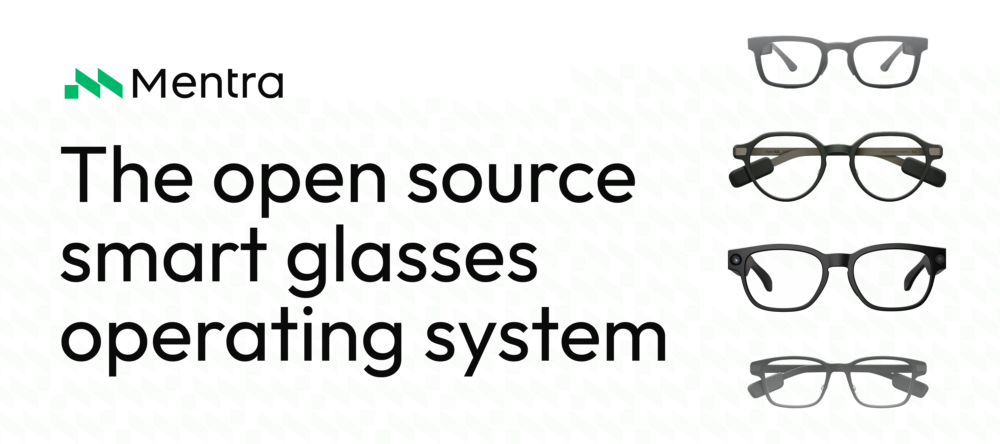

  <p>
    <a href="https://mentra.glass">Website</a> •
    <a href="https://docs.mentra.glass">Documentation</a> •
    <a href="https://console.mentra.glass">Developer Console</a> •
    <a href="https://apps.mentra.glass">Mentra MiniApp Store</a>
  </p>

  <p>
    
    
    
    
    
  </p>
</div>

<div align="center">
  <a href="https://apps.apple.com/us/app/mentra-the-smart-glasses-app/id6747363193">
    
  </a>
  <a href="https://play.google.com/store/apps/details?id=com.mentra.mentra">
    
  </a>
</div>

## Write Once, Run on Any Smart Glasses

MentraOS is how developers and businesses build smart glasses apps.

MentraOS handles pairing, connection, data streaming, hardware access, and cross-device compatibility, so you can focus on building amazing apps. Development goes from months to days.

Every component is open source under the MIT license, giving you privacy, freedom, and control.

## Supported Smart Glasses

MentraOS works across a growing ecosystem of smart glasses.

<div align="center">
  <table border="0" cellspacing="0" cellpadding="0" style="border: 0 !important; border-collapse: separate; border-spacing: 14px;">
    <tbody>
      <tr style="border: 0 !important; background: transparent;">
        <td align="left" width="20%" style="border: 1px solid #e5e7eb; border-radius: 14px; padding: 18px; background: #ffffff;">
          <sub><b>Supported</b></sub>
          <br /><br />
          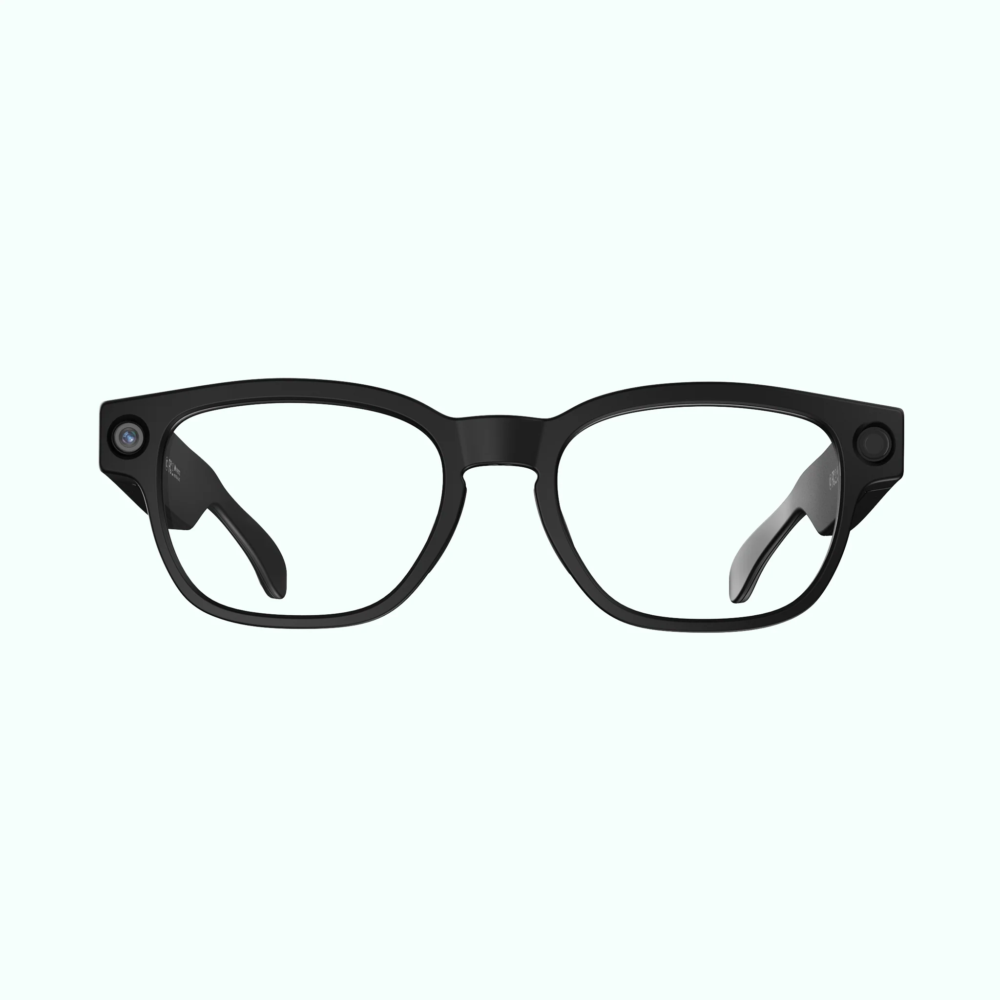
          <br /><br />
          <b>Mentra Live</b>
        </td>
        <td align="left" width="20%" style="border: 1px solid #bbf7d0; border-radius: 14px; padding: 18px; background: #ffffff;">
          <sub><b>Supported</b></sub>
          <br /><br />
          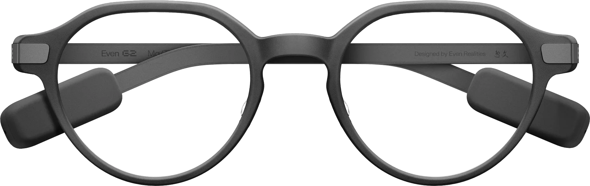
          <br /><br />
          <b>Even Realities G2</b>
        </td>
        <td align="left" width="20%" style="border: 1px solid #e5e7eb; border-radius: 14px; padding: 18px; background: #ffffff;">
          <sub><b>Supported</b></sub>
          <br /><br />
          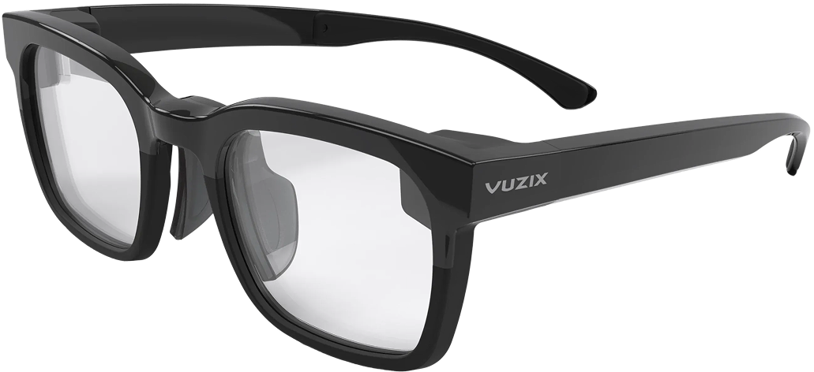
          <br /><br />
          <b>Vuzix Z100</b>
        </td>
        <td align="left" width="20%" style="border: 1px solid #e5e7eb; border-radius: 14px; padding: 18px; background: #ffffff;">
          <sub><b>Supported</b></sub>
          <br /><br />
          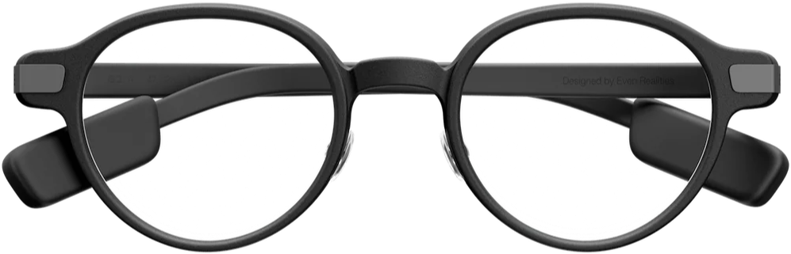
          <br /><br />
          <b>Even Realities G1</b>
        </td>
        <td align="left" width="20%" style="border: 1px solid #fed7aa; border-radius: 14px; padding: 18px; background: #ffffff;">
          <sub><b>Coming soon</b></sub>
          <br /><br />
          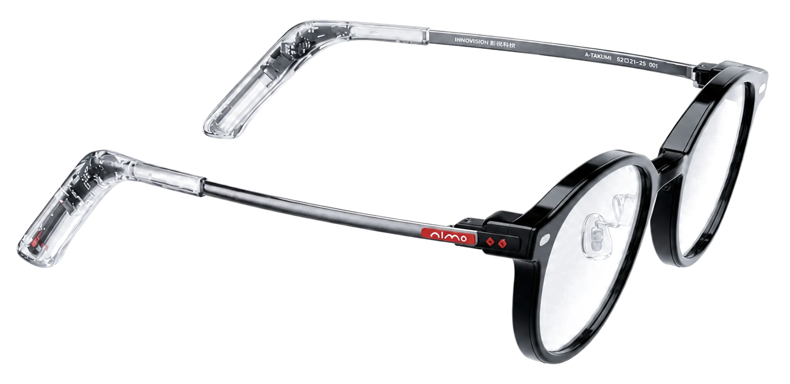
          <br /><br />
          <b>NIMO</b>
        </td>
      </tr>
    </tbody>
  </table>
</div>

## Why Build with MentraOS?

- **Cross-Compatibility:** Build one app that runs on supported smart glasses from multiple manufacturers.
- **Fast Development:** Go from months of custom smart glasses development to a working app in days.
- **Hardware Access:** Use displays, microphones, cameras, speakers, and everything else smart glasses expose from one API.
- **App Distribution:** Publish to the Mentra MiniApp Store and reach users across the MentraOS ecosystem.
- **Business Deployment:** Deploy smart glasses apps for field work, remote support, training, accessibility, and compliance-sensitive workflows. MentraOS is already being deployed by Fortune 500 companies.
- **Open Source Control:** Own it, host it, modify it, and extend it. MentraOS is MIT-licensed infrastructure designed for privacy, transparency, and freedom from hardware or cloud lock-in.

## Apps on the Mentra MiniApp Store

Browse, install, and run MiniApps from your phone. Try captions, AI notes, proactive AI, translation, streaming, and more.

<div align="center">
  <table border="0" cellspacing="0" cellpadding="0" style="border: 0 !important; border-collapse: collapse;">
    <tbody>
    <tr style="border: 0 !important; background: transparent;">
      <td align="center" style="border: 0 !important; padding: 15px; background: transparent;">
        <a href="https://apps.mentra.glass/package/com.augmentos.livecaptions" style="text-decoration: none; color: inherit;">
          
          <br /><b>Captions</b>
        </a>
      </td>
      <td align="center" style="border: 0 !important; padding: 15px; background: transparent;">
        <a href="https://apps.mentra.glass/package/com.mentra.link" style="text-decoration: none; color: inherit;">
          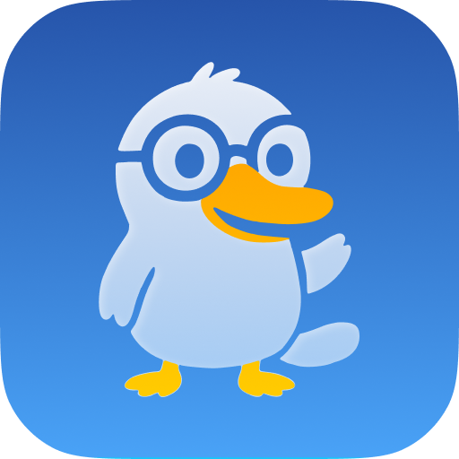
          <br /><b>Link</b>
        </a>
      </td>
      <td align="center" style="border: 0 !important; padding: 15px; background: transparent;">
        <a href="https://apps.mentra.glass/package/com.mentra.merge" style="text-decoration: none; color: inherit;">
          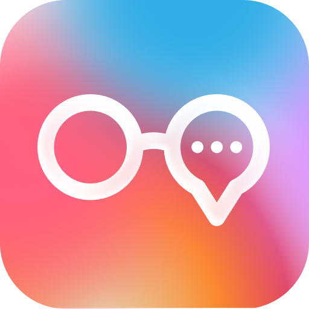
          <br /><b>Merge</b>
        </a>
      </td>
      <td align="center" style="border: 0 !important; padding: 15px; background: transparent;">
        <a href="https://apps.mentra.glass/package/com.mentra.notes" style="text-decoration: none; color: inherit;">
          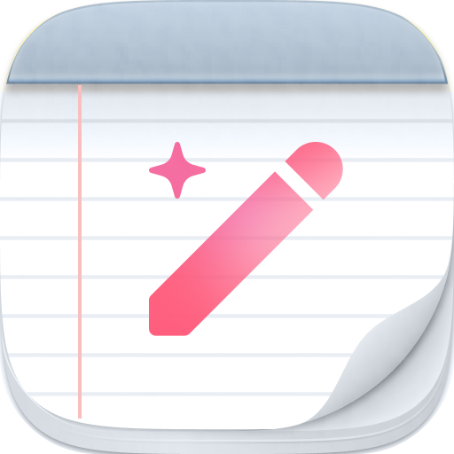
          <br /><b>Notes</b>
        </a>
      </td>
    </tr>
    <tr style="border: 0 !important; background: transparent;">
      <td align="center" style="border: 0 !important; padding: 15px; background: transparent;">
        <a href="https://apps.mentra.glass/package/com.mentra.calendarreminder" style="text-decoration: none; color: inherit;">
          
          <br /><b>Calendar</b>
        </a>
      </td>
      <td align="center" style="border: 0 !important; padding: 15px; background: transparent;">
        <a href="https://apps.mentra.glass/package/com.mentra.dash" style="text-decoration: none; color: inherit;">
          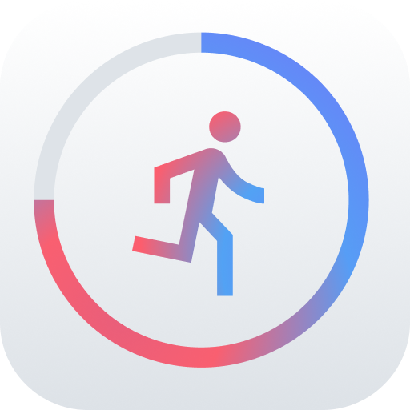
          <br /><b>Dash</b>
        </a>
      </td>
      <td align="center" style="border: 0 !important; padding: 15px; background: transparent;">
        <a href="https://apps.mentra.glass/package/com.mentra.translation" style="text-decoration: none; color: inherit;">
          
          <br /><b>Translation</b>
        </a>
      </td>
      <td align="center" style="border: 0 !important; padding: 15px; background: transparent;">
        <a href="https://apps.mentra.glass" style="text-decoration: none; color: inherit;">
          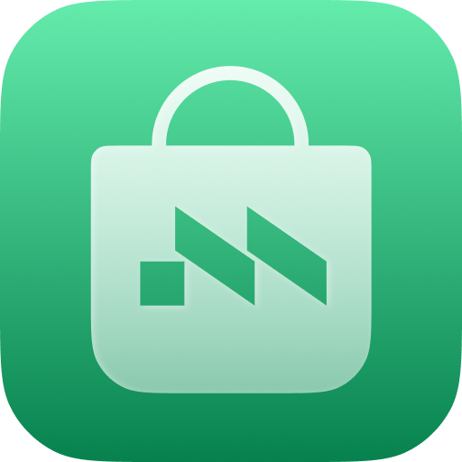
          <br /><b>See All</b>
        </a>
      </td>
    </tr>
    </tbody>
  </table>
</div>

## How MentraOS Works

MentraOS runs MiniApps from the phone and connects them to smart glasses through one shared runtime.

This keeps the glasses lightweight while letting multiple apps run together, like captions, notes, notifications, translation, and AI tools.

Manufacturers can integrate the Mentra Core Engine into their own iOS and Android apps to unlock the Mentra ecosystem while keeping their brand, app, and customer relationship.

## Development Setup

### Quick Start

For detailed setup instructions, see [CLAUDE.md](./CLAUDE.md) in the repository root.

### Recommended Development Environment

- **Platform:** macOS or Linux
- **Node.js:** Version 20.x
- **Package Manager:** bun preferred, npm supported
- **Android:** Android Studio with Java SDK 17
- **iOS:** Xcode
- **Cloud:** Docker and Docker Compose

### Key Commands

**Mobile App** (`mobile/`):

```bash
cd mobile
bun install
bun start
bun android
bun ios
bun test
```

**Cloud Backend** (`cloud/`):

```bash
cd cloud
bun install
bun run dev
bun run test
```

For complete build instructions, testing guidelines, and code style requirements, see [CLAUDE.md](./CLAUDE.md).

## Nightly Builds

<div align="center">
  <p>
    <a href="https://github.com/TeamOpenSmartGlasses/DiscussPlusPlus/releases/download/nightly-builds/mobile-latest.apk">
      
    </a>
    <a href="https://github.com/TeamOpenSmartGlasses/DiscussPlusPlus/releases/download/nightly-builds/asg-latest.apk">
      
    </a>
  </p>
</div>

## Community

MentraOS is built by developers, companies, and users who believe the next personal computer should be open, cross-compatible, private, and user-controlled.

Join us and become part of the Mentra Community by joining our Discord server:  
[https://mentra.glass/discord](https://mentra.glass/discord)

## Contributing

MentraOS is made by a community and we welcome pull requests.

**Contributor guide:**  
[https://docs.mentraglass.com/os-devs/contributing/overview](https://docs.mentraglass.com/os-devs/contributing/overview)

Looking for ways to contribute? We mark issues we'd love the community to help with using the "Help Wanted" tag.

**Help wanted issues:**  
[https://github.com/Mentra-Community/MentraOS/issues?q=is%3Aissue%20state%3Aopen%20label%3A%22help%20wanted%22](https://github.com/Mentra-Community/MentraOS/issues?q=is%3Aissue%20state%3Aopen%20label%3A%22help%20wanted%22)

## Contact

- **Email:** [team@mentra.glass](mailto:team@mentra.glass)
- **Discord:** [https://mentra.glass/discord](https://mentra.glass/discord)
- **X:** [https://x.com/mentraglass](https://x.com/mentraglass)

## License

MIT License

Copyright 2026 Mentra Labs, Inc.

---

<div align="center">
  <br />
  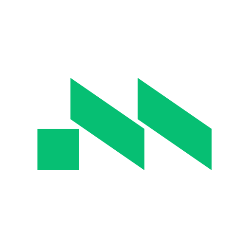
  <h3>© 2026 Mentra Labs, Inc.</h3>
</div>
