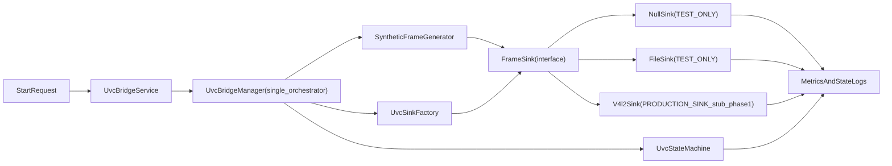
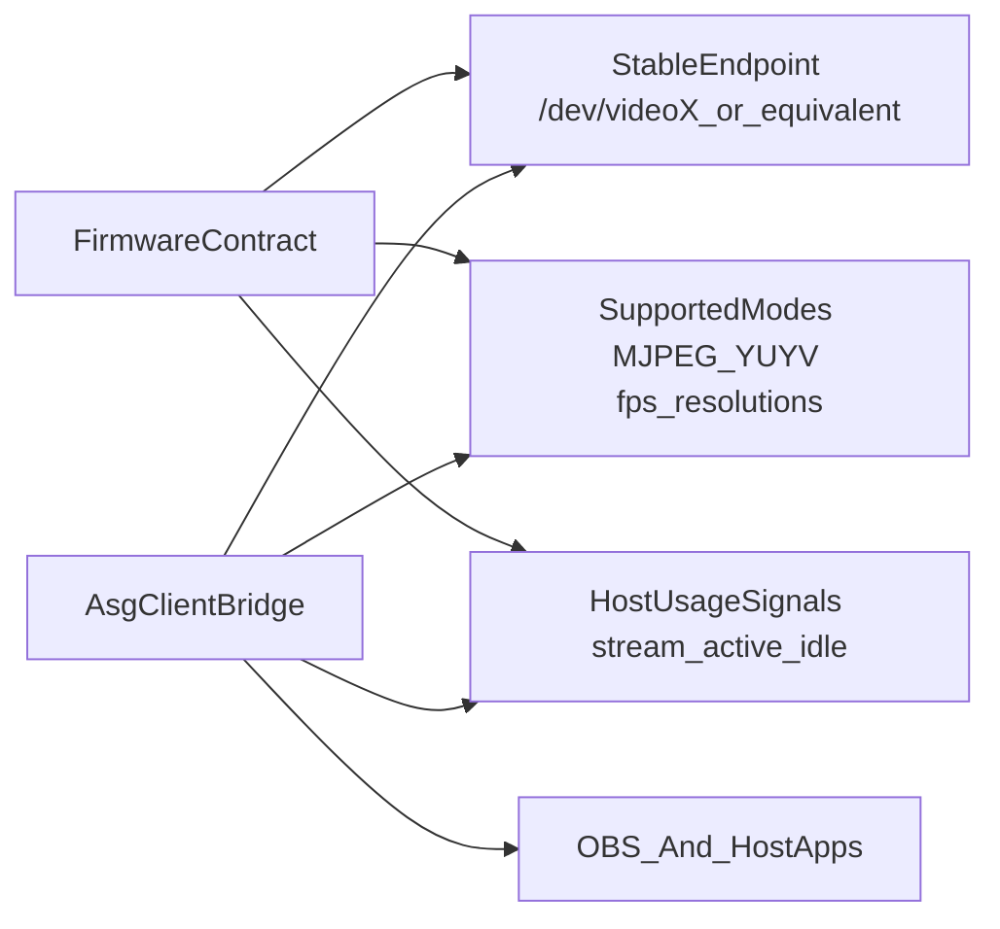

# Mentra Live UVC 3-Step Plan

## Overview

Deliver Mentra Live USB webcam in three phases: zero-firmware-dependency static-frame bring-up, full camera pipeline without firmware dependency, then full firmware-integrated UVC streaming with host validation.

## Todo Tracker

- `phase1-uvc-core` - Implement UVC core module with sink abstraction and sink factory, plus static-frame bring-up using only mock/null/file sinks (`pending`)
- `phase1-service-wireup` - Wire UVC service into manifest, ServiceContainer, and AsgClientServiceManager lifecycle (`pending`)
- `phase1-test-harness` - Implement Phase 1 automated and script-driven validation for NullSink/FileSink pacing, lifecycle cycles, and soak metrics (`pending`)
- `phase2-camera-producer` - Implement Camera2 frame producer under manager-owned orchestration and add shared camera ownership gate (`pending`)
- `phase2-command-surface` - Add UVC command handler and register in CommandProcessor for controlled testing (`pending`)
- `phase2-sink-policy-tests` - Add sink factory policy tests to enforce V4L2-only behavior in release runtime (`pending`)
- `phase2-arbitration` - Integrate UVC ownership checks with MediaCaptureService and RTMP/SRT/WHIP services (`pending`)
- `phase3-native-v4l2` - Implement JNI/C++ V4L2 writer path and Gradle/CMake integration (`pending`)
- `phase3-firmware-bind` - Bind to firmware endpoint, validate host start/stop behavior, and confirm OBS stability (`pending`)
- `phase3-release-profile` - Lock target mode profile (720p30 MJPEG primary) with recovery/replug test pass (`pending`)

## Mission

Ship a reliable USB webcam path for Mentra Live by de-risking transport first, then camera pipeline, then full firmware-integrated host behavior.

## Phase 1: Static Frames (Zero Firmware Dependency)

### Objective

Prove frame generation, pacing, lifecycle, and sink abstraction with no dependency on firmware endpoint availability.

### Scope

- Add a UVC bridge module in `asg_client` with pluggable sinks and deterministic test frame generation.
- Validate static/synthetic frame loop against `NullSink` and `FileSink` only (no `/dev/videoX` requirement).
- Keep a dedicated `UvcBridgeService` in Phase 1 as lifecycle boundary.
- Lock orchestration ownership to `UvcBridgeManager` now (single owner of state, pacing, and producer->sink flow) to avoid Phase 2 refactors.
- Keep sink policy in `UvcSinkFactory` using build/runtime gates; extract to a separate policy object only if logic grows materially.
- Implement the full Phase 1 test harness in this phase (unit tests + script-driven device validation), not as deferred follow-up work.

### Phase 1 architecture (no firmware dependency)

### Files to add or update

- Add UVC core module under:
  - `[/Users/mentra/Documents/MentraApps/MentraOS/asg_client/app/src/main/java/com/mentra/asg_client/io/uvc/core/UvcBridgeService.java](/Users/mentra/Documents/MentraApps/MentraOS/asg_client/app/src/main/java/com/mentra/asg_client/io/uvc/core/UvcBridgeService.java)` - Service boundary for start/stop/status lifecycle and background execution.
  - `[/Users/mentra/Documents/MentraApps/MentraOS/asg_client/app/src/main/java/com/mentra/asg_client/io/uvc/core/UvcBridgeManager.java](/Users/mentra/Documents/MentraApps/MentraOS/asg_client/app/src/main/java/com/mentra/asg_client/io/uvc/core/UvcBridgeManager.java)` - Orchestrates state machine, frame clock, sink selection, and metrics.
  - `[/Users/mentra/Documents/MentraApps/MentraOS/asg_client/app/src/main/java/com/mentra/asg_client/io/uvc/core/UvcDeviceLocator.java](/Users/mentra/Documents/MentraApps/MentraOS/asg_client/app/src/main/java/com/mentra/asg_client/io/uvc/core/UvcDeviceLocator.java)` - Endpoint discovery helper (used in Phase 3; can be no-op in Phase 1).
  - `[/Users/mentra/Documents/MentraApps/MentraOS/asg_client/app/src/main/java/com/mentra/asg_client/io/uvc/model/UvcConfig.java](/Users/mentra/Documents/MentraApps/MentraOS/asg_client/app/src/main/java/com/mentra/asg_client/io/uvc/model/UvcConfig.java)` - Runtime config (fps, frame size, sink type, test flags).
  - `[/Users/mentra/Documents/MentraApps/MentraOS/asg_client/app/src/main/java/com/mentra/asg_client/io/uvc/model/UvcState.java](/Users/mentra/Documents/MentraApps/MentraOS/asg_client/app/src/main/java/com/mentra/asg_client/io/uvc/model/UvcState.java)` - Explicit lifecycle states and transition guards.
- Add sink interfaces/implementations:
  - `[/Users/mentra/Documents/MentraApps/MentraOS/asg_client/app/src/main/java/com/mentra/asg_client/io/uvc/sink/FrameSink.java](/Users/mentra/Documents/MentraApps/MentraOS/asg_client/app/src/main/java/com/mentra/asg_client/io/uvc/sink/FrameSink.java)` - Common sink contract for frame write/open/close semantics.
  - `[/Users/mentra/Documents/MentraApps/MentraOS/asg_client/app/src/main/java/com/mentra/asg_client/io/uvc/sink/NullSink.java](/Users/mentra/Documents/MentraApps/MentraOS/asg_client/app/src/main/java/com/mentra/asg_client/io/uvc/sink/NullSink.java)` - `TEST_ONLY`; validates pacing and lifecycle without I/O side effects.
  - `[/Users/mentra/Documents/MentraApps/MentraOS/asg_client/app/src/main/java/com/mentra/asg_client/io/uvc/sink/FileSink.java](/Users/mentra/Documents/MentraApps/MentraOS/asg_client/app/src/main/java/com/mentra/asg_client/io/uvc/sink/FileSink.java)` - `TEST_ONLY`; writes deterministic frame artifacts for ordering/corruption checks.
  - `[/Users/mentra/Documents/MentraApps/MentraOS/asg_client/app/src/main/java/com/mentra/asg_client/io/uvc/sink/V4l2Sink.java](/Users/mentra/Documents/MentraApps/MentraOS/asg_client/app/src/main/java/com/mentra/asg_client/io/uvc/sink/V4l2Sink.java)` - `PRODUCTION_SINK`; gadget writer path (stub in Phase 1, real in Phase 3).
- Add sink factory and policy gate:
  - `[/Users/mentra/Documents/MentraApps/MentraOS/asg_client/app/src/main/java/com/mentra/asg_client/io/uvc/sink/UvcSinkFactory.java](/Users/mentra/Documents/MentraApps/MentraOS/asg_client/app/src/main/java/com/mentra/asg_client/io/uvc/sink/UvcSinkFactory.java)` - Single creation gate; enforces release policy (`V4L2` only).
  - `[/Users/mentra/Documents/MentraApps/MentraOS/asg_client/app/src/main/java/com/mentra/asg_client/io/uvc/sink/SinkType.java](/Users/mentra/Documents/MentraApps/MentraOS/asg_client/app/src/main/java/com/mentra/asg_client/io/uvc/sink/SinkType.java)` - Allowed sink enum used by config and factory.
- Add service registration and lifecycle wiring:
  - `[/Users/mentra/Documents/MentraApps/MentraOS/asg_client/app/src/main/AndroidManifest.xml](/Users/mentra/Documents/MentraApps/MentraOS/asg_client/app/src/main/AndroidManifest.xml)` - Service declaration and permission/foreground type wiring.
  - `[/Users/mentra/Documents/MentraApps/MentraOS/asg_client/app/src/main/java/com/mentra/asg_client/service/core/ServiceContainer.java](/Users/mentra/Documents/MentraApps/MentraOS/asg_client/app/src/main/java/com/mentra/asg_client/service/core/ServiceContainer.java)` - Dependency injection wiring for UVC manager/factory.
  - `[/Users/mentra/Documents/MentraApps/MentraOS/asg_client/app/src/main/java/com/mentra/asg_client/service/legacy/managers/AsgClientServiceManager.java](/Users/mentra/Documents/MentraApps/MentraOS/asg_client/app/src/main/java/com/mentra/asg_client/service/legacy/managers/AsgClientServiceManager.java)` - Lifecycle ownership (initialize/cleanup/start-stop hooks).
- Add Phase 1 tests and script harness:
  - `[/Users/mentra/Documents/MentraApps/MentraOS/asg_client/app/src/test/java/com/mentra/asg_client/io/uvc/core/UvcBridgeManagerTest.java](/Users/mentra/Documents/MentraApps/MentraOS/asg_client/app/src/test/java/com/mentra/asg_client/io/uvc/core/UvcBridgeManagerTest.java)` - Pacing, lifecycle transition, and start/stop cycle assertions with test sinks.
  - `[/Users/mentra/Documents/MentraApps/MentraOS/asg_client/app/src/test/java/com/mentra/asg_client/io/uvc/sink/FileSinkTest.java](/Users/mentra/Documents/MentraApps/MentraOS/asg_client/app/src/test/java/com/mentra/asg_client/io/uvc/sink/FileSinkTest.java)` - Frame ordering, timestamp monotonicity, and non-empty artifact validation.
  - `[/Users/mentra/Documents/MentraApps/MentraOS/asg_client/scripts/test-uvc-phase1.sh](/Users/mentra/Documents/MentraApps/MentraOS/asg_client/scripts/test-uvc-phase1.sh)` - Device-side script runner for `start-null`, `start-file`, `status`, `logs`, `stop`, cycle, and soak commands.

### Acceptance criteria

- Static/synthetic frame loop runs at target pacing with deterministic counters.
- `NullSink` and `FileSink` validation pass with no unbounded memory growth.
- Bridge logs include frame generation rate, dropped-frame count, and state transitions.
- No Camera2 dependency and no firmware endpoint dependency required to pass this phase.
- `UvcBridgeManager` is the only orchestration owner in runtime (no parallel stream-controller ownership path).

### Test plan (Phase 1)

- Test source setup:
  - Use deterministic synthetic frames (color bars + frame index + timestamp overlay).
  - Run pacing profiles at 5 fps, 15 fps, and 30 fps.
- `NullSink` tests:
  - Run 2-minute pacing tests at each profile.
  - Verify generated frame count is within tolerance of expected count.
  - Verify dropped-frame counter remains within agreed threshold.
- `FileSink` tests:
  - Run 2-minute capture at each profile.
  - Verify output frame sequence count and ordering.
  - Verify timestamps are monotonic and no corrupt/empty frame artifacts.
- Lifecycle tests:
  - Execute 20-50 start/stop cycles.
  - Verify state transitions are valid (`IDLE -> STREAMING -> IDLE`) with no stuck states.
  - Verify worker threads/timers are released on stop.
- Soak test:
  - Run 10-minute continuous stream at target profile.
  - Verify no crashes, no ANR, and no unbounded memory growth.

### Phase 1 exit gate

- All `NullSink` and `FileSink` tests pass.
- Soak test completes without instability.
- Metrics and logs are captured for produced fps, dropped frames, queue depth, and state transitions.
- Phase 1 test harness artifacts (unit test outputs + script-driven run logs) are captured and attached as gate evidence.

### Sink intent policy

- `V4l2Sink` is the only production output path.
- `NullSink` and `FileSink` are test-only adapters and must be gated behind debug/test flags.
- Production build/runtime defaults must never auto-select non-production sinks.
- All sink creation must go through `UvcSinkFactory`; direct sink instantiation outside tests is disallowed.
- Sink-policy logic remains in `UvcSinkFactory` by default and is only extracted if policy complexity materially increases.

## Phase 2: Full Camera Pipeline (Firmware-Independent)

### Objective

Build production camera capture/format pipeline while still allowing fallback to non-firmware-dependent sinks.

### Scope

- Implement frame producer from Camera2.
- Support MJPEG-first path with optional YUYV fallback.
- Add lifecycle state machine and camera ownership policy.
- Add a shared `CameraOwnershipGate` helper to remove duplicated camera busy/kept-alive checks across UVC, media capture, and streaming services.

### Files to add or update

- Add frame producer and scheduler:
  - `[/Users/mentra/Documents/MentraApps/MentraOS/asg_client/app/src/main/java/com/mentra/asg_client/io/uvc/core/UvcFrameProducer.java](/Users/mentra/Documents/MentraApps/MentraOS/asg_client/app/src/main/java/com/mentra/asg_client/io/uvc/core/UvcFrameProducer.java)` - Camera2 capture source, buffer extraction, and frame handoff.
  - `[/Users/mentra/Documents/MentraApps/MentraOS/asg_client/app/src/main/java/com/mentra/asg_client/io/uvc/core/CameraOwnershipGate.java](/Users/mentra/Documents/MentraApps/MentraOS/asg_client/app/src/main/java/com/mentra/asg_client/io/uvc/core/CameraOwnershipGate.java)` - Shared camera-ownership helper for in-use checks and kept-alive camera release policy.
- Integrate with existing camera ownership checks:
  - `[/Users/mentra/Documents/MentraApps/MentraOS/asg_client/app/src/main/java/com/mentra/asg_client/io/media/core/MediaCaptureService.java](/Users/mentra/Documents/MentraApps/MentraOS/asg_client/app/src/main/java/com/mentra/asg_client/io/media/core/MediaCaptureService.java)`
  - `[/Users/mentra/Documents/MentraApps/MentraOS/asg_client/app/src/main/java/com/mentra/asg_client/io/streaming/services/RtmpStreamingService.java](/Users/mentra/Documents/MentraApps/MentraOS/asg_client/app/src/main/java/com/mentra/asg_client/io/streaming/services/RtmpStreamingService.java)`
  - `[/Users/mentra/Documents/MentraApps/MentraOS/asg_client/app/src/main/java/com/mentra/asg_client/io/streaming/services/SrtStreamingService.java](/Users/mentra/Documents/MentraApps/MentraOS/asg_client/app/src/main/java/com/mentra/asg_client/io/streaming/services/SrtStreamingService.java)`
  - `[/Users/mentra/Documents/MentraApps/MentraOS/asg_client/app/src/main/java/com/mentra/asg_client/io/streaming/services/WhipStreamingService.java](/Users/mentra/Documents/MentraApps/MentraOS/asg_client/app/src/main/java/com/mentra/asg_client/io/streaming/services/WhipStreamingService.java)`
- Add command surfaces for local testing:
  - `[/Users/mentra/Documents/MentraApps/MentraOS/asg_client/app/src/main/java/com/mentra/asg_client/service/core/handlers/UvcCommandHandler.java](/Users/mentra/Documents/MentraApps/MentraOS/asg_client/app/src/main/java/com/mentra/asg_client/service/core/handlers/UvcCommandHandler.java)` - Runtime control entry points (`start_uvc`, `stop_uvc`, `status`).
  - `[/Users/mentra/Documents/MentraApps/MentraOS/asg_client/app/src/main/java/com/mentra/asg_client/service/core/processors/CommandProcessor.java](/Users/mentra/Documents/MentraApps/MentraOS/asg_client/app/src/main/java/com/mentra/asg_client/service/core/processors/CommandProcessor.java)` - Handler registration and command routing integration.
- Add sink factory policy tests:
  - `[/Users/mentra/Documents/MentraApps/MentraOS/asg_client/app/src/test/java/com/mentra/asg_client/io/uvc/sink/UvcSinkFactoryPolicyTest.java](/Users/mentra/Documents/MentraApps/MentraOS/asg_client/app/src/test/java/com/mentra/asg_client/io/uvc/sink/UvcSinkFactoryPolicyTest.java)` - Verifies release-mode sink lock-down and debug-mode test sink eligibility.

### Acceptance criteria

- Camera2 frames reach sink at target pacing with no unbounded memory growth.
- Ownership policy blocks local photo/video/RTMP while UVC streaming state is active.
- Can run full pipeline against `NullSink` and `FileSink` for deterministic tests.
- Release policy tests prove non-production sinks cannot be selected in production runtime.
- Camera ownership decisions are centralized via `CameraOwnershipGate` (no duplicated in-use checks across feature paths).

## Phase 3: Full Firmware Integration and Host Validation

### Objective

Bind to firmware-provided gadget endpoint and validate true end-to-end webcam behavior.

### Scope

- Enable native V4L2 writer and endpoint discovery against live firmware.
- Validate host STREAMON/STREAMOFF-driven behavior and recovery paths.
- Lock resolution/format profile for release.

### Files to add or update

- Add native bridge:
  - `[/Users/mentra/Documents/MentraApps/MentraOS/asg_client/app/src/main/cpp/uvc/uvc_writer.cpp](/Users/mentra/Documents/MentraApps/MentraOS/asg_client/app/src/main/cpp/uvc/uvc_writer.cpp)` - Core V4L2 open/configure/queue/dequeue/write loop.
  - `[/Users/mentra/Documents/MentraApps/MentraOS/asg_client/app/src/main/cpp/uvc/uvc_writer.h](/Users/mentra/Documents/MentraApps/MentraOS/asg_client/app/src/main/cpp/uvc/uvc_writer.h)` - Native interface contracts and structs.
  - `[/Users/mentra/Documents/MentraApps/MentraOS/asg_client/app/src/main/cpp/uvc/jni_uvc_bridge.cpp](/Users/mentra/Documents/MentraApps/MentraOS/asg_client/app/src/main/cpp/uvc/jni_uvc_bridge.cpp)` - JNI boundary for Java/Kotlin bridge manager.
  - `[/Users/mentra/Documents/MentraApps/MentraOS/asg_client/app/src/main/cpp/CMakeLists.txt](/Users/mentra/Documents/MentraApps/MentraOS/asg_client/app/src/main/cpp/CMakeLists.txt)` - Native target definitions and library linkage.
  - `[/Users/mentra/Documents/MentraApps/MentraOS/asg_client/app/build.gradle](/Users/mentra/Documents/MentraApps/MentraOS/asg_client/app/build.gradle)` - Gradle wiring for native build and ABI packaging.
- Add JNI wrapper:
  - `[/Users/mentra/Documents/MentraApps/MentraOS/asg_client/app/src/main/java/com/mentra/asg_client/io/uvc/nativebridge/UvcNativeBridge.java](/Users/mentra/Documents/MentraApps/MentraOS/asg_client/app/src/main/java/com/mentra/asg_client/io/uvc/nativebridge/UvcNativeBridge.java)` - Safe Java API around JNI calls, error translation, and lifecycle guards.

### Acceptance criteria

- Bridge discovers and opens firmware endpoint (`/dev/videoX` or documented equivalent).
- OBS receives continuous frames with start/stop host usage behavior.
- Target profile validated (start with 720p @ ~30 fps, MJPEG primary).
- Replug/restart/recovery tests pass without camera deadlocks.

## Cross-Team Interface Contract

- Firmware must guarantee endpoint stability and mode contract.
- `asg_client` must guarantee frame production, arbitration, and lifecycle behavior.

## Risks and Mitigations

- Endpoint not present or unstable: keep sink abstraction and fallback modes until firmware contract is locked.
- Camera resource contention: enforce single ownership policy with explicit rejection paths.
- Throughput instability at HD: start MJPEG-first and tune frame pacing before adding optional formats.

## Exit Gates

- Phase 1 gate: static/synthetic pipeline stable with `NullSink`/`FileSink` and no firmware dependency.
- Phase 2 gate: camera pipeline stable without firmware dependency.
- Phase 3 gate: firmware-integrated live webcam stable across repeated sessions.
