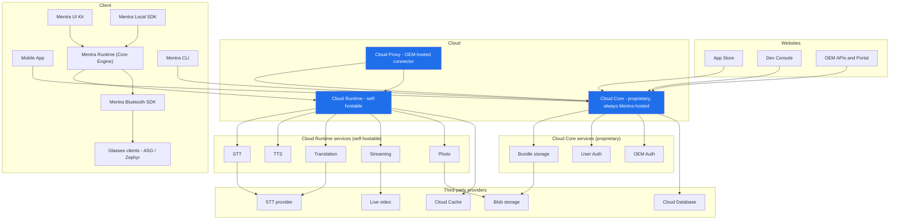
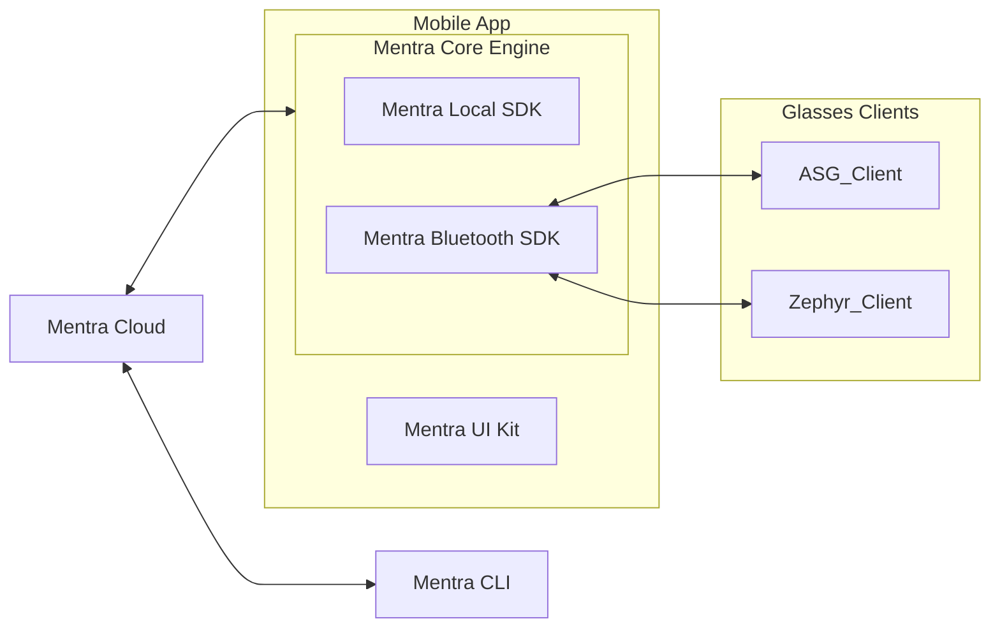

# Mentra Overhaul Plan

## Intro / TL;DR

**What this is**
How the overhaul's related efforts fit together. They overlap heavily but do not all ship at once:

- **Local SDK**: a new way for developers to build mini apps. Shipping first, even on today's Cloud 1: we are back-porting what it needs so the next major app update can ship Local SDK versions of Mentra AI, Captions, and Maps while still on Cloud 1.
- **Cloud V2**: a new cloud backend that scales. Replaces Cloud 1 once it is ready; the Local SDK does not wait on it.
- **Mentra Runtime (Core Engine)**: all of MentraOS's mobile logic as a library OEMs embed in their own phone app.
- **Self-hostable Cloud Runtime**: the cloud services that back the on-device runtime (STT, TTS, translation, streaming, photo). OEMs can run their own or use Mentra's.
- **Cloud Proxy**: a way for OEMs to proxy their app's requests through their own cloud to ours.

This doc explains how they connect.

**What changes for users**
Faster mini apps (no cloud round-trip for most features). Mini apps work offline for local-only features. New mini apps in the App Store that install onto the phone instead of running on a remote server.

**What changes for developers**
A new SDK (`@mentra/miniapp`) and CLI (`@mentra/miniapp-cli`). Write a static web app, build a bundle, publish through the Dev Console. No more running your own server.

**What changes for OEMs**
OEMs can ship MentraOS inside their own phone app instead of sending users to the Mentra app. The Core Engine packages all of MentraOS's mobile logic into a library they embed; OEM Auth signs their users in through the OEM's own identity; and Cloud Proxy lets them choose how much of the cloud to run themselves while still reaching our central Cloud Core.

**What changes for us**
Cloud V1's mini-app server protocol goes away. The cloud gets smaller and more scalable. OEM auth becomes a first-class flow. The mobile app talks to the same cloud regardless of v1 or v2 (wire-shape parity at the seam).

## Glossary

Naming has been inconsistent across docs. This is the canonical set.

**Mentra Runtime (Core Engine)**
All of MentraOS's mobile logic packaged as a library OEMs embed in their own phone app: BLE transport, glasses management, the on-phone mini-app execution runtime, display, audio routing. "Mentra Runtime" and "Core Engine" are the same thing, used interchangeably.

**Mentra Local SDK**
The developer-facing API (`@mentra/miniapp`) mini-app developers write against. Apps built with it run in the Core Engine's mini-app runtime (which is what actually executes them on the phone).

**Mentra CLI**
The developer-facing build and publish tool (`@mentra/miniapp-cli`).

**Mentra UI Kit**
The shared UI layer (components, screens, design system) the Mobile App is built from. Sits alongside the Core Engine inside the Mobile App.

**Cloud V2**
The next generation of Mentra Cloud Core plus Cloud Runtime. Replaces v1 in production. Defined by the absence of cloud-mini-app infrastructure.

**Mentra Cloud Core**
The proprietary cloud product (Hono on Bun). Hosts Mentra's central services: the App Store, Developer Console, OEM APIs and Portal, plus User Auth, OEM Auth, and bundle storage. "Cloud Core" for short. Mentra runs one central Cloud Core for the whole ecosystem; OEMs reach it through Cloud Proxy and never host their own.

**Cloud Runtime**
The self-hostable cloud product (`@mentra/cloud-runtime`, renamed from `cloud-audio`). The cloud half of the on-device Mentra Runtime: STT, TTS, translation, streaming, photo capture and storage, and the phone-WS session coordination (the `__phone__` path). An OEM can run their own or proxy to Mentra's.

**Local JS SDK**
Older name for Mentra Local SDK. Same thing.

## Products and services at a glance

We organize everything as **products** (things we build, like the Mobile App or Cloud Core) and **services** (capabilities one product exposes for others, like bundle storage or the transcription stream).

The cloud is **three products, not one**, and they are hosted differently:

- **Cloud Core is always ours.** The proprietary product: the shared app store and developer ecosystem (App Store, Dev Console, OEM APIs and Portal, User Auth, OEM Auth, bundle storage). Every OEM's users and developers live in the same Cloud Core, which is what makes being part of the ecosystem worth it. OEMs do not host it.
- **Cloud Runtime can be theirs.** The self-hostable product: the per-user runtime services (STT, TTS, translation, streaming, photo) that back the on-device Mentra Runtime. An OEM that needs to (data residency, cost, sovereignty) can run its own instead of using ours.
- **Cloud Proxy is the OEM-side connector.** It is the piece an OEM deploys in their own infrastructure. Their apps reach our central Cloud Core through it (with OEM-scoped auth), and if the OEM runs its own Cloud Runtime, the proxy routes those requests there instead of to ours.

Together, Cloud Core and Cloud Runtime back every product that needs the cloud: the Mobile App, the Mentra Runtime (Core Engine), the OEM APIs and Portal, the App Store, the Dev Console, and the CLI.



## Mini App Platform

**Why it exists**
Third-party developers need a way to ship apps onto Mentra glasses without standing up their own servers. Mini App Platform is the loop that gets them from `mentra init` to "user wearing it on their glasses."

**What it does**
Provides the end-to-end developer journey. Write code with the Local SDK. Build a bundle with the CLI. Upload through the Dev Console. Get listed in the App Store. Install onto the phone. Execute on-device via the Local SDK runtime. Use cloud features (STT, translation, photo, streams) through a thin cloud bridge.

**Products and pieces it contains**

- Mentra Local SDK (the developer API)
- Mentra CLI (the build and publish tool)
- Dev Console (the publish UI)
- App Store mini-apps collection (the discovery UI)
- On-phone install flow
- The on-phone execution runtime (part of the Local SDK)

**Status**
SDK and CLI mostly feature-complete. Runtime landed on phone. STT bridge through the `__phone__` session running on v1. Bundle distribution loop not built (Dev Console, store collection, bundle storage). Internal-only until Phase 3.

## Websites

### App Store

**What it is**
The existing user-facing app discovery surface. Adds a new "mini apps" collection alongside the legacy cloud-apps collection. Both coexist behind a unified store API until Phase 3.

**Status**
Cloud-apps collection works. Mini-apps collection not started.

### Dev Console

**What it is**
The developer portal. Complete rewrite. The old console stored a URL to the developer's server. The new console accepts a ZIP bundle, parses the manifest, versions it, and publishes to the store.

**Status**
Spec not written. No implementation started.

### OEM APIs and Portal

**What it is**
Everything OEM-facing, served under `/api/oem/`. Two parts: the OEM Portal, a web app where OEMs manage their integration (`/api/oem/portal/`), and the OEM backend APIs that an OEM's own servers call directly (`/api/oem/`). New for v2. Portal spike at `cloud-v2/docs/issues/002-oem-portal/`.

**Status**
Portal spiked only. OEM backend APIs not yet started.

## Cloud

Services here are named for what they do, not who provides them: "Cloud Storage" not "Cloudflare R2," "Cloud STT" not "Soniox." Providers can change per region (Alibaba for China, Cloudflare elsewhere) or for cost, so naming by capability keeps it readable. Current providers are listed under each service.

**Service tiers for OEM hosting** (emerging; still being refined)
Every cloud capability falls into one of two tiers, and the tier decides how an OEM can use it:

- **Mentra Runtime Services** (proxyable and self-hostable): STT, TTS, translation, streaming, photo requests. The per-user runtime capabilities that back the on-device Mentra Runtime. An OEM can run their own or proxy to Mentra's.
- **Mentra Proprietary Services** (proxyable only): incident reporting, the MiniApp Store, the Developer Console, mini-app-server auth, and OEM Auth / APIs / Portal. Mentra's central, proprietary services. OEMs always reach Mentra's through Cloud Proxy and cannot self-host them.

These two tiers map onto two products. The Runtime Services live in **Cloud Runtime** (`@mentra/cloud-runtime`, renamed from `cloud-audio`): audio (STT, TTS, translation), streaming, and photo. The Proprietary Services live in **Cloud Core**. Cloud Proxy fronts both for OEMs.

The naming is deliberately symmetric: **Cloud Runtime** is the cloud half of the on-device **Mentra Runtime (Core Engine)**, which makes "an OEM hosts their own Cloud Runtime" easy to reason about. (The exact tier membership is still being refined; the product sections below reflect this split.)

### Mentra Cloud Core (v2)

**Why it exists**
Mentra Cloud Core (Cloud Core for short) exists to support the other Mentra products. Every product that needs the cloud (Mobile App, App Store, Dev Console, OEM APIs and Portal) talks to Cloud Core. If a product needs user state, token exchange, database access, or bundle upload, it goes through Cloud Core.

There is exactly one Cloud Core and Mentra runs it. It is the shared app store and developer ecosystem, so every OEM's users and developers live in the same place (that shared ecosystem is the reason to integrate with us at all). OEMs reach it through Cloud Proxy; they never host their own.

**What it does**
Provides one HTTP and WebSocket server (Hono on Bun, port 3000) with routes organized by the product they serve. The folder structure literally encodes the relationship:

```
cloud-v2/packages/core/src/api/
  store/       <- App Store
  console/     <- Dev Console
  oem/         <- everything OEM-facing
    portal/    <- the OEM Portal web app
    ...        <- endpoints OEMs' own backends call directly
```

That layout is the architecture: one folder per product, no cross-product coupling. The per-user runtime surface (the phone WebSocket plus the managed-stream and photo REST endpoints) lives in **Cloud Runtime**, not here. v1's `client/` API is mostly deprecated under v2 (the runtime parts moved to Cloud Runtime; the rest is going away, with any exceptions still TBD).

**Cloud Core services it provides** (each documented as a sub-section below)

- Bundle Storage: signed-URL blob storage for mini-app bundles
- User Auth: Mentra account authentication
- OEM Auth: RFC 8693 token exchange for OEM users

**What changed from v1**
No more `@mentra/sdk` server protocol. No app session lifecycle. No webhooks. OEM auth is first-class (RFC 8693 token exchange). Sessions are user-scoped, not app-scoped. The folder structure now encodes the product boundary cleanly; v1's API code was organized by HTTP method and grew tangled.

**Status**
Bootstrap deployed to AWS us-west-2. OEM auth working end-to-end. Cloud Database and Cloud Cache connected and verified. `/api/store/`, `/api/console/`, `/api/oem/` not yet started. Bundle upload not yet built. (The phone WS and runtime REST endpoints live in Cloud Runtime.)

#### Bundle Storage
**Why it exists**
The App Store and Dev Console need durable, signed-URL-accessible storage for mini-app bundles. Cloud Core mints short-lived signed URLs and enforces ownership; the phone uploads to and downloads from the storage provider directly (Cloud Core never proxies the bytes).

**What it does**
Stores immutable bundle ZIPs by version. The Dev Console writes them on publish; the App Store install flow reads them. (Photo blobs use the same underlying provider but are owned by Cloud Runtime, not Cloud Core.)

**Providers**
Cloudflare R2 in US and EU today; Alibaba OSS planned for China. Provider is selected per region. Cloud Core talks to a small storage abstraction so swapping providers is a config change.

**Status**
Not yet built; needed for the Dev Console publish and App Store install flows.

#### User Auth
**Why it exists**
Mentra-direct users (people who installed the Mentra app, not OEM customers) sign in, install mini apps, and manage their account through User Auth.

**What it does**
Issues and verifies Mentra access and refresh tokens for the Mobile App and the consumer-facing surfaces. Carried over from Cloud V1 unchanged; it already works.

#### OEM Auth
**Why it exists**
OEMs ship Mentra glasses to their own users. Those users sign in through the OEM's identity system, not Mentra's. OEM Auth is how an OEM-attested identity becomes a Mentra-scoped session, without the user ever creating a Mentra account.

**What it does**
Accepts OEM-attested installation JWTs (per the OEM Auth spec) and issues Mentra access and refresh tokens in exchange. Uses RFC 8693 token exchange as the wire format. Full spec at `cloud-v2/docs/issues/001-oem-auth/`.

**Status**
Implemented in v2 Cloud Core. End-to-end verified with a `test-oem` test issuer.

### Cloud Runtime (v2)

Renamed from `cloud-audio`. The self-hostable product that backs the on-device Mentra Runtime (Core Engine): the per-user runtime services an OEM can run themselves or proxy to Mentra's.

**Why it exists**
The on-device runtime needs cloud-side capabilities it can't do alone: the best STT, TTS, and translation models live in the cloud; live streams need provisioning; photos need durable storage and signed URLs; and transcripts and events have to flow back to the phone. Bundling these into one product (rather than scattering them under Cloud Core) is what makes them self-hostable: an OEM that needs data residency, lower cost, or sovereignty can run their own Cloud Runtime and reach Mentra's central Cloud Core through Cloud Proxy.

**What it provides** (each documented below)

- Audio: STT, TTS (planned), translation
- Streaming: managed live-stream provisioning
- Photo: capture orchestration plus the photo blob storage
- Phone WS: the `__phone__` session path that fans runtime events (transcripts and more) back to the phone

**Client surface**
The phone opens one WebSocket to Cloud Runtime (subscriptions up, `data_stream` events down) and calls a small set of runtime REST endpoints (managed-stream provision/status/teardown, photo request). Everything runtime-related is here, not in Cloud Core.

**Deployment model**
Runnable standalone, independent of Cloud Core. Speaks a defined wire protocol to the phone (the `__phone__` path) and reaches Cloud Core for shared state. Cloud Proxy routes per OEM (use Mentra's, or the OEM's own).

**Status**
Audio pipeline deployed and verified end-to-end with a real STT provider. Streaming and photo exist in v1 (`mentra-miniapp-sdk-2`, PR #2841) and need fresh v2 implementations against the v1 wire contract. TTS not yet built. The phone WS now speaks the v1 `data_stream` contract; broader runtime event fan-out is in progress.

#### Audio (STT / TTS / translation)
**Why it exists**
The best STT and translation models still live in the cloud. On-device models exist and are improving, but they are not yet the quality bar we want for production, especially for captions where transcription quality is the whole product.

**How it scales**
Any pod accepts any audio packet (UDP on port 8000 behind a public NLB; WS-binary fallback). The packet header carries a session ID. The receiving pod writes the packet to a Cloud Cache stream keyed by user; the pod that owns that user reads from the stream. Ownership lives in Cloud Cache with a short TTL refreshed by the owner. On failure another pod claims ownership and replays unacked audio, so transcripts resume with no missing words.

**What changed from v1**
v1 pinned a user to a single pod for the whole session, pods were not interchangeable, and a pod restart dropped transcripts. v2 fixes all three. TTS is new.

#### Streaming
**Why it exists**
Mini apps that live-stream from the glasses (`session.stream.startManaged`) need an RTMP/HLS endpoint provisioned dynamically and torn down when the stream ends. We proxy provisioning to a managed live-video provider rather than running ingest ourselves.

**What it does**
Three stateless routes (provision / status / teardown) returning RTMP / HLS / SRT / WebRTC URLs, with an in-memory ownership map and no durable state.

**Providers**
Cloudflare Stream today (US and EU); China TBD.

**Status**
v1 implementation in `mentra-miniapp-sdk-2` (PR #2841); v2 reimplements fresh against the same wire shapes. Phase 2.

#### Photo
**Why it exists**
`session.camera.takePhoto()` has to land a photo in durable storage and hand the mini app a signed URL.

**What it does**
Mints an upload token, sends `PHOTO_REQUEST` to the glasses, and signs the response URL when the upload lands. Photo blobs use the shared storage provider (owned here, not in Cloud Core).

**Status**
Flow exists in v1 (PR #2841); v2 reimplements against the v1 wire contract.

#### Phone WS (session coordination)
**Why it exists**
The phone needs one channel to subscribe to runtime services and receive their events. This is the `__phone__` path: the phone sends `PHONE_SUBSCRIPTION_UPDATE`, and Cloud Runtime fans transcripts and translation (and other runtime events) back as `data_stream`.

**Status**
The audio WS speaks the v1 contract (`phone_subscription_update` in, `data_stream` out). Wiring the broader runtime event fan-out is in progress.

### Cloud Proxy

**Why it exists**
OEMs ship their own MentraOS-derived apps, and they reach our central Cloud Core through Cloud Proxy, the component they deploy in their own infrastructure. Cloud Core is always ours; the thing that varies between OEMs is Cloud Runtime. Some OEMs are fine using our Cloud Runtime (the proxy just forwards to it). Some run their own Cloud Runtime for data residency, cost, or sovereignty (the proxy routes those requests to theirs and everything else to our Cloud Core).

The architectural commitment is per-service routing: for each service the proxy either forwards to Mentra or routes to the OEM's own deployment. Cloud Core is never the OEM's to host, so it is always forwarded to Mentra; Cloud Runtime can go either way.

**What it does**

Operates in two modes, configured per service:

**Terminating mode**
The OEM hosts their own version of the service behind Cloud Proxy. Cloud Proxy authenticates the OEM's user, terminates the request, and routes it to the OEM-hosted backend. Mentra never sees the request body. Used when an OEM runs their own Cloud Runtime. (Not available for Cloud Core, which is Mentra-hosted only.)

**Transparent mode**
The OEM does not host their own version. Cloud Proxy authenticates the OEM's user, translates OEM-scoped identity to a Mentra-scoped session, and forwards the request to Mentra's hosted backend. Always the mode for Cloud Core; optional for Cloud Runtime.

The configuration is per service, not per proxy. A single Cloud Proxy can be terminating for Cloud Runtime (because the OEM hosts their own) and transparent for Cloud Core (because they use Mentra's). Both modes need to be designed and implemented; that is the explicit goal.

**Status**
Stub. The detailed design (transport, auth flow, per-service mode configuration, deployment shape) is the largest open cloud-side question. Likely an `005-cloud-proxy` design issue.

## Client

How the client pieces nest: the Mobile App is composed of the Mentra UI Kit and the Mentra Core Engine; the Core Engine contains the Local SDK and the Bluetooth SDK; the Bluetooth SDK is what talks to the glasses clients. The Core Engine and the CLI both talk to Mentra Cloud.



### Mobile App

**What it is**
Mentra's consumer app: Mentra's own screens built with the Mentra UI Kit on top of the Core Engine. Cloud URL is runtime-configurable so the same build talks to v1 or v2 by setting.

**Status**
Built on the Core Engine. No cloud-v2-aware code, by design; routing is parity-based.

### Mentra UI Kit

**What it is**
The shared UI layer the Mobile App is built from (components, screens, design system). It sits alongside the Core Engine inside the Mobile App. An OEM building their own app can use it to match the Mentra experience, or bring their own UI on top of the Core Engine.

**Status**
Newly called out as its own piece; detail owned by the client team.

### Mentra Runtime (Core Engine)

**What it is**
A React Native library containing all of MentraOS's mobile logic. The Mentra app is built on it, and OEMs embed it in their own phone app. It connects to Mentra's cloud to download mini apps, carries the client/cloud data flow, hosts the **mini-app runtime** (each mini app runs in its own JS context, JavaScriptCore on iOS and QuickJS via dokar3/quickjs-kt on Android), manages subscriptions, and drives the glasses through the Mentra Bluetooth SDK. This is the OEM-integration product. ("Mentra Runtime" and "Core Engine" are the same thing.)

**Status**
Runs in the Mentra app today; the mini-app runtime works on the phone (bundle install, request dispatch, mic coordination, online and offline STT fallback) on `mentra-miniapp-sdk-2`. Packaging it as a standalone embeddable library for OEMs is the remaining work.

**Reference**
Linear: Mentra Runtime project.

### Mentra Local SDK

**What it is**
The developer-facing API (`@mentra/miniapp`) mini-app developers write against: typed `session.camera`, `session.transcription`, `session.stream`, and so on. Apps built with it run in the Core Engine's mini-app runtime (a no-DOM background layer handles glasses and cloud access; a static-web-app UI layer spawns on demand).

**Status**
All hardware modules implemented. Photo, transcription, translation, and streams bridged through cloud (via the `__phone__` session for streams, dedicated routes for photo and managed streams).

**Reference**
Google Doc: Local MiniApp SDK Execution Plan.

### Mentra CLI

**What it is**
Build, dev, release, pack, publish. Generates manifest. Hot-reload dev server. QR launch onto phone. The publish path communicates with Cloud Core's `/api/console/` endpoints to upload bundles, which is why this product belongs with the cloud-touching side of Mini App Platform rather than the on-phone runtime side.

**Status**
Feature-complete for dev. Publish-to-cloud flow waits on Dev Console backend.

### Mentra Bluetooth SDK

**What it is**
A native library that handles the direct connection to the glasses. The Core Engine uses it; enterprise partners who only need to talk to the glasses directly can use it on its own.

### Glasses clients

**What they are**
Two families of glasses, two clients. Neither is "firmware" by itself.

- **ASG_Client** (Android Smart Glasses Client): the Android code that runs on Android-based smart glasses. Today that means Mentra Live. These glasses pair an Android SOC with a separate microcontroller; the microcontroller runs its own firmware (not the ASG_Client) and handles the BLE link to the phone.
- **Zephyr_Client**: the client for display glasses, which are not Android and run their own firmware built on the Zephyr RTOS. For the third-party display glasses we support today that firmware is not ours; for the Mentra display glasses we are building, it is.

## Phased timeline

Phases match Matt's execution plan. Cloud-side milestones called out per phase so the cloud cutover lands cleanly inside the larger story.

### Phase 1 (in flight)

SDK runtime plus first-party mini-app ports. Internal only.

**Client deliverables**
Live Captions, Navigation, Mentra AI, Live Translation, Photo capture all running on Local SDK.

**Cloud deliverables**
Phone WS in Cloud Runtime with the `PHONE_SUBSCRIPTION_UPDATE` handler, fanning transcription and translation back as `data_stream`. Bundle storage groundwork in Cloud Core (buckets, signed-URL helpers).

**Cloud milestone**
Captions running end-to-end on Cloud V2 with one dev phone routed by setting the backend URL.

### Phase 2

Live streaming on phone. New install platform. Invite-only Dev Console.

**Client deliverables**
Livestreamer on Local SDK. Mentra Notes, X, Merge ports.

**Cloud deliverables**
Managed-streams in Cloud Runtime (Cloudflare Stream proxy). Mini-apps store collection in Cloud Core. Dev Console upload and publish endpoints. Bundle versioning and signed-URL serving.

**Cloud milestone**
An internal dev can `mentra publish` a bundle through the new Dev Console and have it install onto a phone via the new store collection.

### Phase 3

Public launch. Cloud V1 sunset. Cloud V2 in production.

**Client deliverables**
Local SDK packages published to npm. Cloud SDK deprecated. Migration guide for existing developers.

**Cloud deliverables**
Prod Atlas. Prod ElastiCache. Prod Porter target. Cloudflare DNS for the audio NLB. v1 audio code archived.

**Cloud milestone**
Prod users on Cloud V2. v1 cloud-mini-app code archived.

### Phase 4 (optional)

Port remaining low-priority mini apps. Skip if timeline pressure is real.

## Appendix: references

**Design docs**

- `cloud-v2/docs/issues/001-oem-auth/`
- `cloud-v2/docs/issues/002-oem-portal/`
- `cloud-v2/docs/issues/003-audio/`
- `cloud-v2/docs/issues/004-local-sdk/`

**Runbooks**

- `cloud-v2/docs/runbooks/`

**PRs**

- Cloud V2 monorepo bootstrap: https://github.com/Mentra-Community/MentraOS/pull/2766
- Mentra Miniapp SDK (draft): https://github.com/Mentra-Community/MentraOS/pull/2767
- Phone VAD plus local STT routing (merged): https://github.com/Mentra-Community/MentraOS/pull/2839
- Phone-streamed managed streams plus photo plus tester pages: https://github.com/Mentra-Community/MentraOS/pull/2841

**Linear projects**

- Cloud V2
- Local SDK
- Mentra Runtime

**External docs**

- Local MiniApp SDK Execution Plan (Google Doc, Matt)
