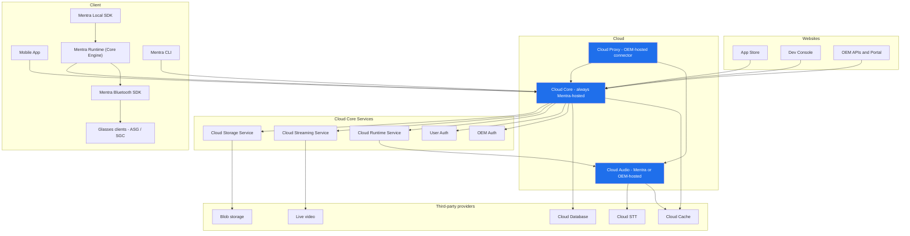
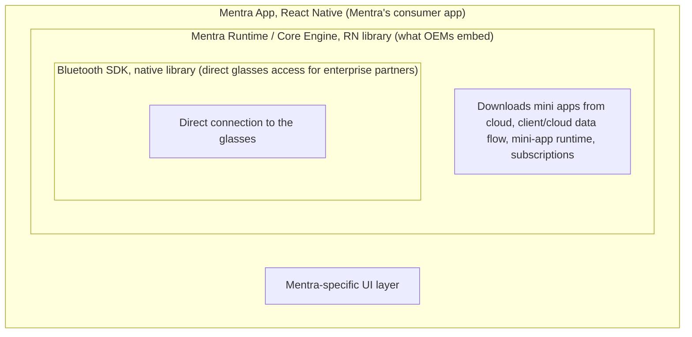

# Mentra Overhaul Plan

## Intro / TL;DR

**What this is**
How the overhaul's related efforts fit together. They overlap heavily but do not all ship at once:

- **Local SDK**: a new way for developers to build mini apps. Shipping first, even on today's Cloud 1: we are back-porting what it needs so the next major app update can ship Local SDK versions of Mentra AI, Captions, and Maps while still on Cloud 1.
- **Cloud V2**: a new cloud backend that scales. Replaces Cloud 1 once it is ready; the Local SDK does not wait on it.
- **Mentra Runtime (Core Engine)**: all of MentraOS's mobile logic as a library OEMs embed in their own phone app.
- **Self-hostable Cloud Audio**: OEMs can run their own audio (STT and translation) stack or use Mentra's, whichever they prefer.
- **Cloud Proxy**: a way for OEMs to proxy their app's requests through their own cloud to ours.

This doc explains how they connect.

**What changes for users**
Faster mini apps (no cloud round-trip for most features). Mini apps work offline for local-only features. New mini apps in the App Store that install onto the phone instead of running on a remote server.

**What changes for developers**
A new SDK (`@mentra/miniapp`) and CLI (`@mentra/miniapp-cli`). Write a static web app, build a bundle, publish through the Dev Console. No more running your own server.

**What changes for OEMs**
OEMs can ship MentraOS inside their own phone app instead of sending users to the Mentra app. The Core Engine packages all of MentraOS's mobile logic into a library they embed; OEM Auth signs their users in through the OEM's own identity; and Cloud Proxy lets them choose how much of the cloud to run themselves while still reaching our central Cloud Core.

**What changes for us**
Cloud V1's mini-app server protocol goes away. The cloud gets smaller and more scalable. OEM auth becomes a first-class flow. The mobile app talks to the same cloud regardless of v1 or v2 (wire-shape parity at the seam).

## Glossary

Naming has been inconsistent across docs. This is the canonical set.

**Mentra Runtime (Core Engine)**
All of MentraOS's mobile logic packaged as a library OEMs embed in their own phone app: BLE transport, glasses management, the on-phone mini-app execution runtime, display, audio routing. "Mentra Runtime" and "Core Engine" are the same thing, used interchangeably.

**Mentra Local SDK**
The developer-facing API (`@mentra/miniapp`) mini-app developers write against. Apps built with it run in the Core Engine's mini-app runtime (which is what actually executes them on the phone).

**Mentra CLI**
The developer-facing build and publish tool (`@mentra/miniapp-cli`).

**Cloud V2**
The next generation of Mentra Cloud Core plus Cloud Audio. Replaces v1 in production. Defined by the absence of cloud-mini-app infrastructure.

**Mentra Cloud Core**
The cloud backend product (Hono on Bun) that hosts the APIs and services for the Mobile App, App Store, Dev Console, and the OEM APIs and Portal. "Cloud Core" for short. Its services are collectively the Cloud Core Services: the Cloud Storage Service, Cloud Streaming Service, Cloud Runtime Service, plus User Auth and OEM Auth. They take a "Cloud" prefix rather than "Core" so the names do not collide with the client-side Core Engine. Mentra runs one central Cloud Core for the whole ecosystem; OEMs reach it through Cloud Proxy and never host their own.

**Local JS SDK**
Older name for Mentra Local SDK. Same thing.

## Products and services at a glance

We organize everything as **products** (things we build, like the Mobile App or Cloud Core) and **services** (capabilities one product exposes for others, like the Cloud Storage Service or the transcription stream).

The cloud is **three products, not one**, and they are hosted differently:

- **Cloud Core is always ours.** We run one central Cloud Core for the whole ecosystem. It is the shared app store and developer ecosystem: every OEM's users and developers live in the same Cloud Core, which is what makes being part of the ecosystem worth it. OEMs do not host it.
- **Cloud Audio can be theirs.** An OEM that needs to (data residency, cost, sovereignty) can run its own Cloud Audio instead of using ours.
- **Cloud Proxy is the OEM-side connector.** It is the piece an OEM deploys in their own infrastructure. Their apps reach our central Cloud Core through it (with OEM-scoped auth), and if the OEM runs its own Cloud Audio, the proxy routes audio there instead of to ours.

**Cloud Core is the spine.** It provides the Cloud Core Services (Cloud Storage Service, Cloud Streaming Service, Cloud Runtime Service, User Auth, OEM Auth) to every other product that needs the cloud: the Mobile App, the Mentra Runtime (Core Engine), the OEM APIs and Portal, the App Store, the Dev Console, and the CLI.



## Mini App Platform

**Why it exists**
Third-party developers need a way to ship apps onto Mentra glasses without standing up their own servers. Mini App Platform is the loop that gets them from `mentra init` to "user wearing it on their glasses."

**What it does**
Provides the end-to-end developer journey. Write code with the Local SDK. Build a bundle with the CLI. Upload through the Dev Console. Get listed in the App Store. Install onto the phone. Execute on-device via the Local SDK runtime. Use cloud features (STT, translation, photo, streams) through a thin cloud bridge.

**Products and pieces it contains**

- Mentra Local SDK (the developer API)
- Mentra CLI (the build and publish tool)
- Dev Console (the publish UI)
- App Store mini-apps collection (the discovery UI)
- On-phone install flow
- The on-phone execution runtime (part of the Local SDK)

**Status**
SDK and CLI mostly feature-complete. Runtime landed on phone. STT bridge through Cloud Core's `__phone__` session running on v1. Bundle distribution loop not built (Dev Console, store collection, Cloud Storage Service wiring). Internal-only until Phase 3.

## Websites

### App Store

**What it is**
The existing user-facing app discovery surface. Adds a new "mini apps" collection alongside the legacy cloud-apps collection. Both coexist behind a unified store API until Phase 3.

**Status**
Cloud-apps collection works. Mini-apps collection not started.

### Dev Console

**What it is**
The developer portal. Complete rewrite. The old console stored a URL to the developer's server. The new console accepts a ZIP bundle, parses the manifest, versions it, and publishes to the store.

**Status**
Spec not written. No implementation started.

### OEM APIs and Portal

**What it is**
Everything OEM-facing, served under `/api/oem/`. Two parts: the OEM Portal, a web app where OEMs manage their integration (`/api/oem/portal/`), and the OEM backend APIs that an OEM's own servers call directly (`/api/oem/`). New for v2. Portal spike at `cloud-v2/docs/issues/002-oem-portal/`.

**Status**
Portal spiked only. OEM backend APIs not yet started.

## Cloud

Services here are named for what they do, not who provides them: "Cloud Storage" not "Cloudflare R2," "Cloud STT" not "Soniox." Providers can change per region (Alibaba for China, Cloudflare elsewhere) or for cost, so naming by capability keeps it readable. Current providers are listed under each service.

### Mentra Cloud Core (v2)

**Why it exists**
Mentra Cloud Core (Cloud Core for short) exists to support the other Mentra products. Every product that needs the cloud (Mobile App, App Store, Dev Console, OEM APIs and Portal) talks to Cloud Core. If a product needs user state, token exchange, database access, bundle upload, or session routing, it goes through Cloud Core.

There is exactly one Cloud Core and Mentra runs it. It is the shared app store and developer ecosystem, so every OEM's users and developers live in the same place (that shared ecosystem is the reason to integrate with us at all). OEMs reach it through Cloud Proxy; they never host their own.

**What it does**
Provides one HTTP and WebSocket server (Hono on Bun, port 3000) with routes organized by the product they serve. The folder structure literally encodes the relationship:

```
cloud-v2/packages/core/src/api/
  client/      <- Mobile App
  store/       <- App Store
  console/     <- Dev Console
  oem/         <- everything OEM-facing
    portal/    <- the OEM Portal web app
    ...        <- endpoints OEMs' own backends call directly
```

That layout is the architecture. New product, new folder. No cross-product coupling inside the API layer.

**Cloud Core Services it provides** (each documented as a sub-section below)

- Cloud Storage Service: signed-URL blob storage; used for bundles, photos, and any other Mentra-owned blobs
- Cloud Streaming Service: managed live-stream provisioning
- Cloud Runtime Service: cloud-side coordinator for the on-phone Local SDK runtime; orchestrates photo capture, stream lifecycle, and the `__phone__` subscription path
- User Auth: Mentra account authentication
- OEM Auth: RFC 8693 token exchange for OEM users

**What changed from v1**
No more `@mentra/sdk` server protocol. No app session lifecycle. No webhooks. OEM auth is first-class (RFC 8693 token exchange). Sessions are user-scoped, not app-scoped. The folder structure now encodes the product boundary cleanly; v1's API code was organized by HTTP method and grew tangled.

**Status**
Bootstrap deployed to AWS us-west-2. OEM auth working end-to-end. Cloud Database and Cloud Cache connected and verified. `/api/client/` has skeleton routes; `/api/store/`, `/api/console/`, `/api/oem/` not yet started. Phone WS not yet built. Bundle upload not yet built.

#### Cloud Storage Service
**Why it exists**
Cloud Core needs durable, signed-URL-accessible blob storage for anything Mentra-owned. Mini-app bundles are the first concrete use case. User photos coordinated by Cloud Runtime Service are the second. More uses will land over time. We don't proxy bytes through Cloud Core itself: the phone (or the glasses) uploads directly to the storage provider and downloads directly from it. Cloud Core's job is to mint the short-lived signed URLs and enforce ownership.

**What it does**
Stores immutable bundle ZIPs by version (for the Mini App Platform). Stores user photos with short-TTL signed URLs (used by Cloud Runtime Service for the photo capture flow). Provides a uniform abstraction for any future blob-storage need.

**Providers**
Cloudflare R2 in US and EU regions today. Alibaba OSS planned for the China region. Provider is selected per region, not per request. Cloud Core talks to a small storage abstraction so swapping providers is a config change.

**Status**
Photo capture uses the Cloud Storage Service in v1 (PR #2841). Cloud v2 needs the same photo flow (orchestrated via Cloud Runtime Service) plus a new bundle-upload flow for Dev Console.

#### Cloud Streaming Service
**Why it exists**
Mini apps that want to live-stream from the glasses (`session.stream.startManaged`) need an RTMP/HLS endpoint provisioned dynamically and torn down when the stream ends. We don't run video ingest ourselves; we proxy provisioning to a managed live-video provider. The Cloud Streaming Service is the abstraction; Cloud Runtime Service is the consumer that wires it into the on-glasses Runtime flow.

**What it does**
Three stateless HTTP routes hosted by Cloud Core under `/api/v2/client/streams/managed/`:

```
POST   /provision               -> returns RTMP / HLS / SRT / WebRTC URLs for a new live input
GET    /:liveInputId/status     -> current connection state
DELETE /:liveInputId            -> idempotent teardown
```

Cloud Core holds an in-memory ownership map (one user cannot tear down another's stream) but stores nothing durably. No DB writes, no lifecycle timers, no WebSocket emissions.

**Providers**
Cloudflare Stream today (US and EU). TBD for the China region; the provider must support RTMP ingest plus the standard set of playback URLs.

**Status**
v1 implementation lives in `mentra-miniapp-sdk-2` (PR #2841). v2 needs the same three routes implemented fresh, against the same wire shapes. Phase 2 deliverable.

#### Cloud Runtime Service
**Why it exists**
The on-phone Local SDK runtime needs cloud-side coordination for capabilities that cannot be done purely on-device. Photo capture has to land in cloud storage and come back as a signed URL. Managed live streams have to be provisioned by a video provider. Transcripts have to flow back from Cloud Audio to the phone WS so the local mini app receives them. Cloud Runtime Service is the cloud-side coordinator that owns all of this in one place.

**What it does**
Orchestrates the cloud-side half of on-glasses Runtime calls. Specifically: the photo capture flow (mints upload tokens via the Cloud Storage Service, sends `PHOTO_REQUEST` to glasses, signs the response URL when the upload lands); managed-stream lifecycle (delegates provisioning to the Cloud Streaming Service, tracks ownership); phone WS routing (accepts `PHONE_SUBSCRIPTION_UPDATE`, demuxes Cloud Audio events back to the right user). Anything new the on-glasses Runtime needs from the cloud lands here.

**Status**
Photo capture flow exists in v1 (PR #2841). Managed-streams flow exists in v1 (PR #2841). Phone WS routing (`__phone__` subscription) is partly designed at `cloud-v2/docs/issues/004-local-sdk/`. v2 implements all three fresh against the v1 wire contract.

#### User Auth
**Why it exists**
Mentra-direct users (people who installed the Mentra app, not OEM customers) sign in, install mini apps, and manage their account through User Auth.

**What it does**
Issues and verifies Mentra access and refresh tokens for the Mobile App and the consumer-facing surfaces. Carried over from Cloud V1 unchanged; it already works.

#### OEM Auth
**Why it exists**
OEMs ship Mentra glasses to their own users. Those users sign in through the OEM's identity system, not Mentra's. OEM Auth is how an OEM-attested identity becomes a Mentra-scoped session, without the user ever creating a Mentra account.

**What it does**
Accepts OEM-attested installation JWTs (per the OEM Auth spec) and issues Mentra access and refresh tokens in exchange. Uses RFC 8693 token exchange as the wire format. Full spec at `cloud-v2/docs/issues/001-oem-auth/`.

**Status**
Implemented in v2 Cloud Core. End-to-end verified with a `test-oem` test issuer.

### Cloud Audio (v2)

**Why it exists**
The best STT and translation models still live in the cloud. On-device models exist and are improving, but they are not yet the quality bar we want for production, especially for captions users where transcription quality is the whole product. We need a cloud pipeline that takes audio from glasses, gets transcripts back, and delivers them to mini apps with low latency.

Cloud V1's audio path could not scale horizontally (one user pinned to one pod), so v2 was rebuilt from scratch to be stateless and pod-interchangeable. It was also redesigned to be deployable as a standalone service, separate from Cloud Core. OEMs that want to host their own audio stack (for data-residency, cost, or sovereignty reasons) can run Cloud Audio independently while still reaching our central Cloud Core through Cloud Proxy, which handles the routing so OEM apps hit the right deployment.

**What it does**
Receives audio from glasses over UDP (port 8000, fronted by a public Network Load Balancer). Decodes LC3 in worker threads, one per core. Sends decoded audio to a Cloud STT provider. Streams transcripts back to whichever pod owns the user session.

**How it scales**
Any pod accepts any audio packet. The packet header carries a session ID. The receiving pod writes the packet to a Cloud Cache stream keyed by user. The pod that owns that user reads from the stream. Ownership lives in Cloud Cache with a short TTL refreshed by the owner. On failure, another pod claims ownership and replays unacked audio from the stream. Transcripts resume with no missing words.

**What changed from v1**
v1 pinned a user to a single pod for the entire session. v1 pods were not interchangeable. v1 could not survive a pod restart without dropping transcripts. v2 fixes all three.

**Status**
Full pipeline deployed and verified end-to-end with a real STT provider. Fan-out to mini apps (via the Cloud Runtime Service) not yet wired.

### Cloud Proxy

**Why it exists**
OEMs ship their own MentraOS-derived apps, and they reach our central Cloud Core through Cloud Proxy, the component they deploy in their own infrastructure. Cloud Core is always ours; the thing that varies between OEMs is Cloud Audio. Some OEMs are fine using our Cloud Audio (the proxy just forwards to it). Some run their own Cloud Audio for data residency, cost, or sovereignty (the proxy routes audio to theirs and everything else to our Cloud Core).

The architectural commitment is per-service routing: for each service the proxy either forwards to Mentra or routes to the OEM's own deployment. Cloud Core is never the OEM's to host, so it is always forwarded to Mentra; Cloud Audio can go either way.

**What it does**

Operates in two modes, configured per service:

**Terminating mode**
The OEM hosts their own version of the service behind Cloud Proxy. Cloud Proxy authenticates the OEM's user, terminates the request, and routes it to the OEM-hosted backend. Mentra never sees the request body. Used when an OEM runs their own Cloud Audio. (Not available for Cloud Core, which is Mentra-hosted only.)

**Transparent mode**
The OEM does not host their own version. Cloud Proxy authenticates the OEM's user, translates OEM-scoped identity to a Mentra-scoped session, and forwards the request to Mentra's hosted backend. Always the mode for Cloud Core; optional for Cloud Audio.

The configuration is per service, not per proxy. A single Cloud Proxy can be terminating for Cloud Audio (because the OEM hosts their own audio stack) and transparent for Cloud Core (because they use Mentra's). Both modes need to be designed and implemented; that is the explicit goal.

**Status**
Stub. The detailed design (transport, auth flow, per-service mode configuration, deployment shape) is the largest open cloud-side question. Likely an `005-cloud-proxy` design issue.

## Client

These nest: the Mentra app is built on the Core Engine, which is built on the Bluetooth SDK. Each layer out is a wider audience.



### Mobile App

**What it is**
Mentra's consumer app: the Mentra-specific UI layer, built on the Core Engine. Cloud URL is runtime-configurable so the same build talks to v1 or v2 by setting.

**Status**
Built on the Core Engine. No cloud-v2-aware code, by design; routing is parity-based.

### Mentra Runtime (Core Engine)

**What it is**
A React Native library containing all of MentraOS's mobile logic. The Mentra app is built on it, and OEMs embed it in their own phone app. It connects to Mentra's cloud to download mini apps, carries the client/cloud data flow, hosts the **mini-app runtime** (each mini app runs in its own JS context, JavaScriptCore on iOS and QuickJS via dokar3/quickjs-kt on Android), manages subscriptions, and drives the glasses through the Mentra Bluetooth SDK. This is the OEM-integration product. ("Mentra Runtime" and "Core Engine" are the same thing.)

**Status**
Runs in the Mentra app today; the mini-app runtime works on the phone (bundle install, request dispatch, mic coordination, online and offline STT fallback) on `mentra-miniapp-sdk-2`. Packaging it as a standalone embeddable library for OEMs is the remaining work.

**Reference**
Linear: Mentra Runtime project.

### Mentra Local SDK

**What it is**
The developer-facing API (`@mentra/miniapp`) mini-app developers write against: typed `session.camera`, `session.transcription`, `session.stream`, and so on. Apps built with it run in the Core Engine's mini-app runtime (a no-DOM background layer handles glasses and cloud access; a static-web-app UI layer spawns on demand).

**Status**
All hardware modules implemented. Photo, transcription, translation, and streams bridged through cloud (via the `__phone__` session for streams, dedicated routes for photo and managed streams).

**Reference**
Google Doc: Local MiniApp SDK Execution Plan.

### Mentra CLI

**What it is**
Build, dev, release, pack, publish. Generates manifest. Hot-reload dev server. QR launch onto phone. The publish path communicates with Cloud Core's `/api/console/` endpoints to upload bundles, which is why this product belongs with the cloud-touching side of Mini App Platform rather than the on-phone runtime side.

**Status**
Feature-complete for dev. Publish-to-cloud flow waits on Dev Console backend.

### Mentra Bluetooth SDK

**What it is**
A native library that handles the direct connection to the glasses. The Core Engine uses it; enterprise partners who only need to talk to the glasses directly can use it on its own.

### Glasses clients

**What they are**
Two families of glasses, two clients. Neither is "firmware" by itself.

- **ASG Client** (Android Smart Glasses Client): the Android code that runs on Android-based smart glasses. Today that means Mentra Live. These glasses pair an Android SOC with a separate microcontroller; the microcontroller runs its own firmware (not the ASG Client) and handles the BLE link to the phone.
- **SGC Client** (Smart Glasses Controller): the controller for display glasses, which are not Android and run their own firmware. For the third-party display glasses we support today that firmware is not ours; for the Mentra display glasses we are building, it is.

## Phased timeline

Phases match Matt's execution plan. Cloud-side milestones called out per phase so the cloud cutover lands cleanly inside the larger story.

### Phase 1 (in flight)

SDK runtime plus first-party mini-app ports. Internal only.

**Client deliverables**
Live Captions, Navigation, Mentra AI, Live Translation, Photo capture all running on Local SDK.

**Cloud deliverables**
Phone WS endpoint in Cloud Core with `PHONE_SUBSCRIPTION_UPDATE` handler. Cloud Audio fan-out wired to Cloud Core for transcription and translation. Cloud Storage Service groundwork (buckets, signed-URL helpers).

**Cloud milestone**
Captions running end-to-end on Cloud V2 with one dev phone routed by setting the backend URL.

### Phase 2

Live streaming on phone. New install platform. Invite-only Dev Console.

**Client deliverables**
Livestreamer on Local SDK. Mentra Notes, X, Merge ports.

**Cloud deliverables**
Managed-streams route in Cloud Core (Cloudflare Stream proxy). Mini-apps store collection in Cloud Core. Dev Console upload and publish endpoints. Bundle versioning and signed-URL serving.

**Cloud milestone**
An internal dev can `mentra publish` a bundle through the new Dev Console and have it install onto a phone via the new store collection.

### Phase 3

Public launch. Cloud V1 sunset. Cloud V2 in production.

**Client deliverables**
Local SDK packages published to npm. Cloud SDK deprecated. Migration guide for existing developers.

**Cloud deliverables**
Prod Atlas. Prod ElastiCache. Prod Porter target. Cloudflare DNS for the audio NLB. v1 audio code archived.

**Cloud milestone**
Prod users on Cloud V2. v1 cloud-mini-app code archived.

### Phase 4 (optional)

Port remaining low-priority mini apps. Skip if timeline pressure is real.

## Appendix: references

**Design docs**

- `cloud-v2/docs/issues/001-oem-auth/`
- `cloud-v2/docs/issues/002-oem-portal/`
- `cloud-v2/docs/issues/003-audio/`
- `cloud-v2/docs/issues/004-local-sdk/`

**Runbooks**

- `cloud-v2/docs/runbooks/`

**PRs**

- Cloud V2 monorepo bootstrap: https://github.com/Mentra-Community/MentraOS/pull/2766
- Mentra Miniapp SDK (draft): https://github.com/Mentra-Community/MentraOS/pull/2767
- Phone VAD plus local STT routing (merged): https://github.com/Mentra-Community/MentraOS/pull/2839
- Phone-streamed managed streams plus photo plus tester pages: https://github.com/Mentra-Community/MentraOS/pull/2841

**Linear projects**

- Cloud V2
- Local SDK
- Mentra Runtime

**External docs**

- Local MiniApp SDK Execution Plan (Google Doc, Matt)
