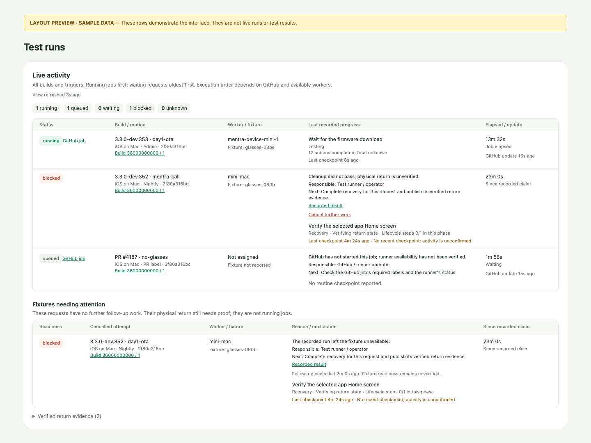

# Live activity and fixture recovery

Admin → Test runs separates current GitHub jobs, outstanding request follow-up,
and physical fixtures needing attention. A completed progress checkpoint is not
proof of cleanup. GitHub completion alone is not a routine verdict.



| Situation | Display / action |
| --- | --- |
| Original result uploads after an export failure | Remove the old follow-up when that same request's result proves cleanup and return; link **Completed result**. |
| Linked recovery proves the fixture returned | Remove its follow-up and retain links to original and recovery results. The original test failure remains unchanged. |
| Original result was never published, but trusted recovery binds its frozen snapshot | Use the recovery's return proof and show **Original result not published**. |
| Export succeeded but fixture is unavailable | Show the result as a blocker even if an older worker settled its claim as terminal. |
| Follow-up is abandoned | **Cancel further work** closes only inactive follow-up. The attempt moves to **Resolved follow-up history**, marked as cancelled, with its reason and result link, and is summarized under **Fixture readiness after resolved follow-up**. |
| Original worker closes a released install refusal | An inactive closed claim moves to **Resolved follow-up history**, marked as closed by its original worker with no test run. Its failed result is unchanged and the fixture stays **unverified** (uncommissioned). A still-active GitHub job stays in live activity without the recovery blocker. |
| Repeated cancelled attempts on one fixture | One summary row per exact worker + fixture, judged only by the newest stored claim on that identity (including ordinary terminal passes): **returned** (that claim's own results verify cleanup and return; the latest known routine return, not an observation of later use), **in use** (that claim is unsettled or in a GitHub job), **unverified** (it is a cancelled attempt, or its result failed, is missing or conflicts), or **not checked** (a claim/result lookup failed or exceeded 100 fixtures). An older return never stands in for a newer claim. |
| Another request passes on the same fixture | Does not silently resolve this request or overwrite its history. A newer verified return is shown only as the fixture's latest evidence; the same alias on another worker is not compared. |

Every blocker names its reason, responsible role, and next action. Without an
explicit structured input request, responsibility is the test runner/operator,
not an assumption that the user must click something. Queued jobs link to GitHub;
the view does not infer a missing runner capability without verified inventory.

Cancellation requires the existing Admin session, explicit JSON confirmation,
and a fresh complete GitHub activity read. Active or queued requests cannot be
closed here. A concurrent worker checkpoint/settlement rejects the stale action.
The audit marker is written with majority/journal acknowledgement beside the
immutable claim; no result, credential, device lease, or firmware writer changes.
This is not a hardware stop button and does not grant another execution.

Return reconciliation uses authenticated run metadata: exact request digest,
fixture, consumed CI relationship, generation, archive, terminal snapshot and
verified return. A linked recovery with no original publication must name the
original request ID, its frozen digest, and a recovery-history digest. Conflicting
generations and newer failed returns remain unresolved. This is a display
projection, not a claim-settlement rewrite or deletion.

Focused checks:

```sh
bun test packages/core/src/services/test-run-overview*.test.ts \
  packages/core/src/services/test-run-follow-up.service.test.ts \
  websites/admin/src/pages/test-run-overview.test.tsx
```

Optional database proof uses `TEST_RUN_ACTIVITY_MONGO_URI=mongodb://127.0.0.1:PORT/`
with `packages/core/src/services/test-run-activity.mongo.test.ts`. The test creates
and drops its own random database; remote or credential-bearing URLs are refused.
