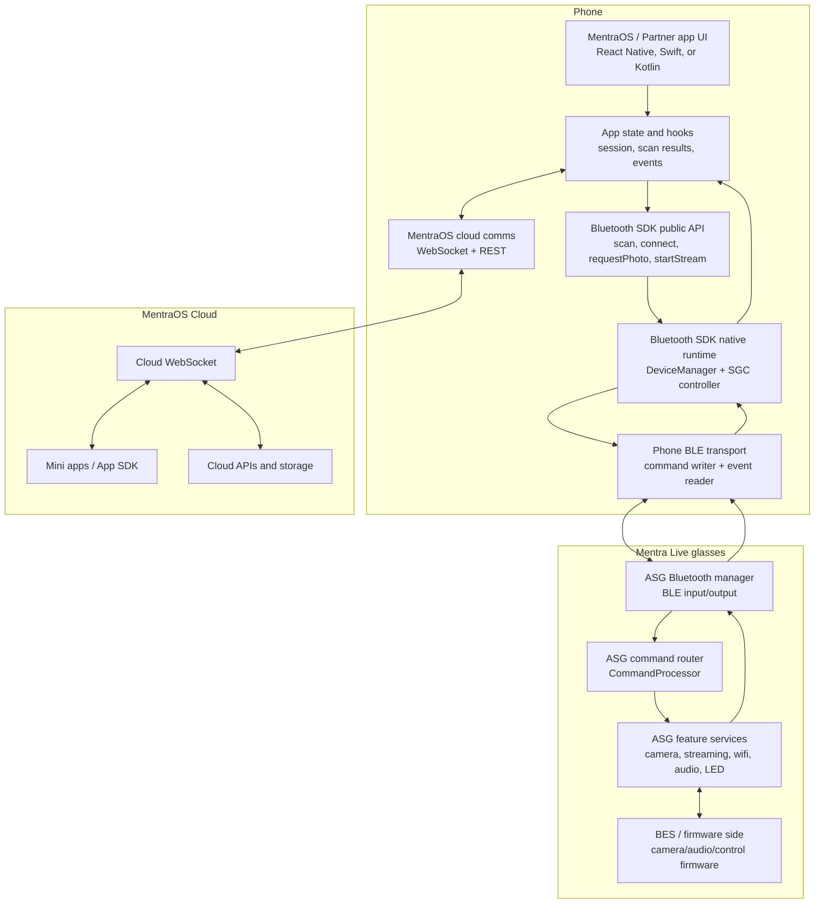
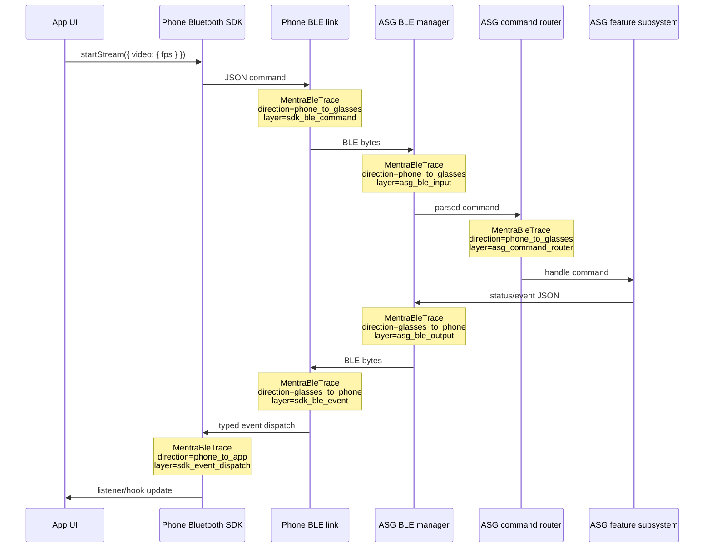

# Bluetooth SDK Subsystem Tracing

This document maps the Bluetooth SDK command path and the stable trace logs that can be used to inspect subsystem inputs and outputs without hardcoding individual BLE command names in `logcat`.

## Logcat

Use the same tag on the phone and on Mentra Live:

```bash
# Live trace, no command-name grep needed.
adb -s RFCX71TH0CR logcat -v time -s MentraBleTrace:V
adb -s 0123456789ABCDEF logcat -v time -s MentraBleTrace:V

# Recent buffered trace without clearing logcat.
adb -s RFCX71TH0CR logcat -d -T 5m -v time -s MentraBleTrace:V
adb -s 0123456789ABCDEF logcat -d -T 5m -v time -s MentraBleTrace:V
```

Each trace line is structured:

```text
BLE_TRACE direction=<direction> layer=<boundary> source=<caller> type=<json type> bytes=<bytes> payload=<sanitized json>
```

Sensitive fields such as passwords, tokens, auth fields, secrets, and emails are redacted. The `type` field is extracted from JSON payloads automatically, including standard JSON messages wrapped inside the Mentra Live `C` envelope.

## Runtime Subsystems



## BLE Command Path

```mermaid
flowchart LR
    App["Partner / MentraOS app\nReact Native or native UI"]
    SdkApi["Bluetooth SDK public API\nrequestPhoto, startStream, setMicState"]
    PhoneSdk["Phone SDK native runtime\nDeviceManager + SGC"]
    PhoneBle["Phone BLE wire\nMentraLive.sendJson / processJsonMessage"]
    AsgBle["ASG BLE manager\nBaseBluetoothManager"]
    AsgRouter["ASG command router\nCommandProcessor + handlers"]
    AsgFeature["ASG feature subsystems\ncamera, streaming, wifi, audio"]
    AsgOut["ASG response/event output\nMediaManager / CommunicationManager"]

    App -->|"API call"| SdkApi
    SdkApi -->|"typed request object"| PhoneSdk
    PhoneSdk -->|"JSON command"| PhoneBle
    PhoneBle -->|"BLE packet"| AsgBle
    AsgBle -->|"decoded JSON"| AsgRouter
    AsgRouter -->|"handler call"| AsgFeature
    AsgFeature -->|"status/event JSON"| AsgOut
    AsgOut -->|"BLE packet"| PhoneBle
    PhoneBle -->|"typed SDK event"| PhoneSdk
    PhoneSdk -->|"listener / hook update"| App
```



## Trace Boundaries



## Boundary Meanings

- `sdk_ble_command`: command JSON generated by the phone Bluetooth SDK before it is sent over BLE.
- `sdk_ble_event`: decoded event JSON received by the phone Bluetooth SDK from the glasses.
- `sdk_event_dispatch`: typed SDK event emitted to React Native/native app listeners.
- `asg_ble_input`: raw JSON-like BLE input received by ASG client from the phone.
- `asg_command_router`: parsed ASG command routed to a subsystem handler.
- `asg_ble_output`: JSON response/event emitted by ASG client back to the phone.
