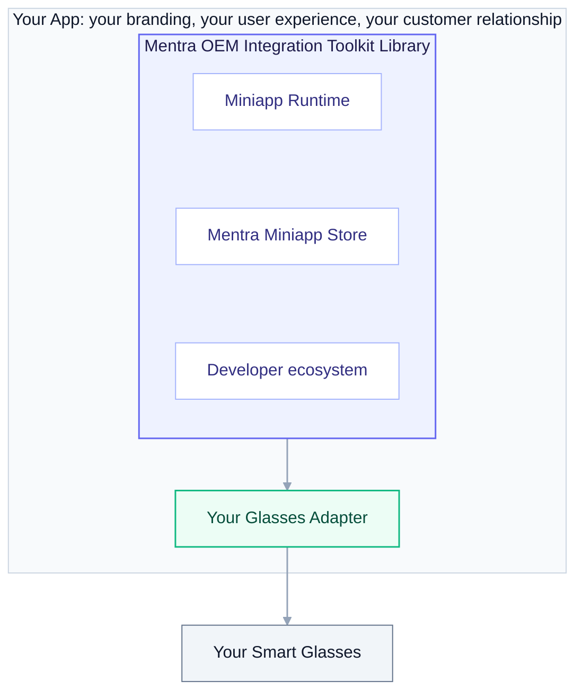

## What it is

The **Mentra OEM Integration Toolkit** is all of MentraOS's phone-side logic packaged as a library you embed in your **own** app. Your users stay in your app and on your brand, but they get the full MentraOS experience: the Mentra Miniapp Store, installable miniapps, and the same developer ecosystem that powers the Mentra app.

The toolkit owns everything between your glasses and Mentra's backend services:

- **Mentra Miniapp Store + runtime**: discover, install, and run miniapps on the phone.
- **Glasses I/O**: display rendering, microphone/audio routing, and the rest of the glasses feature set.
- **Backend connectivity**: talking to Mentra's backend services for the store, transcription, translation, streaming, and photos.

You bring two things: **your glasses** (and however you talk to them over Bluetooth) and **your app** (its shell, navigation, and branding).



## Integrating in four moves

### 1. Install the toolkit

Add the toolkit to your app, using the path that matches how your app is built:

- **React Native / Expo**: install the toolkit as a module.
- **Native (iOS / Android)**: embed the native libraries (iOS framework, Android library) directly.
- **Flutter**: embed the native libraries and bridge them into Flutter through platform channels.

### 2. Configure the toolkit

You give the toolkit a single configuration when your app boots. The toolkit manages its own settings internally. The only things you hand it are what's yours:

- **Your identity**: how your users are signed in (see [Backend connectivity](#3-connect-to-the-backend-services)).
- **Optional proxy**: if you route Mentra's backend services through your own infrastructure, you pass your proxy here (see below).

### 3. Connect to the backend services

The toolkit talks to two tiers of Mentra backend services:

- **Mentra Runtime Services.** The capabilities the toolkit relies on: speech-to-text, text-to-speech, translation, live streaming, and photo handling. Self-hostable and/or proxyable (run your own, route through your proxy, or both).
- **Mentra Cloud Core Services.** The Mentra Miniapp Store, the developer console, and the OEM APIs. Proxyable only (always Mentra-hosted, optionally reached through your proxy).

The toolkit also includes **on-device STT/TTS** as a fallback for offline or degraded-network scenarios. Cloud STT/TTS is the recommended path for production quality; on-device is the safety net.

**Identity.** Your users sign in through *your* identity system. They never create a Mentra account. The toolkit exchanges your app's signed-in identity for a Mentra-scoped session, so your users see only your login.

**Routing through your proxy.** You don't stand up a separate proxy service. When you configure the toolkit, you give it your proxy details and it routes all backend traffic through your infrastructure. Without a proxy, the toolkit talks to the backend services directly.

### 4. Register your glasses

This is the part that's specific to your hardware. The good news: **the only thing you have to write is a small Bluetooth driver for your glasses.** Everything else (display, microphone, dashboard, app menu, and the rest of the smart-glasses features) the toolkit provides on top of that driver, for free. You override a feature only if your glasses do it differently.

There are three pieces, and most OEMs only write the first two:

1. **Describe your glasses** (capabilities): what hardware they have.
2. **Write the Bluetooth driver**: how to find, connect to, and exchange data with your glasses.
3. **Get the features for free**: the toolkit builds display, audio, dashboard, etc. on top of your driver. Override any feature your glasses handle differently.

The toolkit then treats your glasses as a first-class device, exactly like the glasses Mentra ships.

The example below is the common OEM shape today (think Even Realities G2): a monochrome text display, a microphone, a capacitive touchpad, and an IMU, no camera.

#### 1. Describe your glasses

A plain object listing what your hardware has. The toolkit uses it to decide which miniapps are compatible and which features to drive. Anything your glasses don't have is `null`.

```ts
const capabilities: Capabilities = {
  modelName: "Acme Vision One",

  display: {
    ocularity: "binocular",   // "monocular" | "binocular"
    isColor: false,
    color: "green",
    canDisplayBitmap: true,
    resolution: {width: 640, height: 200},
    maxTextLines: 5,
    adjustBrightness: true,
  },

  microphone: {count: 1, hasVAD: false},

  input: {
    surfaces: [{kind: "touchpad"}, {kind: "button"}],
    events: ["tap", "double_tap", "triple_tap", "long_press", "swipe_up", "swipe_down"],
  },

  imu: {hasAccelerometer: true, hasGyroscope: true, hasCompass: true},

  power: {hasExternalBattery: false},

  // A capability the device doesn't have is null.
  camera: null,
  speaker: null,
  light: null,
  wifi: null,
}
```

#### 2. Write the Bluetooth driver

This is the only code you must write. It's a small interface that knows how to find your glasses, connect, and move data to and from them over your own BLE link. `sendMessage` is the workhorse: the toolkit hands it a structured message, and your driver serializes it to your glasses' own protocol (protobuf on today's glasses) and writes it out. Every feature is built on top of `sendMessage`.

```ts
const acmeBle: GlassesBLEAdapter = {
  scan()              { /* discover nearby glasses; resolve the list */ },
  connect(device)     { /* connect to one */ },
  disconnect()        { /* disconnect */ },
  forget()            { /* unpair / clear the bond */ },

  sendBytes(bytes)    { /* raw write to the glasses */ },
  sendMessage(message) { /* serialize a structured message to your protocol, then sendBytes */ },
  onMessage(cb)       { /* receive + decode messages from the glasses */ },
}
```

#### 3. Get the features for free

Hand your driver and capabilities to the toolkit. That's it. The toolkit gives you the full smart-glasses feature set, each method built on top of your driver's `sendMessage`:

```ts
const acmeAdapter = new GlassesAdapter(acmeBle, {capabilities})

toolkit.registerGlassesAdapter(acmeAdapter)
```

You now have, with no extra code:

```ts
// Display
acmeAdapter.displayText(text)
acmeAdapter.displayBitmap(bmp)
acmeAdapter.clearDisplay()
acmeAdapter.setBrightness(level)
acmeAdapter.setHeadUpAngle(deg)

// Dashboard — a firmware-rendered overlay; the toolkit feeds it data
acmeAdapter.showDashboard()
acmeAdapter.setTime(epochMs)
acmeAdapter.setWeather(weather)
acmeAdapter.setCalendarEvents(events)

// On-glasses app menu — the user launches a miniapp from the glasses
acmeAdapter.setAppMenu(apps)
acmeAdapter.onAppMenuSelect(cb)

// Notifications — on Android the toolkit captures and sends them; on iOS the
// glasses pull them directly over ANCS, so this isn't used there
acmeAdapter.pushNotification(notif)

// Microphone, input, IMU
acmeAdapter.setMicEnabled(on)
acmeAdapter.onInputEvent(cb)   // taps, swipes, presses
acmeAdapter.setImuEnabled(on)
acmeAdapter.onImuData(cb)
```

**Override only what differs.** If a feature works differently on your hardware, replace that one method; everything else keeps the default. Drop to `sendBytes` when you need to emit your own encoding:

```ts
acmeAdapter.setAppMenu = (apps) => acmeBle.sendBytes(myAppMenuEncoding(apps))
```

That's the whole integration. The toolkit handles everything above it: which miniapps run, how their content is laid out for your screen, routing your mic audio to speech-to-text.

Your code lives **in your app**: your Bluetooth protocol, your firmware, your transport stay private to you. You never submit glasses code to Mentra, and you never wait on a Mentra release to ship a hardware change.

## Why this works

- **Your hardware, no fork.** Implement the BLE transport, get the feature layer for free, override only what differs. Add or change a model entirely within your app.
- **Your app, your brand.** Users never leave your app or see a Mentra account. The toolkit is a library inside your experience, not a separate app.
- **One shared ecosystem.** Every OEM's users and developers live in the same MentraOS ecosystem. That's what makes the Mentra Miniapp Store worth being part of.
- **You decide what you host.** Use Mentra's backend services as-is or route them all through your own proxy.

## Availability

The Mentra OEM Integration Toolkit releases **July 30, 2026**. To start an integration, reach out to [help@mentra.glass](mailto:help@mentra.glass).
