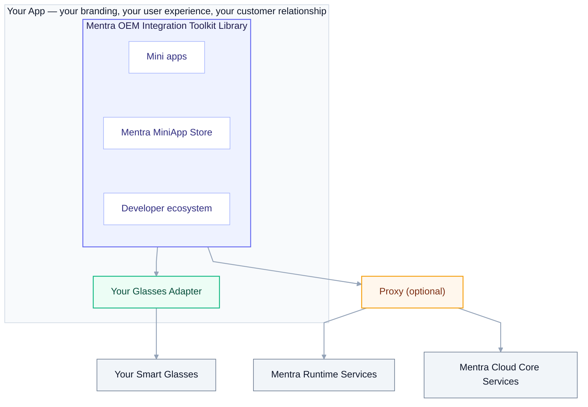

## What it is

The **Mentra OEM Integration Toolkit** is all of MentraOS's phone-side logic packaged as a library you embed in your **own** app. Your users stay in your app and on your brand, but they get the full MentraOS experience: the Mentra MiniApp Store, installable mini apps, and the same developer ecosystem that powers the Mentra app.

The toolkit owns everything between your glasses and Mentra's backend services:

- **Mentra MiniApp Store + runtime** — discover, install, and run mini apps on the phone.
- **Glasses I/O** — display rendering, microphone/audio routing, and the rest of the glasses feature set.
- **Backend connectivity** — talking to Mentra's backend services for the store, transcription, translation, streaming, and photos.

You bring two things: **your glasses** (and however you talk to them over Bluetooth) and **your app** (its shell, navigation, and branding).



## How you integrate it, depending on how your app is built

- **React Native / Expo** — install the toolkit as a module.
- **Native (iOS / Android)** — embed the native libraries (iOS framework, Android library) directly.
- **Flutter** — embed the native libraries and bridge them into Flutter through platform channels.

## Integrating in four moves

### 1. Install the toolkit

Add the toolkit to your app, using the path that matches how your app is built (above).

### 2. Configure the toolkit

You give the toolkit a single configuration when your app boots. This is where you hand it:

- **Your identity** — how your users are signed in (see [Backend connectivity](#3-connect-to-the-backend-services)).
- **Your settings store** — so the toolkit reads and writes its settings through your app's own settings store.
- **Optional proxy** — if you route Mentra's backend services through your own infrastructure, you pass your proxy here (see below).

### 3. Connect to the backend services

The toolkit talks to two tiers of Mentra backend services:

- **Mentra Runtime Services** — the capabilities the toolkit relies on: speech-to-text, text-to-speech, translation, live streaming, and photo handling. **Self-hostable and/or proxyable** — you can run your own, route through your proxy, or both.
- **Mentra Cloud Core Services** — the Mentra MiniApp Store, the developer console, and the OEM APIs. **Proxyable only** — always Mentra-hosted, optionally reached through your proxy.

The toolkit also includes **on-device STT/TTS** as a fallback for offline or degraded-network scenarios. Cloud STT/TTS is the recommended path for production quality; on-device is the safety net.

**Identity.** Your users sign in through *your* identity system — they never create a Mentra account. The toolkit exchanges your app's signed-in identity for a Mentra-scoped session, so your users see only your login.

**Routing through your proxy.** You don't stand up a separate proxy service. When you configure the toolkit, you give it your proxy details and it routes backend traffic through your infrastructure. Per service, traffic either reaches Mentra's hosted version (for anything you don't host yourself, like Cloud Core) or your own deployment (for Runtime Services you choose to self-host). Without a proxy, the toolkit talks to Mentra's backend services directly.

### 4. Register your glasses

The toolkit talks to glasses through a **Glasses Adapter** — a contract that describes one model of glasses. You implement an adapter for your hardware, in your own app, against your own Bluetooth stack, and register it at startup. The toolkit then treats your glasses as a first-class device, exactly like the glasses Mentra ships.

Your adapter declares two things:

- **Capabilities** — what your glasses have: a display (and its resolution, color, brightness range), a microphone, buttons, an LED, and so on. The toolkit uses this to decide which mini apps are compatible and which features to drive. You only declare — and only implement — what your hardware actually has.
- **Behavior** — how to do each thing on your hardware: connect and disconnect, show text or a bitmap on the display, enable the microphone and stream audio up, set brightness. Each maps to a method you implement over your own BLE link.

```
Your Glasses Adapter
├── Identity        model name, capabilities, display profile
├── Connection      scan · connect · disconnect
├── Display         show text · show bitmap · clear · brightness   (if you have a display)
├── Microphone      enable/disable · stream audio up               (if you have a mic)
└── Buttons / LED   button & touch events · LED control            (optional)
```

**Example — a monocular display + mic device (no camera).** Most OEM glasses today are display-and-mic devices: a single monochrome text display and a microphone, no camera. Below is roughly what the adapter for such a device looks like.

**Declare your capabilities.** This is the same capability shape the toolkit already uses for every device it supports — you fill it in for your hardware. A display-and-mic device declares a display and a microphone, and leaves camera, speaker, buttons, and lights out:

```ts
const capabilities: Capabilities = {
  modelName: "Acme Vision One",

  hasCamera: false,
  camera: null,

  hasDisplay: true,
  display: {
    count: 1,
    isColor: false,
    color: "green",
    canDisplayBitmap: true,
    resolution: {width: 640, height: 200},
    maxTextLines: 5,
    adjustBrightness: true,
  },

  hasMicrophone: true,
  microphone: {count: 1, hasVAD: false},

  hasSpeaker: false,  speaker: null,
  hasButton: false,   button: null,
  hasLight: false,    light: null,
  hasWifi: false,
  power: {hasExternalBattery: false},
}
```

**Implement the behavior.** Each method drives your hardware over your own BLE link. You implement only what your capabilities declared — the toolkit never calls `displayBitmap` on a device with no display, or the mic methods on one with no microphone:

```ts
const acmeAdapter: GlassesAdapter = {
  model: "Acme Vision One",
  capabilities,
  displayProfile: acmeDisplayProfile,   // how your screen renders text (size, monochrome)

  // Connection
  async connect(device)    { /* your BLE connect */ },
  async disconnect()       { /* your BLE disconnect */ },
  onStatusChange(cb)       { /* report connected / battery / etc. */ return unsubscribe },

  // Display
  async displayText(text)  { /* push text to the glasses */ },
  async displayBitmap(bmp) { /* push a bitmap */ },
  async clearDisplay()     { /* clear the screen */ },
  async setBrightness(n)   { /* set brightness */ },

  // Microphone
  async setMicEnabled(on)  { /* turn the mic on/off */ },
  onAudio(cb)              { /* stream mic audio up to the toolkit */ return unsubscribe },
}

registerGlassesAdapter(acmeAdapter)
```

That's the whole integration. The toolkit handles everything above it — which mini apps can run, how their content is laid out for your screen, routing your mic audio to speech-to-text.

Your adapter lives **in your app**: your Bluetooth protocol, your firmware, your transport all stay private to you. You never submit glasses code to Mentra, and you never wait on a Mentra release to ship a hardware change.

The display engine is built in. You describe your display once (resolution, monochrome) and the toolkit lays out mini app content to fit it.

## What you bring vs. what the toolkit provides

| You bring | The toolkit provides |
| --- | --- |
| Your glasses + your Bluetooth stack | The Mentra MiniApp Store and on-device runtime |
| Your app shell, UI, and branding | Display rendering, audio/mic routing, and other glasses I/O your hardware supports |
| Your users' identity / sign-in | Backend connectivity (Runtime Services + Cloud Core) |
| A Glasses Adapter declaring your hardware | Compatibility, lifecycle, and event handling |
| (Optional) your proxy / self-hosted services | The whole MentraOS developer ecosystem |

## Why this works

- **Your hardware, no fork.** The Glasses Adapter is your private extension point — add or change a model entirely within your app.
- **Your app, your brand.** Users never leave your app or see a Mentra account. The toolkit is a library inside your experience, not a separate app.
- **One shared ecosystem.** Every OEM's users and developers live in the same MentraOS ecosystem — that's what makes the Mentra MiniApp Store worth being part of.
- **You decide what you host.** Use Mentra's backend services as-is or route them through your own proxy — per service, your choice.

## Availability

The OEM Integration Toolkit ships as a private package. We onboard integration partners directly — reach out to [help@mentra.glass](mailto:help@mentra.glass) to start, and we'll walk your team through the toolkit, the Glasses Adapter contract for your hardware, and the backend setup for your deployment.
