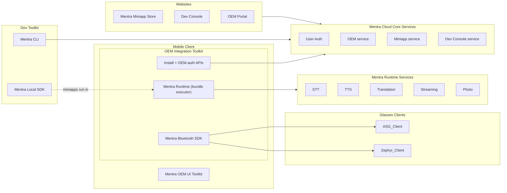

# Contributing To MentraOS

Thank you for your interest in contributing to MentraOS! This page orients you to the architecture and points you to the deeper guides. For the development workflow (branching, PRs, setup), see [`CONTRIBUTING.md`](https://github.com/Mentra-Community/MentraOS/blob/main/CONTRIBUTING.md) in the repo root.

## What MentraOS is

MentraOS is an open-source operating system, app store, and development framework for smart glasses. The pieces:

- **Smart glasses** connect to the user's phone over Bluetooth.
- **The Mentra App** (the phone app) runs the glasses, the miniapp runtime, and the connection to Mentra's cloud.
- **Miniapps** are the third-party apps users install. They run **on the phone**, inside the Mentra App's runtime.
- **Mentra's cloud** provides the shared store and developer ecosystem, plus the services the runtime relies on (transcription, translation, streaming, photos).

## Components

### The Mentra App (`mobile/`)

The phone app, built with React Native and Expo. It manages glasses, runs miniapps on-device, drives the display and audio, and talks to Mentra's cloud. Native code lives in `mobile/modules/core/android` and `mobile/ios` (iOS is generated by Expo prebuild). See the [Mentra App Guidelines](/os-devs/contributing/mentraos-manager-guidelines).

Key native modules under `mobile/modules/`:

- **`bluetooth-sdk`**: the BLE/native layer that talks to the glasses.
- **`island`** / **`mentrajs-runtime`**: the on-device miniapp runtime.
- **`miniapp`**: the miniapp SDK surface.

### Cloud (`cloud/`)

The backend, written in TypeScript (Bun). Two tiers:

- **Cloud Core Services**: the shared, Mentra-hosted product: the Mentra Miniapp Store, the Developer Console, accounts, and bundle storage.
- **Runtime Services**: the services the on-device runtime relies on: speech-to-text, text-to-speech, translation, streaming, and photo handling.

The SDK and shared packages live in `cloud/packages/` (`sdk`, `types`, `react-sdk`, `cli`, and more); web apps live in `cloud/websites/` (`store`, `console`, `account`).

### Glasses clients

The code that runs **on** the glasses:

- **ASG Client (`asg_client/`)**: runs on Android-based smart glasses like Mentra Live. It bridges the glasses' hardware (camera, display, mic, Bluetooth, networking) to the MentraOS ecosystem. It's thoroughly documented on its own. Start at the **[ASG Client docs](/os-devs/asg-client/README)** and the [`asg_client` README](https://github.com/Mentra-Community/MentraOS/blob/main/asg_client/README.md). See also the [ASG Client Guidelines](/os-devs/contributing/mentraos-asg-client-guidelines).

### Miniapps

Third-party apps built with the Mentra SDK and run on-device by the runtime. To build one, see the [App Devs](/app-devs/getting-started/overview) docs. To add support for a new pair of glasses, see [Add New Glasses Support](/os-devs/contributing/add-new-glasses-support).

## Contribution workflow

Branching, PR targets, and environment setup are covered in [`CONTRIBUTING.md`](https://github.com/Mentra-Community/MentraOS/blob/main/CONTRIBUTING.md). In short: branch from `dev`, open PRs against `dev`, and don't commit directly to `main`.

Per-component coding standards:

- **[Mentra App Guidelines](/os-devs/contributing/mentraos-manager-guidelines)**: React Native / Expo mobile app.
- **[ASG Client Guidelines](/os-devs/contributing/mentraos-asg-client-guidelines)**: Android smart glasses client.

## Where to start

- **Glasses support**: add a new device.
- **Display rendering**: improve layout and components.
- **SDK**: improve the miniapp developer experience.
- **Docs & tests**: always welcome.

Join the [Discord community](https://mentra.glass/discord), report issues on GitHub, and discuss major changes in advance.

## License

Contributions are licensed under the project's [MIT License](https://github.com/Mentra-Community/MentraOS/blob/main/LICENSE).
