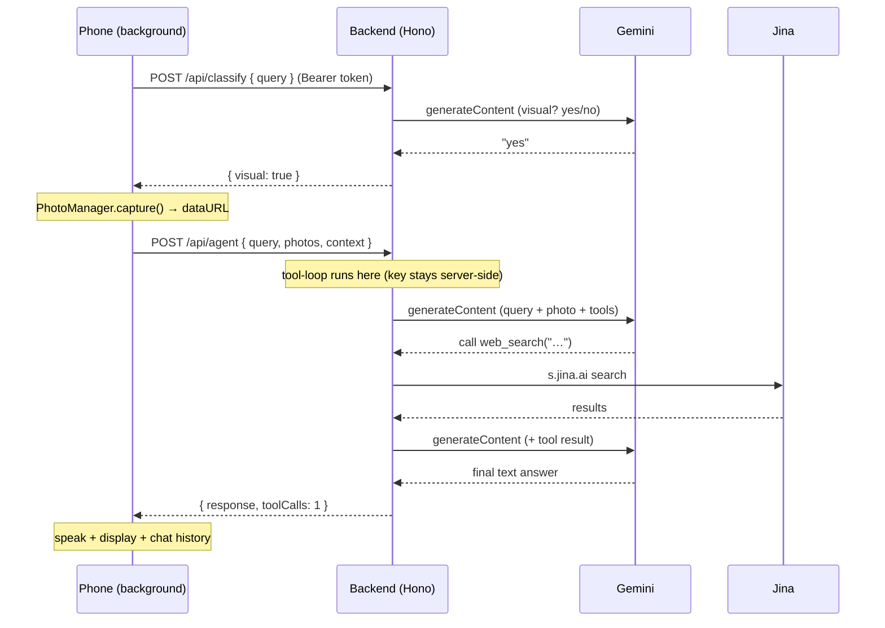

# Mentra AI (local) — Backend + Auth Architecture Plan

> Goal: bring the **best practices from `miniapps/merge`** into **`miniapps/mentra-ai-local`** —
> specifically a **server-side backend** that holds the AI secrets and a **real `@mentra/auth`
> token flow** — *without* throwing away mentra-ai-local's richer feature set (managers, agent
> tool-loop, vision, chat UI).
>
> This document is the **plan only**. No feature code is rewritten here. It defines the target
> structure, the request flow, and the exact seams we touch.

---

## 1. Why change anything?

Today `mentra-ai-local` ships the Gemini + Jina API keys **inside the JS bundle**
(`MENTRA_PUBLIC_*`, inlined by `build.ts`). The code itself flags this:

> ⚠️ Anything inlined here ships inside the JS bundle and is extractable.
> Fine for local/dev. Before production, move these behind a backend proxy.
> — `.env.example`, `lib/ai-config.ts`

`merge` already solves exactly this:

| Concern              | `merge` (good)                                              | `mentra-ai-local` (today)                     |
| -------------------- | ---------------------------------------------------------- | --------------------------------------------- |
| AI secrets           | Server-side only, in `backend/`                             | Baked into the shipped bundle                 |
| Auth                 | `@mentra/auth` JWKS, package-scoped Bearer, `aud` enforced | `localAuth.ts` shim (always-authenticated)    |
| Network call         | `session.auth.fetch(backendUrl/...)`                       | `fetch(googleapis.com?key=...)` direct        |
| Backend boot         | `createApp()` → `Bun.serve` → SIGTERM/SIGINT → `/healthz`  | none                                          |
| Secret management    | Doppler (`local-merge` project) + layered dev scripts      | `.env` only                                   |
| Service layer        | `services/insights/insights.service.ts` + typed errors     | inline `fetch` in agent/classifier/tools      |

We adopt merge's left column for mentra-ai-local.

---

## 2. Target directory structure

Mirror merge's split: a `backend/` peer and a `miniapp/` peer under the app root.
The existing `src/` becomes `miniapp/src/` essentially unchanged.

```
miniapps/mentra-ai-local/
├── .env.example                 # rewritten: backend secrets (no MENTRA_PUBLIC_ keys) + public backend URL
├── package.json                 # rewritten: merge-style dev/backend/miniapp scripts
│
├── backend/                     # NEW — Hono server, holds Gemini + Jina secrets
│   ├── README.md
│   └── src/
│       ├── index.ts             # startMentraAiBackend(): createApp → Bun.serve → SIGTERM/SIGINT
│       ├── api/
│       │   ├── app.ts           # createApp(): cors + /healthz + route mounts
│       │   ├── agent.api.ts     # POST /api/agent      (auth) → agentService
│       │   ├── classify.api.ts  # POST /api/classify   (auth) → classifyService
│       │   └── search.api.ts    # POST /api/search     (auth) → searchService (Jina)
│       └── services/
│           ├── agent/agent.service.ts        # Gemini generateContent + tool loop (moved server-side)
│           ├── classify/classify.service.ts  # visual-query yes/no
│           └── search/search.service.ts      # Jina web search
│
└── miniapp/                      # was ./ — the bundle (background JSContext + webview)
    ├── build.ts                 # MENTRA_PUBLIC_* now only carries the BACKEND URL, no keys
    ├── miniapp.json
    ├── tsconfig.json
    └── src/                     # ← today's src/ moved here, mostly untouched
        ├── background/
        │   ├── index.ts
        │   ├── MentraAIController.ts
        │   ├── managers/...                  # unchanged
        │   ├── agent/
        │   │   ├── MentraAgent.ts            # now calls backend /api/agent  (was direct Gemini)
        │   │   ├── visual-classifier.ts      # now calls backend /api/classify
        │   │   ├── prompt.ts                 # stays (prompt building can live client- or server-side)
        │   │   └── tools/index.ts            # web_search now calls backend /api/search
        │   └── lib/
        │       └── ai-config.ts              # becomes the BACKEND-URL config (the documented swap-point)
        ├── shared/
        └── ui/...                            # unchanged
```

> Note: moving `src/ → miniapp/src/` is the only large mechanical change. Everything else is
> additive (new `backend/`) or a small edit at the three AI-call seams.

---

## 3. The seam — only three call-sites move

mentra-ai-local makes outbound AI calls in **exactly three places**. Each currently reads a
bundled key and hits a third-party API. Each gets redirected at the backend, with the key
removed from the client.

| # | File (in miniapp)                  | Today                                            | After                                                   |
| - | ---------------------------------- | ------------------------------------------------ | ------------------------------------------------------- |
| 1 | `agent/MentraAgent.ts`             | `fetch(generativelanguage…:generateContent?key)` | `session.auth.fetch(BACKEND/api/agent)`                 |
| 2 | `agent/visual-classifier.ts`       | `fetch(generativelanguage…?key)`                 | `session.auth.fetch(BACKEND/api/classify)`              |
| 3 | `agent/tools/index.ts` (webSearch) | `fetch(s.jina.ai, Bearer JINA_KEY)`              | `session.auth.fetch(BACKEND/api/search)`                |

The Gemini tool-loop itself (currently in `MentraAgent.ts`) moves **server-side** into
`agent.service.ts`, because the loop needs the Gemini key. The client sends `{query, photos,
context}` and gets back `{response, toolCalls}` — the same `GenerateResult` shape it returns
today, so `QueryProcessor` and every manager are untouched.

`lib/ai-config.ts` stops exporting keys and instead exports the resolved backend URL — this is
the single swap-point the file's own header already promised.

---

## 4. Request flow (the part you wanted drawn out)

### 4a. High-level: who talks to whom

```
┌──────────────────────────── PHONE (one user) ────────────────────────────┐
│                                                                           │
│   Glasses mic ──audio──▶  MentraOS host                                   │
│                              │                                            │
│                              ▼                                            │
│        ┌─────────── miniapp background JSContext ───────────┐            │
│        │  TranscriptionManager → wake word → QueryProcessor  │            │
│        │            │                                        │            │
│        │            ├─ visual-classifier ─┐                  │            │
│        │            ├─ MentraAgent ───────┤ session.auth.fetch│           │
│        │            └─ tools/web_search ──┘   (Bearer token)  │           │
│        └──────────────────────│──────────────────────────────┘            │
└───────────────────────────────│──────────────────────────────────────────┘
                                 │  HTTPS + miniapp Bearer token
                                 ▼
        ┌──────────────────── BACKEND (Hono, Bun.serve) ───────────────────┐
        │  @mentra/auth: verify JWKS, enforce aud = PACKAGE_NAME           │
        │     /api/agent     → agent.service     ─┐                        │
        │     /api/classify  → classify.service  ─┼─ holds GEMINI_API_KEY  │
        │     /api/search    → search.service    ─┘   + JINA_API_KEY       │
        │     /healthz                                                     │
        └─────────────────────────────│───────────────────────────────────┘
                                       ▼
                        Gemini generateContent  /  Jina s.jina.ai
                          (secrets never leave the backend)
```

### 4b. End-to-end: one spoken query

```
User speaks  "what's this and is it on sale?"  (looking at a product)
   │
   ▼  glasses → host → background
TranscriptionManager  ── wake word + silence-finalize ──▶  QueryProcessor.processQuery()
   │
   ├─(1)─▶ isVisualQuery(query)
   │         └─ session.auth.fetch( BACKEND /api/classify )  ──▶  classify.service → Gemini
   │              ◀── { visual: true }
   │
   ├─ visual ⇒ PhotoManager.capture()  → dataURL photo
   │
   └─(2)─▶ generateResponse({ query, photos, context })
             └─ session.auth.fetch( BACKEND /api/agent )     ──▶  agent.service
                                                                   │  Gemini tool-loop:
                                                                   │   model wants web_search?
                                                                   │     └─(3) search.service → Jina
                                                                   │   feed tool result back to Gemini
                                                                   ▼
             ◀── { response: "It's a …, $39 — currently 20% off", toolCalls: 1 }
   │
   ├─ AudioManager / session.speaker.speak(response)
   ├─ DisplayManager.showTextWall(response)
   └─ ChatHistoryManager.add(turn) → ui.send("chat:event", …) → webview
```

> The whole tool-loop runs **inside `agent.service` on the backend** (Option A, §6). That keeps
> the Gemini key entirely server-side and means the client makes **one** `/api/agent` round-trip
> per query instead of N.

The same flow as a **sequence diagram** (Option A — all AI compute on the backend):



### 4c. Auth handshake (per request)

```
mobile host  ──cloudClient.auth.getMiniappToken(packageName)──▶  Cloud Core
   ◀── package-scoped JWT (aud = com.mentra.<app>, iss ∈ MENTRA_AUTH_ISSUERS)
   │
background  session.auth.fetch(url)  attaches  Authorization: Bearer <JWT>
   │
backend  createMentraAuth({ packageName }).hono()  middleware:
   ├─ fetch JWKS (MENTRA_AUTH_JWKS_URL), verify signature
   ├─ enforce aud === PACKAGE_NAME, iss ∈ issuers
   └─ set c.var.mentraAuth = { mentraUserId }   → handlers read userId from token, not body
```

This is exactly merge's `insights.api.ts` pattern (`createMentraAuth`, `mentraAuth.hono()`,
`c.get("mentraAuth")`), reused verbatim for our three routes.

---

## 5. Config / scripts / secrets (adopted from merge)

- **`.env.example`** rewritten:
  - backend-only: `GEMINI_API_KEY`, `GOOGLE_GENERATIVE_AI_API_KEY`, `JINA_API_KEY`, `LLM_MODEL`,
    `PORT` (default e.g. `3131`), `MENTRA_AUTH_JWKS_URL`, `MENTRA_AUTH_ISSUERS`, `PACKAGE_NAME`.
  - public (inlined into bundle): **only** `MENTRA_PUBLIC_MENTRA_AI_BACKEND_URL`. No keys.
- **`package.json`** scripts mirror merge: `dev` (doppler), `dev:local` (backend + miniapp
  together), `backend:dev`, `miniapp:dev`, `build`, `pack`. Doppler project name TBD
  (e.g. `mentra-ai-local`).
- **`backend/README.md`**: localhost port, `adb reverse tcp:<port> tcp:<port>` for USB, JWKS
  override for local Core, web-search toggle — same shape as merge's README.
- **`build.ts`** keeps inlining `MENTRA_PUBLIC_*` but now that set contains only the backend URL.

---

## 6. Design decision — RESOLVED: Option A (whole agent server-side)

**Where does the Gemini tool-loop run? → On the backend (cloud).**

The entire multi-step tool-loop (Gemini + Jina) runs **inside `agent.service` on the backend**.
The client calls `/api/agent` **once** with `{query, photos, context}` and gets back the final
`{response, toolCalls}`. The Gemini key and Jina key never leave the backend, and prompt
building moves server-side. This is merge's architecture — the backend genuinely owns the AI.

*Cost accepted:* photos (data URLs) are uploaded to the backend on each visual query.

<details><summary>Rejected alternative — Option B (thin proxy, loop on phone)</summary>

Keep the tool-loop in `MentraAgent.ts` on the client; expose `/api/gemini` + `/api/search` as
authenticated passthroughs. Smaller diff, but the client drives N round-trips per query and the
backend is just a key-hider. Not chosen.
</details>

---

## 7. Proposed execution order (once direction is approved)

1. Scaffold `backend/` (app.ts, index.ts, `/healthz`) — boots, returns ok, no logic yet.
2. Move `src/ → miniapp/src/`; update `tsconfig`, `build.ts`, `miniapp.json` paths.
3. Rewrite `package.json` + `.env.example` to merge-style scripts/secrets.
4. Port the three services into `backend/src/services/*` (agent loop, classify, search).
5. Add `@mentra/auth` middleware to the three routes.
6. Repoint the three client seams at `session.auth.fetch(BACKEND/...)`; gut keys from
   `ai-config.ts`, leaving it as the backend-URL swap-point.
7. `bun run build` (miniapp) + `bun run backend:dev`; smoke-test classify → agent → search.

Each step is independently reviewable; nothing in `managers/`, `ui/`, or `shared/` changes.
```
