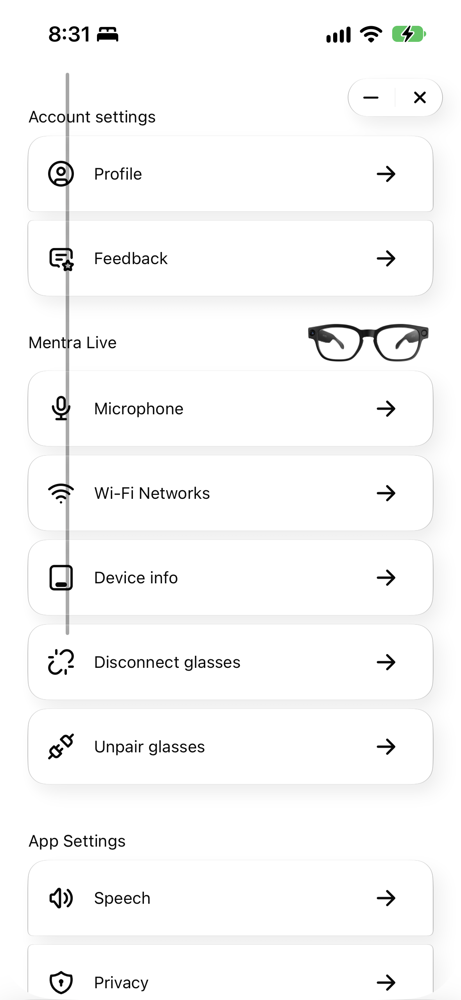
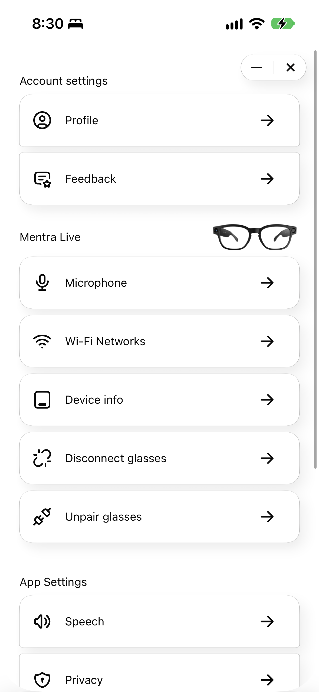

# OS-1983 Settings scrollbar evidence

The native vertical scroll indicator crosses the Settings row icons on an iPhone 15 running iOS 27.0 (24A437). Disabling `automaticallyAdjustsScrollIndicatorInsets` on the main Settings scroll view keeps the indicator at the right edge. Content inset adjustment and scrolling remain enabled.

| Before                                                          | After                                                  |
| --------------------------------------------------------------- | ------------------------------------------------------ |
|  |  |

Both PNGs are unedited 1179 × 2556 device screenshots captured with `xcrun devicectl device capture screenshot` while scrolling. The phone retained the same account, paired glasses, and settings.

- Baseline source: `80cdc739be976e2f9008ecabfb54c65c4d1fc32f`.
- Fixed source: `d464cb3e8f84903c9d4ebe854020b8a013fdefec`.
- Both Release archives were built and installed on this Mac with `cd mobile && bun ios:mac`.
- On the phone, the original installed app reproduced the issue. The changed build placed the indicator correctly. Reinstalling the archived baseline reproduced the misplaced indicator again; reinstalling the changed build restored the correct placement. Scrolling in both directions and returning from a settings subpage were checked.
- On the Mac, both builds passed the same seven-step native accessibility replay: open Settings, scroll down, visit Privacy, return, scroll up, close, and reopen. Both reports passed the independent screenshot/video/frame-liveness checks. Mobile TypeScript and formatting checks passed; focused ESLint reported no errors and one existing inline-style warning.
- The changed build was left installed on the phone, with Settings open.

## Physical-device build prerequisite

The inherited app uses the pre-UIScene application lifecycle. A binary linked against SDK 27 aborts on this iOS 27 device in `UIApplicationEvaluateRuntimeIssueForNoSceneLifecycleAdoption` before React renders. For this local A/B check, **both** archived app copies received the same test-only adjustment: `vtool -set-build-version ios 15.5 26.0 -replace` on their main executable, followed by signing with the original Apple Development identity and entitlements. JavaScript SHA-256 hashes were checked against the original `ios:mac` manifests and remained unchanged. The original archives were preserved.

This compatibility metadata adjustment is not a source change or part of the PR. These screenshots validate the scrollbar fix on iOS 27 under the existing app lifecycle; they do not qualify an SDK 27 app-lifecycle migration. Firmware OTA was disabled in both local test builds.
