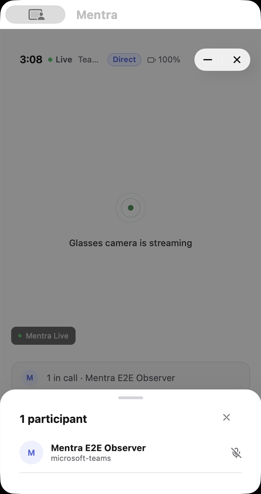

# Restore Mentra Call on iOS and qualify a real Teams call

Branch: `codex/enable-mentra-call-ios`, based on dev `c06ccbea30fd961a90253a1f3f46dbe68e77e2e6`. Keep the recorded harness on `codex/mentra-e2e-harness`; integrate this branch there for local Mac testing. Call's external source is `Mentra-Community/Mentra-Call` main, at published `6ab859d499321e7bc394f3113db8e024649e7faa`; local main adds `92149df` (2.1.14; publication currently lacks write access).

The user requested iOS enablement and fixes, will provide Mentra Live glasses for pairing, and authorized opening the resulting Teams link in a browser to verify the remote participant's experience. Reported failure: the CTO completed the pre-join checklist but joining still failed. No report ID or exact error is available yet; reproduce the failing stage and retain its underlying error. The user confirmed USB `ML396102B` and Bluetooth suffix `03BE`; Bluetooth audio and app pairing are now complete. This supersedes the earlier local-Mac-only visibility allowance.

- [x] Create an isolated branch from dev.
- [x] Inspect existing native ACS, media and hotspot paths. Both WHEP and local WHIP exist on iOS; do not rely on the superseded structural-impossibility spike.
- [x] Restore Call install/catalog visibility and migrate the policy-forced hidden flag once. Preserve subsequent user hiding and China restrictions.
- [x] Run focused migration/policy tests and existing Swift media/audio suites; build and install the integrated local iOS-on-Mac app.
- [x] Identify and pair the user's Mentra Live through the real app; record build/firmware/transport identity.
- [x] Inspect Call's native accessibility surface after first-launch permissions.
- [ ] Compile and record the English Call routine: home/settings, joining/creating, link retrieval, browser participant, media observation, mute, leave and cleanup.
- [ ] Reproduce reported iOS failures and fix the shared state/media path. Update Call main/version/ZIP only if its source needs changes.
- [ ] Verify a controlled Teams meeting from the browser: live changing glasses video and audio delivery, consistent participant/call state, mute behavior and cleanup. Mere local CONNECTED state is insufficient.
- [ ] Retain failures and qualify deterministic repeatability. Document Mac Mini setup and which checks require a physical iPhone.
- [ ] Publish the separate iOS PR with actual validation and outstanding hardware gates.

The selected qualification path is Direct link: original glasses `Mentra_Live_03BE` → glasses Wi-Fi hotspot → Mac → Teams, with Ethernet carrying the Mac's internet. The wired connection is verified; the first attempt failed at hotspot association, as recorded below. Verify a wired default route before each attempt; otherwise the Mac could lose its current Wi-Fi internet. Direct link is the default for the bundled ACS Teams build, and cloud relay is a manually selected alternative, not an automatic fallback. Do not infer iPhone SoftAP results from a Mac call or change transports to manufacture a pass.

The native network check now recognizes a satisfied Ethernet or cellular route and reports which it found. Wi-Fi alone is accepted only after hotspot release and when its SSID differs from the glasses network. A satisfied path is routing evidence, not proof that Teams is reachable. The ACS join treats an unvalidated route as advisory and still attempts the join; the earlier description of this check as a mandatory cellular gate was too strong. The separate general-purpose hotspot relay does require the check to succeed. Actual Mac hotspot/media qualification remains pending.

## Current evidence

- The user supplied USB target `ML396102B` and Bluetooth suffix `03BE`. ADB reports model Mentra Live and ASG `3.2.0-dev.206-camera-failure-dev` (`versionCode=100000206`); Wi-Fi is already associated with Mentra. No firmware or network configuration was changed.
- macOS inquiry found exact name `Mentra_Live_03BE`, address `CC:E7:DE:E0:03:BE`. This is the user's confirmed pair; `Mentra_Live_023B` is a different saved device and must not be used.
- The app's semantic scan/selection reached Pair Audio, which explicitly names `Mentra_Live_03BE`. This early run stopped before pairing completed; the subsequent native fix and successful run are recorded below. Android's own Bluetooth is off because the audio/BLE connection belongs to the glasses' separate Bluetooth subsystem; do not enable Android Bluetooth to work around this.
- Installed `blueutil` 2.14.0 from Homebrew for reproducible setup without mouse input. The old saved Mac bond failed to connect; refreshing only this target removed that bond, but fresh pairing returned `0x02 (No Connection)`. Subsequent inquiry did not find 03BE. The user subsequently entered pairing mode. Fresh bonding succeeded, followed by a target-only reconnect to recover an initial A2DP failure (20722); macOS then exposed both the glasses microphone and speakers.
- Integrated harness source `0b1037ad6f` built and installed successfully. Call now appears on the real iOS home page after migration. Its normal glasses-required guard correctly remains until pairing is complete.
- Six Jest visibility/migration tests, 17 Swift media-core tests, 23 Swift audio-policy tests and 205 engine ACS/SoftAP tests passed. Full mobile TypeScript passed in the provisioned integration worktree. The standalone new worktree initially lacked generated dependency artifacts; those errors were not treated as product failures.
- Pairing discovery `2026-09-16T18-54-24-086Z-discovery-ab5b3c` has four observed steps and valid MP4/PNG/AX/chapter evidence, ending at Pair Audio. Call launch discovery `2026-09-16T19-01-55-812Z-discovery-a4be19` retains the unmet glasses fixture as a failed launch, followed by dismissal of the guard. Neither is a successful call test.

- The enabled host availability/search routine passed three deterministic five-step replays on this app build (5.841667, 5.963333 and 5.84 seconds). Screenshots, AX trees, chapters and video liveness passed independent checks. The actual pairing-incomplete fixture was retained; this is not a Call join pass.

## Audio pairing follow-up

The September 16 run `2026-09-16T20-06-18-365Z-discovery-e575e5` retains two app readiness failures after Bluetooth audio profiles connected, including a same-build relaunch. Six observed steps and the 356.56-second video passed artifact/liveness verification. The original Mac input, output and system-alert devices were restored and verified with `SwitchAudioSource` 1.2.2.

The native route observer now belongs to DeviceManager rather than depending on PhoneMic initialization. A first probe build still failed (`2026-09-16T20-18-00-690Z-discovery-624eac`, three steps, 122.768333 seconds, valid artifacts). Selecting the connected target produced an explicit native diagnostic: `Mentra_Live_03BE (type: Bluetooth)`, rejected by the iPhone-only profile matcher; availableInputs was empty. This is an iOS-on-Mac port representation, not evidence that the device is unpaired.

Commit `de31f7b9d2` also accepts this observed generic port only on iOS-on-Mac and still requires the selected-device name. Six Swift tests pass for observer lifecycle, normal iPhone ports, the Mac port, and rejection of wrong/empty identity and non-Bluetooth devices. Both native builds succeeded. On the full fix, run `2026-09-16T20-23-15-226Z-discovery-ba137e` reached “Success — Mentra Live connected,” continued past the development-build notice without OTA, skipped both optional tutorials, and returned to paired home. ASG telemetry confirms USB `ML396102B`, Bluetooth `CC:E7:DE:E0:03:BE`, BES `26.9.9.1`, MTK `MentraLive_20260908.4`, and ASG `3.2.0-dev.206-camera-failure-dev`. Its 11 executed steps and 405.571667-second video have verified PNG/AX/chapter/liveness evidence. Overall discovery status remains failed: an initially guessed tutorial destination missed its confirmation, and first Call launch stopped at the required-permissions explanation. These setup misses are retained rather than overwritten with the later success. Pairing used ordinary UI/Bluetooth state, without a simulated hardware override.

## First Call launch and permission fix

Call requested camera, microphone and calendar before opening. Camera and microphone are required by the current ACS implementation. Calendar is unrelated to New Call or Join via Link, and `SHOW_CALENDAR` is false in the miniapp. Mark its manifest permission `required: false` so denied calendar access cannot prevent calling. The host already supports optional declarations. A new host regression proves launch succeeds with camera/microphone granted and calendar denied; all 19 permission tests pass. The existing external CalendarManager test also passes.

Local external Call main commit `92149df` bumps the canonical manifest to 2.1.14. Packaged with `pack:prod` through `scripts/sync-miniapp.mjs`; ZIP SHA-256 `c1c3bf69bcdede1acbffe4c9238a4e463a310c484cbe65c317954cbd7b591c35`. The embedded manifest was checked directly. The first package attempt lacked installed CLI dependencies; `bun install` resolved it without lockfile changes.

Computer Use rejected access to `com.apple.UserNotificationCenter` “for safety reasons.” Do not bypass that restriction using another automation route. The user completed camera/microphone grants, and 2.1.14 now opens. The first controlled meeting was subsequently created; cloud provisioning failed before ACS join, as recorded below. The CTO's exact original failure is still not established.

External publication gate: `git push origin main` was rejected with “Write access to repository not granted.” GitHub confirms account `PhilippeFerreiraDeSousa` has `pull: true`, `push: false` on Mentra-Community/Mentra-Call. The local source commit and bundled ZIP are retained; do not report it as published. Repository write access or a maintainer applying the commit is required.

The 2.1.14 signed Release build and background launch succeeded (integration source `16e8d35c08078ddba678c61a356ca24f52fad7b8`, app build `302005351`). Run `2026-09-16T20-34-52-490Z-discovery-09285e` verified the actual prompt lists only Camera and Microphone: three steps / 39.885 seconds, artifact/liveness checks passed. Native and JS hashes match the build manifest. No calendar grant was made. The user subsequently confirmed the prompts and the working Call UI verifies completion. The normal Mac input/output/system devices were restored and checked; the paired glasses remain connected to the app.

A separate harness fix explicitly scales captured frames to fill the video canvas on lower-density displays. The earlier pairing recording is preserved with its original padding. Fresh recordings prove the corrected layout. All ten runner/native checks ultimately passed after transient subprocess-launch failures; no speculative subprocess changes were retained.

## Real Call UI and failed cloud join — September 16

The installed build `302005351` opens Call with paired `Mentra_Live_03BE`. Thirteen recorded UI steps now cover home, settings, the saved name/transport/video profile, empty Join and default New Call forms, minimize/reopen and close. Three deterministic replays passed in 11.855, 11.75 and 12.196667 seconds; all 39 PNG/AX pairs, videos, chapter timestamps and capture liveness passed independent checks, with zero model calls and no observed Mentra foreground activation. The harness owns these routines and evidence; this product PR does not include the harness.

The real create-and-join run `2026-09-16T21-05-39-830Z-discovery-6bcdc6` successfully created one Teams meeting through the separate production Call backend at 21:09:40 UTC. The MentraOS dev runtime then failed its three Cloudflare stream-provision attempts with `Authentication error`, surfaced to the app as `HTTP 500 on POST /api/camera/stream`. Porter `cloud-dev` runtime revision v202 confirms the stack in `cloudflare-stream.provider.ts`. Read-only Cloudflare probes returned active-token verification (200) but Stream live-input listing failed (403/code 10000). The merged Porter account/token pair matches Doppler `cloud-v2/dev_aws`, and root `cloud-v2/dev` contains the same values. Switching those Doppler configs would not fix the failure. No credential or deployment changes were made.

This blocks the cloud/WHEP meeting lane before ACS and does not qualify iPhone Direct link/SoftAP behavior. The user was asked to have the Cloudflare credential owner correct Stream access for the configured account. Calendar and macOS permission gates are resolved; external Call repository write access remains unresolved.

Cleanup verified: Direct link returned to its original on state; Mac input/output/system defaults restored; pairing retained. Back to Home and miniapp closure did not retire the created Graph meeting. After matching the exact backend creation log, ID, subject and start timestamp, the harness operator deleted that one test object (204) and verified GET returned 404. This is cleanup evidence, not an app cleanup pass. No invitations were sent; no browser participant joined.

Remaining findings are tracked separately from the passing navigation routine: AXValue did not edit the link input despite reporting success; individual radio AXValues all read zero despite the selected visual profile; the Account row labels an opaque user ID as an email; the Settings Teams status copy runs together at the narrow Mac viewport. These require source fixes and installed-app verification. The routine asserts the actual profile summary and excludes editing, individual radio selection and connected media until qualified.

## Android comparison and Mac Direct link attempt

The connected Fold was running dev.263. Its APK hash matches the published release, and direct inspection of both dev.262 and dev.263 found the identical Call 2.1.13 ZIP, with the **development** Call backend assigned in its bundle. This differs from the local Mac's `pack:prod` Call 2.1.14. Neither the linked Android release nor the source repository's main branch alone proves the backend selected in a packaged app.

The Fold's Direct link setting was on. Its attempt failed with `SOFTAP_NO_CELLULAR_INTERNET`; Android reported no ready SIM. Subsequent identity evidence also showed that Fold had connected `Mentra_Live_023B`, not the agreed 03BE, so this attempt is not a valid matched-hardware comparison. The harness now rejects a mismatched Android fixture before starting UI actions. Cloud relay was not exercised on that Fold. Retiring its exact test meeting through the development backend's Graph credentials was not attempted after verification GET returned 403; this cleanup remains pending. No broader credential was substituted.

Product commit `206e00f261` recognizes Ethernet during native hotspot internet checks and removes misleading cellular-only progress text. Validation passed: 22 Swift CoreKit tests (including five route-policy cases), 201 engine ACS/SoftAP tests, integrated mobile TypeScript, and a signed Release build from clean integration source `8c840639d1f4b6b42d634cbb17399e406e4af782`. Adding a native CoreKit source required `MENTRA_POD_INSTALL=force bun ios:mac --build-only` to regenerate the CocoaPods file list. The installed executable SHA-256 is `f93e8f72a7579d15f8a419af60088e0c37e23988204df609a73bbff1d05b78a1`.

Ethernet `en10` had an address and the default internet route, while Wi-Fi `en0` remained enabled. Explicit Ethernet-bound HTTPS probes reached Microsoft and the Call backend with certificate verification enabled. macOS independently reported 03BE connected with audio profiles, and its input/output devices were selected for the call. The initial two-step UI run `2026-09-16T23-12-46-615Z-mentra-call-ui-0408b6` correctly failed the audio readiness guard while built-in audio was selected; its 11.553333-second video and artifacts verified.

Discovery `2026-09-16T23-13-54-664Z-discovery-7d93c2` then recorded 11 steps and 180.355 seconds of video. Direct link was verified on. Create & Join created one production-backend Teams meeting at 23:15:37 UTC. The correct glasses announced “starting call” and acknowledged hotspot enablement. The native scoped join failed at 23:15:44 with `SCOPED_JOIN_FAILED`, `internal error.`; the UI displayed **Couldn't link phone to glasses**. ACS join and remote media were not reached. This is a failed run with verified PNG/AX/video/chapter/liveness evidence.

Teardown acknowledged hotspot disabled, returned to host home, and restored all three original Mac audio defaults. The exact Mac test meeting survived app closure; after matching its ID, subject and creation time, operator cleanup returned Graph DELETE 204 and verification GET 404. This does not qualify app-owned meeting retirement. Setup, routing, audio and private native logs are retained alongside the run in `2026-09-16T23-09-37Z-mac-hotspot-setup`.

The signed app and its provisioning profile both contain HotspotConfiguration and Wi-Fi information entitlements. `nehelper` denied Wi-Fi information because Mentra was not authorized for Location; System Settings showed Location Services and Mentra access off. However, the Xcode SDK's `NEHotspotNetwork.h` documents four alternative conditions for `fetchCurrent`, including **the app configured the current network with NEHotspotConfiguration**. Location is therefore not a mandatory prerequisite for reading a successfully joined app-configured hotspot. The earlier Location prerequisite interpretation and approval dependency were withdrawn; no privacy settings changed. The denied reads were on the ordinary Wi-Fi before association and do not explain the `apply` failure. Native join diagnostics now retain Apple's error domain/code and underlying error identity without dumping credentials or full `userInfo`; use these to investigate the actual failing API. No Bluetooth bonds or firmware were changed.

Two further diagnostic builds passed. Run `2026-09-16T23-29-37-580Z-discovery-873164` retained nine steps / 105.281667 seconds. Its new dynamic Foundation log messages were redacted, so their absence was not evidence of a different Call path. The final logger explicitly exposes only non-sensitive error domain/code fields. Clean integration build `dee7f2e6a0c73f8f5a7f410e64204acafcb366c3` (native SHA-256 `3368953fa90e22f99ee02005476e074a03fa44546ce4faa3022b6f3faa9b7979`) produced run `2026-09-16T23-33-50-907Z-discovery-261f81`: nine steps / 145.973333 seconds, failed association, verified artifact/liveness checks. Both attempts kept Location off and the same 03BE/Ethernet/Direct link fixture.

At 23:34:32 UTC the app logged `apply_start ios_on_mac=true`, immediately followed by Apple's helper result 107 and `apply_failed domain=NEHotspotConfigurationErrorDomain code=8 underlying_domain=none underlying_code=none`. This confirms the failing API and its generic error, not a specific cause or a blanket iOS limitation. ACS/media were not reached. Both additional Mac meetings were retired with exact identity/time checks (DELETE 204, GET 404); hotspot teardown and restoration of all three audio defaults were verified. The remaining cellular-only scoped-join progress line is also corrected to describe separate internet connectivity.

## Foreground comparison and minimal API reproduction

The authorized foreground comparison completed on the same `dee7f2e6a0` binary and 03BE/Ethernet fixture. Run `2026-09-16T23-42-30-164Z-discovery-4dfadc` retained 12 steps / 227.74 seconds, with verified screenshots, AX, video chapters and liveness. Mentra was frontmost before Create & Join and at failure. At 23:45:16 UTC, the same API error 8/helper result 107 recurred immediately; no underlying error was provided. Foreground focus did not resolve association. Apple defines not-in-foreground as a separate error 14. Hotspot/audio teardown verified, and exact operator meeting cleanup returned DELETE 204 then GET 404. All four Mac hotspot-created meetings are now retired; app-owned cleanup and the Fold meeting cleanup remain unqualified/pending respectively.

The next bounded experiment used a minimal signed UIKit app with the existing app identity/profile and the required Wi-Fi entitlements. It loaded no React Native, BLE or Teams code, requested a fresh nonexistent temporary SSID with `joinOnce = false`, and removed that exact configuration after completion. Run `2026-09-16T23-54-53-913Z-minimal-hotspot-api-probe-8dd363` retained three deterministic steps / 1.493333 seconds, with verified screenshot/AX/video/liveness evidence and zero model calls during replay. Apple returned `NEHotspotConfigurationErrorDomain` code 8 in 0.006 seconds with no underlying error. UIKit reported active state (0) while another desktop app remained frontmost. This reproduces the configuration error without the Call flow and shows that desktop focus and UIKit state differ; it is not proof of an iPhone SoftAP limitation or of real-glasses association.

The probe confirmed its temporary configuration absent and restored the original Mentra executable in the background; no privacy, account or pairing settings were changed. Source, build/signing manifest and replay commands are retained in `2026-09-16T23-52-07Z-minimal-hotspot-probe`. The probe executable hash is `e9a4941a1dee5559527e91a404bb72e499f546e02195544441f6fd18efb0907b`. This is diagnostic provenance, not a product build. The failed API outcome remains failed in the report even though result-capture and cleanup assertions passed.

The diagnostic's different window title exposed a harness-only literal-title assumption. #4069 now selects the accessible standard window by its actual title and process for both screenshots and video, including after relaunch. Nineteen runner/native checks and harness TypeScript passed. The same-build Mentra relaunch run `2026-09-16T23-55-46-543Z-paired-recorder-lifecycle-47a4f6` passed two steps / 6.28 seconds with verified artifacts and no observed foreground change. The actual Call failure remains before ACS; the next investigation should isolate Mac hotspot configuration/routing without assuming the same limitation on a physical iPhone.

## Mac association and local transport fix

macOS successfully joined original 03BE through `networksetup`, received a Wi-Fi
client address on the glasses' subnet and read `/api/health` on port 8089. Ethernet
remained the default internet route and reached Teams HTTPS. The five-step run
`2026-09-17T00-13-35-329Z-macos-hotspot-join-53853a` passed. This establishes host
association independently of the failing iOS configuration API.

In one signed iOS process, both system-selected routing and a connection bound to
the hotspot source IP returned HTTP 200 healthy over `en0`. Requiring the Wi-Fi
interface type then returned no network route and timed out. Run
`2026-09-17T00-47-24-457Z-ios-permission-route-a9093c` preserves all nine steps and
the failing constraint comparison (59.018333-second video). An earlier bound-IP
probe had reported Local Network denial; this same-process success supersedes it
as the evidence for whether IP binding is usable. It does not establish which
permission prompt the user accepted.

Run `2026-09-17T00-51-04-853Z-ios-whip-listener-8b4637` passed ten steps in
42.831667 seconds. The diagnostic compiled the actual `WhipIngestServer`,
`WhipRequest` and `LocalMediaPolicy` sources into a signed UIKit app. The real
USB-identified glasses sent a GET over their hotspot to the iOS listener and
received HTTP 405 with `Allow: POST`, as required by that server. No fake network
state or media negotiation was used. Each source hash, executable hash, command,
response, screenshot and video chapter is retained. All artifact and liveness
checks passed, with zero model calls during replay. This proves incoming HTTP,
not SDP/ICE, decoded video or Teams media.

The product change keeps iPhone routing unchanged. On iOS-on-Mac it binds the
gateway probe and WHIP listener to the verified hotspot source IP without the
failing Wi-Fi type constraint. It can reuse a macOS-established connection only
when both the exact SSID and a valid client address match the glasses' reported
gateway. It removes only hotspot configurations it created; cancellation still
invalidates pending callbacks before another join can start. Two new identity and
DHCP tests bring CoreKit to 24 passing tests. The signed Release build passed;
its source diff and binary hashes are archived with the diagnostic build.

Exact-SSID reuse is not yet qualified: Location Services and Mentra location
access are off, and `fetchCurrent` returns no network. An app-configured current
network can qualify for SSID access without Location, but these tests established
the connection through macOS instead. The user has been asked to approve a
temporary Location grant for this different path, with restoration afterward.
No permission change has been made. Original Mentra was restored, the test
hotspot stopped and only newly added Wi-Fi preferences removed after each run.
The ASG fixture remains `3.2.0-dev.206-camera-failure-dev`; it is not a latest-build
firmware qualification. Full product join, Teams browser media, repeated calls
and app-owned cleanup remain outstanding.

Product commit `4f1c87dd57` is pushed to draft #4078. The candidate full app is
installed as build `302005557`, executable SHA-256
`33a64c8efc429c784de962e4bdb7dc4345170512ae75e3b5282cd4c773a3634d`.
The 13-step paired UI replay `2026-09-17T00-56-20-518Z-mentra-call-ui-d728a4`
passed in 11.753333 seconds, including settings, forms, minimize/reopen and close.
All screenshot/AX/video/chapter/liveness checks passed, zero model calls; no
meeting was created. The build's source diff and native/JS hashes are archived.
The candidate remains running and all three original audio defaults were restored
and verified. Temporary Location permission approval is still pending; a spoken
attention request was issued through the Mac speakers as requested by the user.

## Authorized Location comparison and test-only Mac network adapter

The temporary Location experiment did not make the Mac APIs work. With both
System Settings switches on, full-app run
`2026-09-17T01-08-34-876Z-mac-prejoined-call-071e57` still reached error 8 before
ACS. A minimal signed UIKit comparison reported CoreLocation services ON,
authorization 3 (Always), accuracy 0 (Full), while both NEHotspotNetwork and
CaptiveNetwork returned no network. Run
`2026-09-17T01-14-21-331Z-ios-location-ssid-ec55ac` records nine steps / 52.06
seconds with valid artifacts and a failed SSID assertion. No coordinates were
requested. Both temporary Location switches were restored OFF and verified.
The new owned meeting was retired after matching its exact ID, subject and
01:09:39.757Z start time (DELETE 204, GET 404).

To continue real media qualification on this Mac, an explicit `MENTRA_E2E`
compilation condition adds a host network lease input. It is excluded from normal
builds and CI. The harness owns and verifies association, including matching the
Wi-Fi gateway MAC against the exact USB fixture's ap0 interface, then supplies a
fresh SSID/gateway/client-address lease when launching the test process. The
adapter additionally requires iOS-on-Mac, a matching BLE-requested network,
current client address, a five-minute maximum age and single consumption per
hotspot manager. It never supplies frames, SDP, ACS state or UI results.

The build and run explicitly record `mac-host-verified-test-only` and native
association remains unqualified. This is a test dependency input, not a shipping
fallback for failed identity checks. The existing native association logic is
unchanged. The matching harness helper does not activate the app or handle
system dialogs. Keep a fixed signed test build during the diagnostic session;
cleanup relaunches it without the lease rather than rotating app variants.

Core tests pass with the condition enabled (25 tests) and disabled (24 tests).
The real Call/Teams test using this adapter is still pending; compilation or
health checks do not establish media success. The computer rebooted after a
power loss; existing evidence/cleanup survived, Ethernet returned on en10, and
the USB fixture retained the same boot ID. The ADB transport changed to 1 and is
resolved afresh rather than copied into the controller.

## Full-app media attempt and current qualification

The signed test build `302005618` (native SHA-256
`5a0f05a07db23b447645aad13b1a52d981896a9b5f4f4bc55eec3ddb45fab478`)
accepted the verified host lease. In run
`2026-09-17T01-39-19-655Z-mac-host-adapter-call-ab682e`, ACS reached connected,
the glasses received/applied the WHIP answer, then startup failed with
`ice_timeout` after 8.544 seconds. The UI showed “Couldn't start glasses camera.”
No browser participant or decoded frame was verified. The exact owned meeting
was retired with DELETE 204 followed by GET 404; hotspot/audio cleanup completed.

The transient enabled Leave control originally satisfied a UI assertion. The
overall run is now failed, with original reports/raw observations retained and
the correction recorded separately. The harness adds sustained state checks;
successful qualification still requires actual browser media, not that control.

Repeated signed diagnostic variants prompted Local Network approval repeatedly.
Further runs reuse one fixed signed app. Location remains OFF. The scoped packet
capture setup passed in `2026-09-17T02-24-34-538Z-mac-fixed-build-media-e6641d`
(16 steps, 70.04 seconds); no meeting was created before stopping to sync dev.
Capture copy hashes and restoration to the original ADB shell user were verified.

Latest fetched dev `e8e1ced74c05705b313769d49dfbf98f8bf5b1d2` adds the BES
26.9.17.0 manifest and a Windows miniapp watcher correction. It contains no new
Call/iOS media/Bluetooth SDK implementation fix. Sync source before continuing
the ICE diagnosis; this source sync does not install firmware on the fixture.

## OTA-enabled build and Call after the firmware update

Synced with dev `e8e1ced74c` and built the integrated signed app with the explicit
public OTA manifest from merged PR #4080. The build verifies the URL in bundled
JavaScript and records it in its manifest. Native SHA-256 is
`cbd2419dff595ff2b531f6a2d40eec660fbe3bd83f72843630fcebc7d69e7c7a`;
JavaScript SHA-256 is
`41786720e307dc5deddd2d42ef3f0c32675cfcbf6adf41787bd6ada04d6d5c1b`.
No further diagnostic binary rotation is needed for the permission investigation.

The user-authorized normal OTA flow updated the same USB/CID/Bluetooth fixture to
ASG `302000015` (`3.2.0`), MTK `MentraLive_20260915.0`, and BES `26.9.17.0`.
MTK activated slot `_b`, boot `29d9df46-e015-4b38-a62a-035153d8a026`.
The ASG APK SHA-256 matches the published manifest; fresh current-boot BES replies
supersede the cached pre-update version. The old custom ASG is no longer installed.
Discovery `2026-09-17T02-33-08-925Z-mentra-live-ota-discovery-bf2ed2` retains
608.695 seconds and nine steps. Hardware succeeded, but the discovery report
remains failed because one assertion missed a brief finishing screen. The final
Update Complete screen and independent hardware proof are retained separately.

Harness PR #4069 now contains the English OTA routine and deterministic controller.
Its already-current replay `2026-09-17T02-54-37-726Z-mentra-live-ota-16bc79`
passed six steps in 7.34 seconds with zero model calls and verified artifacts.
A complete autonomous installation remains unqualified until a future update.

Call run `2026-09-17T02-49-31-935Z-call-after-ota-95a7ea` then failed its sustained
active-call check. ACS connected and the glasses applied HTTP 201 WHIP answer;
ASG reported `ice_timeout` after 8.673 seconds. Scoped AP packet capture records
82 STUN requests from glasses to the Mac, no STUN replies and no DTLS/media.
Both offer and answer advertise the correct hotspot subnet. The packet parser
reports a TCP reassembly gap, so do not claim the archived answer is complete.
The app's Network.framework gateway probe reported `Local network prohibited`.
System Settings showed duplicate Mentra entries enabled; this does not prove the
running process's effective permission. Apple's TN3179 documents unexpected
behavior with multiple installed app versions (FB15568200). The fixed signed app
and path are retained while investigating; no privacy database or global policy
is modified. Location remains off.

The 17-step / 104.916667-second failed run passed screenshot/AX/video/chapter and
liveness checks. Its exact owned meeting was retired after ID/subject/time checks
(DELETE 204, GET 404). Hotspot, original audio defaults and ADB shell privilege were
restored. The firmware update did not resolve Call, and browser media is still
unqualified. Private packet, native and glasses logs stay under the run setup
`2026-09-17T02-47-23Z-call-after-ota` in the integration evidence directory.

## Real browser video/audio and iOS roster correction — September 17

The same fixed signed OTA-enabled build succeeded on a later retry after the user
accepted local-network access. Setup `2026-09-17T02-56-16Z-call-permission-retry`
and recording `2026-09-17T02-56-37-469Z-call-permission-retry-11f617` retain native
first-frame and ACS-connected events, successful two-way STUN/DTLS and media
traffic. No Local Network prohibition appeared in this retry. No permission
database, firewall, quarantine or global network policy was changed.

After the user completed Microsoft email verification and clicked Join now,
Teams displayed the actual glasses scene at 960×540. The unpaused video’s
currentTime advanced from 65.146 to 109.747 seconds. A 16.56-second browser clip
is screenshot-sampled with saved timestamps; the Mentra window has a separate
continuous 1931.965-second MP4. A 13.475-second WAV captured nonzero browser
output; the user then confirmed intelligible glasses speech from the laptop.
These are actual glasses-to-browser video/audio results on the explicitly
marked `mac-host-verified-test-only` network adapter, not native iPhone
association or an autonomous browser-join qualification.

The browser participant uses the laptop’s built-in camera and microphone. A
virtual output selected for audio capture initially made the laptop silent;
selecting its speakers fixed that setup issue. Mac volume keys controlled the
system default glasses output instead of Teams’ separately selected laptop
speakers. The user disconnected Bluetooth Classic and requested no automatic
audio-route overrides. Preserve those selections. Return audio was reported
silent before the disconnect and has not been qualified; after Classic is
disconnected, sound through the glasses is not expected. A player backlog after
route changes is a diagnostic lead, not a confirmed cause. No speculative PCM
recovery or audio-device override change is included.

The participant sheet stayed at zero while the browser showed both people in
the meeting. iOS omitted remote-roster reporting entirely; Android implements
it. The fix seeds the roster when joining, attaches participant state/name/mute/
speaking delegates, publishes changes on the session queue and detaches them
on leave. Late callbacks from an old call/participant are ignored. The
miniapp’s existing typed roster path consumes these events. The full signed
Release build passed: native SHA
`e5a24789c6c8dcdb3a49f7732f0dc8c5107bdcc8039dc5ab6c5f32a94dd7619e`,
JS SHA `f517fad5fcc9d957c4d878b0c868d6ad645a0036ecf2182542f70b0010fc94a8`.
Installed-app roster/rejoin qualification is pending the next fixture run;
compilation alone does not prove it. The disabled miniapp preview is for
outgoing glasses video and does not render the laptop participant.

The original recording retains 25 steps and failed status, including the
participant wait and human intervention while the controller deadline was
paused. All screenshots, AX, video chapters and frame-liveness checks passed.
The browser left, the app closed Call, the owned hotspot stopped, the scoped
packet capture was copied/hash-verified and removed, and ADB returned to uid2000.
The operator retired only the exact owned test meeting (Graph DELETE204/GET404).
The original controller briefly restored its initial audio defaults; the user’s
latest selections were immediately reapplied and verified. The next prepared
controller only inspects devices and never selects or restores audio routes.

## Rebuilt iOS roster and lobby-state follow-up — September 17

Build `302005751` (native `e5a24789…`, JS `f517fad5…`) passed the 13-step
paired UI replay in 11.873333 seconds, with zero model calls and verified
screenshots, AX, chapters and video liveness. The real-call diagnostic
`2026-09-17T03-34-34-888Z-call-roster-check-5bc264` then recorded 27 passing
Mentra/network steps across 1548.888333 seconds. Its tested scope is roster
arrival/departure and cleanup, not browser admission or duplex media.

Both anonymous and email-verified browser guests appeared by name in the iOS
roster, changing 0 → 1 on lobby arrival and 1 → 0 on departure. The browser
remained in the Teams lobby. The screenshot below captures the native roster
fix but also exposes a separate miniapp bug: it labels the waiting guest
“in call.” It must not be used as evidence of admission.

Call 2.1.15 preserves native admission state into the UI. The strip now reports
“0 in call · 1 waiting in lobby,” and the participant row says “Waiting in
lobby.” Local external commit `3dc879b` adds this correction on top of the
calendar fix. All 473 miniapp tests (1,348 assertions), including the guest
lobby/admission/departure regression, and miniapp TypeScript pass. The production
backend ZIP is SHA-256
`2c5d3425d66373f48de7c508533308c908e05ed5a38964be57dc6a2d937c72e5`.
Installed UI qualification of 2.1.15 is pending. External origin/main remains
`6ab859d`; the current account still lacks push permission. Keep this PR draft
until the external commits are published and the remaining device checks pass.

A stale Teams guest sign-in failed inside Microsoft's page. Signing out through
normal Teams UI and retrying reached email verification; the user entered the
code successfully. The verified guest still waited in the lobby. Reloading the
full Teams web app subsequently stalled on its loader. These browser failures
remain separate from the native roster success. Do not change tenant policy or
infer admission from a participant count. The standalone browser routine needs
a persistent dedicated profile plus a sign-in-required checkpoint; no promise
is made that Microsoft will never request another verification code.

Cleanup passed: browser left its lobby, Mentra showed “You left the call,” the
owned hotspot stopped, the scoped capture was copied and hash-verified, ADB
returned to uid2000, and the exact meeting was retired (DELETE204 / GET404).
The controller performed zero audio routing mutations; all user-selected audio
device UIDs matched before and after. The test-only Mac network adapter remains
explicitly declared. Return audio and native iPhone association remain unqualified.

## Capability-gated lobby admission — implementation validation

Microsoft documents [lobby admission](https://learn.microsoft.com/en-us/azure/communication-services/how-tos/calling-sdk/lobby)
for connected callers with organizer, co-organizer or presenter permission.
The installed SDK exposes `manageLobby` and individual `CallLobby.admit`.
The new host path reports that capability and permits one current lobby guest
at a time, using the exact participant identifier from the active call. The
miniapp gets a named Admit button only when permission is explicitly granted.
Unknown/denied permission never enables it. There is no admit-all action or
meeting/tenant policy change. Failure leaves the ongoing call intact; success
still requires the native participant state to change to connected.

Call 2.1.16 (`5412bac` locally in the external repository) includes the typed
SDK bridge and UI. Its production-backend ZIP SHA is
`fe39832978a067b3c1d2f86a233abbc16b58db7bc1f48f035c3d2cd1a54b7b5f`.
Validation: 473 miniapp tests / 1,355 assertions; 84 host-service tests / 229
assertions; 27 SDK meeting tests / 71 assertions; miniapp and SDK TypeScript.
The signed Release build passed with clean integration source `abe03aab716b`,
native SHA `6dc59afac11706a3733bf1039fb36ee2c0176863eb4478f043e8b4737818bfb1`
and JS SHA `a7db04379bcb5294e386e5f3fbca5e11276b96648b26c5bece78a2899c8fe278`.

The first UI run retained failure at the intentional Classic-disconnected
warning. A separate one-step recording chose Mentra's Ignore for this declared
roster-only fixture; no audio devices were selected. The subsequent 13-step
UI replay `2026-09-17T04-10-29-826Z-mentra-call-ui-06aba8` passed in 13.985 seconds,
with zero model calls and verified PNG/AX/video/chapters/liveness. This does not
qualify the newly added admission action; the next real call tests it.

## Real admission and permission retention, September 17

After the user approved Local Network for the signed Call 2.1.16 build, a delayed test first failed because its short-lived Mac network lease expired before Create & Join. That is a harness timing failure, not evidence that approval failed. The retry proceeds directly from verified hotspot setup into creation.

Run `2026-09-17T04-21-31-860Z-call-prompt-retention-20cfd4` successfully admitted the named anonymous browser participant through **Admit Mentra E2E Observer** in Mentra Call. The UI correctly moved **0 in call · 1 waiting** → **1 in call**. Teams displayed live 960×540 glasses video, with playback time advancing 10.912 → 62.516 seconds, unpaused at readyState 4. No email code was needed. The browser used the laptop's built-in camera, microphone and speakers. The continuous native recording has 26 steps / 273.785 seconds; artifact and liveness checks passed. It retains failed status because the departure assertion incorrectly expected a main-screen zero-participant button. Correct behavior hides that strip; the participant sheet exposes **0 participants** and **Nobody else is in the call yet.**

The harness installer now archives signed builds and updates one managed `~/Applications/Mentra E2E/Mentra.app` path, retaining signing identity and executable UUID. Apple's TN3179 documents Local Network settings problems with multiple installed versions (FB15568200); matching Apple-issued signing requirements were verified before changing installation layout. All 22 legacy harness wrappers were archived, extracted, signature/hash-verified and retired. Neither privacy settings nor the app container were reset. Same-build installation and replacement both launched successfully. This addresses a known contributing condition; permission persistence across a newly compiled binary remains to be qualified.

Run `2026-09-17T04-30-06-098Z-call-stable-install-7ce2e2` started a real hotspot call from the fixed installation with no Local Network prohibition. All 27 native steps passed in 436.315 seconds, including repeated named guest admission and corrected departure verification; artifact/liveness checks passed. The standalone Chrome observer received actual glasses video on one attempt but rejected the legitimate adaptation from 848×480 to 960×540; the assertion is fixed and unit-covered. Its subsequent rejoin reached a connected Teams UI but showed no remote participant within 20 seconds. Browser repeatability remains unqualified, and this native pass does not conceal that companion failure.

Both calls and the intervening lease-failure meeting were retired with exact ID, subject and creation-time checks (DELETE 204, GET 404). Hotspots stopped, scoped captures were retained and verified, ADB returned to uid 2000, and all three audio defaults were preserved with zero routing mutations. Glasses return audio remains excluded while Bluetooth Classic is disconnected. The miniapp's disabled preview is intentional and renders neither participant's video; its dormant preview implementation targets the outgoing glasses feed.
