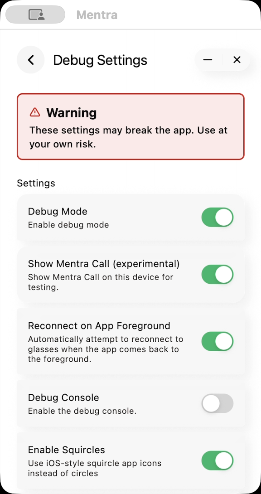
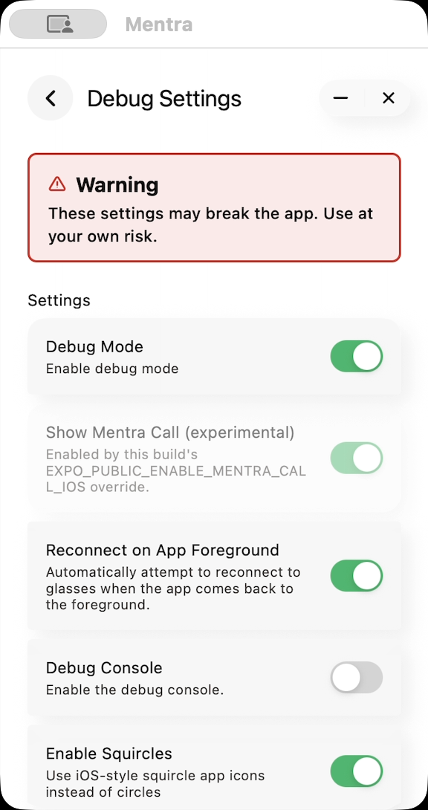

# iOS Call test visibility and setup

Mentra Call stays hidden by default on iOS, including the iOS app on Mac.
Android availability is unchanged. PR4078 provides two explicit opt-ins.

## Debug setting

Open Debug Settings and enable **Show Mentra Call (experimental)**. The existing
settings system persists `show_mentra_call_ios` locally, defaults it to false and
does not synchronize it to the server. Enabling installs/shows bundled Call.
Disabling hides it and stops it through normal miniapp cleanup without restarting
the app. Debug Mode and Super Mode alone do not enable Call.

## Optional build override

In the ignored `mobile/.env` used for the test build:

```dotenv
EXPO_PUBLIC_ENABLE_MENTRA_CALL_IOS=true
```

Only the exact string `true` forces visibility. Unset, empty, `false` or an
unrecognized value follows the saved debug setting. With the override active,
the UI switch is on and disabled, explaining that build configuration enables
Call. The override never changes the saved setting, so removing it restores the
previous preference. Keep the example commented in `.env.example` so CI uses
default production behavior.

Expo inlines the variable into JavaScript. Reload Metro's bundle or rebuild an
installed standalone app after changing it; editing `.env` cannot alter an
already-installed IPA. No Mac-specific default, server flag or detection bridge
is needed. Standard fresh-Mac setup and signing are documented in harness PR4069
under `tools/mentra-e2e/SETUP.md` and the mobile `ios:mac` command.

## Policy and lifecycle

Home, All Apps/search, the glasses menu and every installation source apply the
same policy. Reconciliation runs after settings hydration and before autostart,
including for old hidden/running installations. One serialized controller
rechecks policy after downloads, so disabling during installation cannot reveal
Call. It clears the old forced-hide flag once on opt-in, preserving subsequent
ordinary user hiding. The no-op migration slot 5 protects test installations that
already consumed that version; behavior never relies on rerunning the migration.

## Repeatable checks

1. With no override and a false saved setting, verify Call is absent from Home,
   All Apps and the glasses menu.
2. Enable the debug setting; verify Call appears, then restart and verify it stays
   enabled. Disable it and verify hiding and normal stop/cleanup.
3. Build with the override while the saved setting is false; verify Call appears
   and the debug switch is on/disabled with the build explanation.
4. Reinstall a default build and verify the saved false setting hides Call again.
5. Preserve each run's screenshots, video chapters and failed assertions. These
   visibility checks create no meeting or glasses stream.

The English routine and compiled flows are in harness PR4069:
`tools/mentra-e2e/IOS-CALL-VISIBILITY-ROUTINE.md` and
`tools/mentra-e2e/flows/ios-call-visibility.ts`.

## Recorded evidence

Three runs under the integration checkout's `.test-results/mentra-e2e/` passed
47 total steps with screenshots, chapters, video liveness and zero foreground
focus changes in the final replay:

- Default: `2026-09-17T17-52-08-414Z-ios-call-visibility-259ea6`.
- Override: `2026-09-17T17-55-04-292Z-ios-call-build-override-f196c2`.
- Restored default: `2026-09-17T17-57-23-960Z-ios-call-visibility-bb865a`.

Exact signed archive and bundle identities are in
`ios-call-visibility-builds/default-grid-fixed-manifest.json` and
`ios-call-visibility-builds/env-final-manifest.json` beside the run evidence.
These runs used cached installations; fresh settings/install paths have focused
unit coverage. Native call qualification remains separate from visibility.




