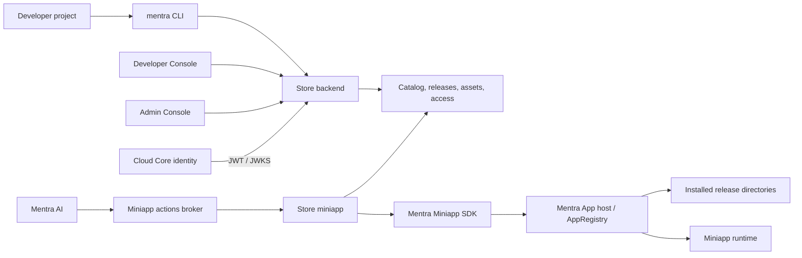

# Mentra Miniapp Store restoration design

## Outcome

MentraOS has a backend-neutral miniapp distribution system in which the Mentra
Miniapp Store is itself a bundled Mentra miniapp with an independently
deployable Store backend. Cloud Core remains the identity issuer and broker;
the Store backend owns catalog, publishing, review, tracks, access control, and
artifacts. The Mentra App owns the privileged installation boundary. The Mentra
Miniapp SDK exposes that host capability only to build-trusted SYSTEM Store
miniapps.

This structure supports Mentra's Store today without making Mentra's backend a
permanent requirement for installation. An OEM build may bundle its own Store,
use its own backend, and invoke the same host API. Multiple trusted Stores may
coexist, while package provenance and build-assigned ownership prevent them
from replacing each other's miniapps.

The Store is included in the app build but remains hidden and unscheduled by
default for the initial merge. A dedicated **Mentra Miniapp Store** setting in
Debug Settings enables the preview. The backend, Developer Console, CLI, host
installer, actions, and update foundations can therefore ship before the Store
has production inventory or is exposed to ordinary users.

The implementation checklist and verification record are maintained in
[the Store restoration plan](../plans/2026-08-24-mentra-miniapp-store-restoration.md).

## Product scope

This design includes:

- An independent Store backend and immutable release-publication model.
- Canonical ZIP ingestion, validation, storage, and protected distribution.
- Stable and beta release tracks.
- Public and per-user private miniapp distribution.
- Private-beta invitations and explicit public betas.
- A Developer Console for organization, listing, release, access, and review
  management.
- A CLI for authentication, package reservation, signing, validation, upload,
  submission, and release inspection.
- A bundled Store miniapp with discovery, search, details, installation,
  updates, track selection, and uninstall UI.
- A backend-neutral SYSTEM Store installation API in the Mentra Miniapp SDK.
- Host compatibility enforcement for Mentra App version, Miniapp SDK ABI, and
  glasses hardware.
- Store-owned automatic updates, including assigned SYSTEM package updates.
- Transient actions for invisible maintenance and Mentra AI Store operations.
- Multiple build-trusted Mentra or OEM Store miniapps.

This design does not make the Store responsible for extracting files, writing
the app registry, or deciding whether a caller is trusted. Those are host
responsibilities.

## System architecture



### Component responsibilities

| Component          | Responsibility                                                                                                                                                                           |
| ------------------ | ---------------------------------------------------------------------------------------------------------------------------------------------------------------------------------------- |
| Cloud Core         | Mentra account/OEM identity, token exchange, miniapp-scoped token issuance, stable Mentra user identifiers, and public signing-key discovery.                                            |
| Store backend      | Developer organizations, API keys, packages, releases, canonical manifests, Store listings, tracks, review, publication, invitations, enrollments, assets, and download authorization.   |
| Developer Console  | Human-facing management of organizations, API keys, listings, artwork, releases, distribution visibility, beta access, invitations, and review feedback.                                 |
| Admin Console      | Review of public submissions, canonical permissions and requirements, artwork, moderation fields, acceptance, rejection, and publication.                                                |
| `mentra` CLI       | Browser/API-key authentication, organization selection, package reservation, local signing, canonical packing and validation, upload, submission, and status inspection.                 |
| Store miniapp      | Catalog UI, selected-track behavior, install/update intent, automatic reconciliation, and Store actions. It never receives native filesystem access.                                     |
| Mentra Miniapp SDK | Typed SYSTEM-only APIs for listing/opening miniapps, compatibility preflight, installation, update progress, and uninstall, plus the actions API.                                        |
| Mentra App host    | Build trust, SYSTEM identity, Store ownership, downloads, ZIP validation, compatibility enforcement, extraction, atomic activation, rollback, garbage collection, and running lifecycle. |
| Cloud Runtime      | Runs cloud-connected miniapp sessions. It does not own Store catalog or release distribution state.                                                                                      |

### Service and authentication boundaries

The official service runs from `cloud-v2/packages/store` on its own public
origin and process. It may initially share the Cloud V2 Mongo deployment and
object-storage credentials, but it owns its collections and behavior. Core no
longer mounts public Store, Console, release, catalog, bundle, or Store-admin
routes.

- The Store miniapp uses the normal Mentra miniapp authentication flow. Core
  issues an audience-pinned miniapp token; Store verifies it against Core's
  public JWKS contract.
- Mentra App host calls use the normal Core access token. Store verifies the
  public signature and claims without importing Core implementation code.
- Developer Console and CLI users authenticate directly to Store through a
  thin shared WorkOS adapter or a Store-owned organization API key. Publisher
  organizations and API keys are Store data, not Core identity data.
- A narrow authenticated service bridge resolves verified account emails to
  opaque Mentra user IDs for invitations. Store admin report/support views
  proxy to Core through the same service-authenticated boundary because those
  records remain Core-owned.
- Core calls Store only to verify developer-mode publisher attestations before
  minting a miniapp token. This does not give Core ownership of developer keys.

The official endpoints are independently configurable (`MENTRA_CORE_URL` and
`MENTRA_STORE_URL`). The Store miniapp reaches its backend through the normal
Miniapp SDK authenticated-fetch surface; `@mentra/cloud-client` does not own a
parallel Store catalog module. The CLI and Mentra App derive `store.*` only from
a conventional `core.*` hostname (and local port 3003 from Core port 3000,
including a Metro host's LAN address on physical phones). An independently
named OEM Store must be selected explicitly as part of the same endpoint
profile. An arbitrary custom Core hostname never falls back to Mentra's Store,
so a Core identity credential cannot be sent to an unrelated distribution
service. Existing two-endpoint custom profiles derive Store from their selected
Core until the user supplies the new explicit Store field. Coordinated mobile
release tooling pins and verifies Core, Store, and Runtime together in the
shipped JavaScript bundle. The Android `bun adb` helper reverses both local Core
port 3000 and local Store port 3003. OEM or self-hosted deployments may point
the same host contract at their own identity issuer and Store implementation.

## Design principles

1. **The Store is a miniapp.** Its UI and background controller use the same
   two-layer SDK architecture as other Mentra miniapps.
2. **Installation is a host capability.** A Store requests installation; the
   host independently authorizes and validates it.
3. **SYSTEM is build-owned.** A developer cannot request SYSTEM in
   `miniapp.json`. Bundled ZIP provenance is the authority.
4. **The install contract is backend-neutral.** The Mentra Store and OEM Stores
   use the same request shape without requiring Cloud Core.
5. **The ZIP manifest is canonical.** Catalog metadata improves UX but cannot
   weaken host enforcement.
6. **Publication and distribution are explicit.** Uploaded artifacts are not
   automatically public.
7. **Access is checked when bytes are served.** A retained private URL is not a
   durable authorization grant.
8. **Updates preserve ownership.** A Store cannot adopt or overwrite packages
   owned by another Store.
9. **Maintenance need not become visible activity.** Transient actions may run
   a miniapp context without placing it in the running tray.
10. **Publisher identity travels with the artifact.** Every production ZIP is
    developer-signed; Store and the host independently verify the same embedded
    identity, and updates must retain it.
11. **Identity and distribution are separate services.** Store trusts
    versioned Core JWT/JWKS contracts; Store data and policy do not live in Core.

## Identity and trust model

### SYSTEM identity

The build process generates a bundled miniapp catalog from the ZIPs included in
the Mentra App. Every package in that generated catalog is SYSTEM for that
build. There is no separate author-declarable SYSTEM permission and no parallel
hardcoded list of first-party package names.

SYSTEM has these consequences:

- Users cannot uninstall the package.
- Users may remove it from Home without removing its installation.
- Direct developer installs cannot replace it.
- A build-trusted Store may update it only when the build assigns that Store as
  the package's SYSTEM update owner.
- A Store-installed update retains SYSTEM identity across restarts because the
  host preserves build provenance independently of the installed ZIP.

This means the first-party bundles currently shipped with the Mentra App are
SYSTEM because they are bundled, not because their names appear in a special
source list.

### Trusted Stores and provenance

Each app build owns a list of Store package identities it trusts. A Store must
be both:

- Present as a build-owned SYSTEM package.
- Connected as that exact host-trusted package when invoking install or
  uninstall APIs.

The host records the Store that installed a non-SYSTEM package. Later updates
or uninstall requests must come from the same Store. A build may separately
assign one trusted Store as update owner for each SYSTEM package. The Store
cannot update itself through its in-process reconciliation loop.

This supports multiple Stores without a global “any SYSTEM app may install
anything” rule.

### First-release authorization

The first release authorizes an install using:

- The build-trusted SYSTEM Store caller.
- Package name and semantic version.
- An HTTPS bundle URL outside explicit development environments.
- The expected bundle SHA-256.
- Store and package ownership policy.
- The canonical manifest found inside the ZIP.
- The developer's Ed25519 publisher signature embedded in that ZIP.

The first valid, durably stored Store release upload atomically binds the package
record to the derived publisher-key fingerprint. The first authorized non-SYSTEM install
binds that package on the device. Every later Store release and host update must
match the established fingerprint. Bundled SYSTEM packages are stricter: the
build-generated catalog pins their expected publisher fingerprints, so neither
a new Store install nor a legacy device record can choose their identity.

Publisher identity and Store provenance are separate. The publisher signature
answers who produced the bytes; build trust and `storeOwnerPackageName` answer
which Store may manage them. Neither Core nor Store signs miniapps or installation
descriptors in v1.

## Canonical release artifact

A release is a ZIP with exactly one canonical root `miniapp.json` and one
reserved `META-INF/MENTRA.SIG` entry. The signature envelope contains the
developer's Ed25519 public key, its derived fingerprint, package/version,
canonical manifest SHA-256, canonical complete-file-index SHA-256, and the
signature over that payload. The file index covers every non-directory archive
entry except the signature itself. The final ZIP SHA-256 separately protects
transport without creating a circular embedded hash.

Store reads and verifies the archive during upload and binds the release record
to the actual ZIP. Developers do not separately type compatibility or identity
metadata into the Store. Removing the signature or changing the manifest,
executable code, or assets invalidates the production artifact.

The canonical release record includes:

- Package name and version.
- Stable or beta track.
- Bundle SHA-256 and size.
- Canonical manifest and manifest SHA-256.
- Publisher signing-key identity and signature state.
- Minimum Mentra App version.
- Mentra Miniapp SDK ABI version.
- Hardware requirements and permissions.
- Review, publication, and active-release state.

Store and the host reject malformed archives, unsafe paths, symbolic links,
duplicate or nested manifests, CRC failures, excessive entry counts, oversized
downloads or manifests, missing entry files, identity mismatches, and
decompression abuse.

The Store listing is a separate presentation document. It contains subtitle,
long description, categories, privacy/support/website links, icon, cover,
screenshots, featured state, and review tier. Publishing freezes a reviewed
listing snapshot onto that release. Editing a draft listing later does not
mutate the live public listing.

## Developer publishing workflow

### CLI and Console split

Executable creation, signing, and upload remain CLI-only so publisher private
keys stay on the developer's machine. The Console manages the uploaded package
and its distribution state.

The normal workflow is:

1. Run `mentra login`, or configure an organization API key for CI.
2. Select the developer organization.
3. Reserve a package identity with `mentra miniapps create`.
4. Create or import its durable package publisher key with
   `mentra miniapps keys create --package ...` or
   `mentra miniapps keys import --package ... <path>`.
5. Back up the private key. It uses the CLI's existing OS-keychain-first
   storage policy with mode-`0600` files under
   `~/.mentra/cli-v2/signing-keys/` as fallback. CI may provide an explicit
   key file or secret JSON without importing it.
6. Build and publish from the project using `mentra publish`, selecting
   `stable` or `beta` and optionally leaving the release as a draft.
7. `pack` creates the final signed ZIP; `publish` verifies and uploads that
   exact artifact without detached or server-side signing.
8. Store validates the ZIP, manifest, signature, package ownership, version, and
   track before storing the draft release.
9. Open the package in the Developer Console to edit its Store listing,
   artwork, visibility, beta policy, and invitations.
10. Submit a public release for review, or publish a private release after
    automated validation.
11. Inspect release status, immutable manifest, hashes, signing identity, and
    review feedback in the Console or CLI.

Package creation and signed bundle upload are clearly described as CLI-only in
the Console. Once created or uploaded, the package and releases appear in the
GUI.

### Developer Console v1

The Console provides the complete management surface required by this design:

- WorkOS sign-in and organization onboarding/switching.
- Multi-organization membership, roles, members, and invitations.
- Interactive CLI login guidance and revocable organization API keys.
- Miniapp list, package identity, release summaries, and release history.
- Canonical manifest, bundle/manifest hashes, signing identity, and timestamps.
- Store listing fields, publication readiness, and artwork upload/delete.
- Stable and beta track state.
- Public/private miniapp visibility.
- Private-distribution user invitation and revocation.
- Private/public beta mode, tester invitation, and revocation.
- Submission, private publication, status, and review feedback.

The v1 Console is not intended to include analytics, crash telemetry, billing,
percentage rollout controls, browser-held publisher keys, browser ZIP upload,
or one-click rollback/unpublish.

## Review and publication model

Stable and beta are independent publication lanes. Each has its own active
release pointer and immutable reviewed listing snapshot. Publishing a beta does
not change the stable release.

Public releases require Mentra review. Reviewers see the canonical manifest,
permissions, hardware requirements, Store copy, artwork, integrity metadata,
and moderation controls. Private releases do not require Mentra content review;
they publish after the same automated archive, signature, ownership, and
compatibility-metadata validation.

Submission, review decisions, publication, listing mutation, moderation, and
artwork deletion are serialized by a renewable per-miniapp database lease.
Publication uses a recoverable journal:

1. Stage the candidate and frozen listing without changing the active release.
2. Commit the release state.
3. Promote the journal to the appropriate active pointer.
4. Let a later lease holder safely finish or discard an interrupted operation.

The previous active release remains catalog-visible until promotion completes.

## Distribution modes

Visibility and release track are separate dimensions.

| Miniapp visibility | Release track | Who can discover/install                                                                                               | Review behavior                                                  |
| ------------------ | ------------- | ---------------------------------------------------------------------------------------------------------------------- | ---------------------------------------------------------------- |
| Public             | Stable        | All Store users after publication                                                                                      | Mentra review required.                                          |
| Public             | Private beta  | Invited verified Mentra accounts                                                                                       | Invitees may access the beta; public stable remains unchanged.   |
| Public             | Public beta   | Signed-in users may opt in after public approval; existing invitees retain transition access while approval is pending | Mentra review required before general beta exposure.             |
| Private            | Stable        | Invited verified Mentra accounts                                                                                       | Automated validation; no Mentra content review.                  |
| Private            | Beta          | App invitees with beta entitlement                                                                                     | Automated validation; app privacy always remains the outer gate. |

### Private miniapps

Private distribution is per verified Mentra account email. It is an access gate
around an otherwise normal non-SYSTEM miniapp:

- The developer changes the miniapp visibility to private.
- The developer invites existing verified Mentra accounts in the Console.
- Authorized users see the miniapp in their Store catalog and may install or
  update it normally.
- Uninvited users receive no listing, artwork, or bundle.
- Revocation removes future discovery, downloads, and updates.
- Switching a private release to public never bypasses public review.

Private does not imply SYSTEM, mandatory installation, org membership,
automatic deployment, or a special runtime mode.

### Beta tracks

Beta is release selection, not Cloud deployment environment. Development,
staging, and production Store deployments may each contain both stable and beta
releases.

- Stable is the default selected track.
- Betas default to private invitation mode.
- A developer may explicitly make a beta public.
- A public beta is an opt-in; the Store does not place a general beta button on
  every listing.
- Enrollment belongs to the authenticated Mentra user and package.
- A beta-only miniapp can be discovered by an authorized tester before the
  first stable release exists.
- Leaving beta falls back to stable when stable exists.
- If no eligible beta is available, selection falls back package-by-package to
  stable rather than breaking the installed miniapp.
- Revoking a private-beta invitation removes its enrollment and future bundle
  access.

## Catalog and protected assets

Store exposes catalog browse, search, category, pagination, detail, artwork, track
selection, and bundle routes. Catalog results include the selected release,
available tracks, access state, installation metadata, manifest-derived
permissions and compatibility requirements, and moderated listing fields.

Only an active app with an active published release and matching immutable
listing snapshot is catalog-visible. Search, featured ordering, categories,
details, artwork, and bundle authorization use the same selected-track and
access rules.

Bundle bytes use an authenticated Store distribution route. On every request,
Store resolves the asset back to:

- The exact active app and current active release for the selected track.
- Published release state.
- Public approval or the current user's private/beta authorization.
- Current beta enrollment where installation requires it.

Historical, revoked, archived, inactive, unassigned, or wrong-track bundle URLs
fail closed. Responses are private and non-cacheable.

Artwork follows the same current visibility rules. Private-only artwork is
served only to an authorized user with `private, no-store`. Public artwork must
revalidate rather than remaining anonymously reusable for a year after a
public-to-private transition. Previously downloaded bytes cannot be recalled,
but the retained URL no longer grants future origin access.

## Store install API

The Store calls a backend-neutral SDK request with this effective v1 shape:

```ts
interface InstallMiniappRequest {
  packageName: string
  version: string
  bundleUrl: string
  bundleSha256: string
  minHostVersion?: string
  sdkVersion?: string
  hardwareRequirements?: Array<{
    type: string
    level: string
    description?: string
  }>
  releaseId?: string
  channel?: string
}
```

Catalog fields are preflight hints. The host does not trust them as the final
manifest. An install transaction is:

1. Verify the connected caller is a build-trusted SYSTEM Store.
2. Enforce Store provenance and SYSTEM update ownership.
3. Reject Store self-replacement and unauthorized downgrade/replacement.
4. Validate the configured, host-trusted Store origin and URL policy.
5. Download through a bounded stream with a fresh host-owned Core identity
   credential when the URL belongs to the configured Store.
6. Reject credential-bearing redirects and never expose the Core token to the
   Store miniapp.
7. Verify SHA-256, archive limits, package, and version.
8. Read the ZIP's canonical `miniapp.json` and `META-INF/MENTRA.SIG`.
9. Recompute the canonical manifest/file digests and verify the embedded
   Ed25519 signature and derived fingerprint.
10. Require that fingerprint to match the installed package identity and, for
    SYSTEM packages, the build-generated identity pin.
11. Re-run host, SDK, permissions, and hardware admission against that manifest.
12. Extract into an isolated staging directory.
13. Retain any previous same-version bundle as a backup, create a durable
    pending journal whose name records whether that prior target existed, and
    make a reversible filesystem swap.
14. Persist the old publisher/release/active-version metadata snapshots into
    that journal, then write the candidate metadata while the swap remains
    rollback-capable.
15. Atomically rename the journal from pending to committed. A metadata or
    commit failure rolls back immediately; process-death recovery restores
    pending filesystem and metadata state idempotently, while a committed
    marker keeps the candidate and finishes cleanup.
16. Reload or restart the runtime as needed, restoring the prior release and
    running state on failure.

Other installation sources—bundled synchronization and developer URLs—share
serialized AppRegistry transactions so they cannot race a Store activation.

The abandoned Cloud V2 preinstalled-registry prototype is intentionally absent.
It was a one-device Store stopgap with a second update policy, API, admin UI,
and startup reconciler. Bundled SYSTEM packages and user-installed packages now
use the single Store catalog/install/update model described here.

## Compatibility model

Compatibility is evaluated twice:

1. The Store uses catalog data derived from the uploaded canonical manifest to
   explain availability before downloading.
2. The host independently reads the downloaded ZIP manifest and enforces the
   same requirements before activation.

The current gates are:

- `minHostVersion`: minimum compatible Mentra App/host version.
- `sdkVersion`: supported Mentra Miniapp SDK ABI.
- `hardwareRequirements`: required and optional capabilities for the currently
  selected or remembered glasses model.

For example, a camera-required release is not installable for Even Realities G1
but is installable for compatible camera glasses such as Mentra Live. Optional
hardware produces warnings rather than rejection.

An installed miniapp remains on its current release when a newer release is
incompatible. After the user updates the Mentra App or connects/selects
compatible hardware, the release becomes installable and eligible for the next
automatic reconciliation.

## Automatic updates

Automatic reconciliation is owned by the Store miniapp and invoked by the host
through the `reconcile_updates` transient action. It runs when Store Preview is
enabled on:

- Mentra App startup.
- App foreground.
- Connectivity restoration.
- Store open.
- A bounded in-process interval.

The controller fetches the authenticated, complete catalog independently of the
currently visible Store search. It coalesces overlapping refreshes and
serializes mutations. Updating the background catalog does not replace or clear
the user's active search results.

An automatic update is eligible only when:

- Its semantic version is strictly newer.
- The installed release is owned by this Store, or the package is SYSTEM and
  this Store is its build-assigned update owner.
- The release belongs to the user's selected eligible track.
- Current Mentra App, SDK ABI, and hardware requirements pass.
- The Store is not attempting to update itself.

Incompatible updates are deferred, not treated as failures. Failed activation
restores the prior release. After success, obsolete release directories are
garbage-collected while retaining the active and rollback releases.

Manual Store installation and update use the same host checks and ownership
rules as automatic updates. “Manual” here means the user tapped Get/Update or a
trusted Store action requested it; it does not mean an untrusted URL install.

## Actions and transient lifecycle

### General action model

A miniapp declares actions in `miniapp.json` and registers handlers through
`session.actions`. An action declares:

- `lifecycle: persistent | transient`
- `audience: system | host`
- Input and output schemas.

Persistent is the ordinary user-visible lifecycle. Transient is temporary work
that may start the background context without placing the miniapp in the Home
running tray or mounting its phone UI.

The host owns transient lifecycle, not the caller. It acquires a reference-
counted invisible context lease, shares it across concurrent calls, and releases
it after all invocations settle. If the user opens the miniapp during that work,
the host promotes the same context to ordinary visible activity without
respawning it. This leaves the Store free to use display/UI functionality in
the future; transient describes one invocation, not the miniapp's permanent
type.

Host-audience actions are not exposed through miniapp discovery or normal
miniapp invocation. System-audience actions are available only through SYSTEM
action policy.

### Store actions

The Store declares:

| Action                | Audience | Purpose                                                                |
| --------------------- | -------- | ---------------------------------------------------------------------- |
| `reconcile_updates`   | Host     | Refresh the full catalog and install eligible updates invisibly.       |
| `search_miniapps`     | SYSTEM   | Search compatible catalog results for Mentra AI.                       |
| `get_miniapp_details` | SYSTEM   | Resolve authoritative current details for an exact package.            |
| `install_miniapp`     | SYSTEM   | Install an exact package after the Store resolves the current release. |
| `update_miniapp`      | SYSTEM   | Update an installed exact package to its eligible current release.     |

Search and details are read-only. Install and update accept only an exact
package name from the caller; they do not accept bundle URLs, hashes, or a
caller-supplied “confirmed” flag. The Store refreshes authenticated catalog
state and resolves the release itself. Mutation actions accept only the
build-approved Mentra AI caller, and the host still independently enforces all
installation rules.

When Store Preview is disabled, Store actions are not discoverable or
invocable, and the scheduler/context is stopped.

## Store miniapp UI

The bundled Store is a responsive phone UI built inside `miniapps/store` using
the Mentra Miniapp SDK. It provides:

- Discover, featured content, categories, and search.
- Detail pages with description, artwork, permissions, requirements, links,
  verification/review identity, and release track.
- Get, install progress, Open, Update, retry, and uninstall flows.
- Installed and Updates views, including Update all.
- Stable/beta selection and beta-only offers.
- Compatibility explanations before Get/Update.
- Loading, empty, offline, incompatible, failure, and delisted-installed states.
- Protected SYSTEM uninstall UX and Remove from Home separation.
- Safe-area, focus, reduced-motion, light/dark, and phone-width behavior.

The Store may show an incompatible listing, but its install/update control is
disabled with the host/SDK/hardware reason. The host remains authoritative.

## Uninstall and Home behavior

- SYSTEM miniapps cannot be uninstalled by users or Stores.
- SYSTEM miniapps may be removed from Home.
- Non-SYSTEM packages may be uninstalled only by their owning Store.
- Uninstall removes the installed release and local data according to the
  normal miniapp lifecycle.
- A user uninstall is not silently reversed by bundled synchronization for a
  non-SYSTEM package; an explicit later install clears its tombstone.

## Preview and rollout behavior

`com.mentra.store` is bundled and has SYSTEM provenance, but
`miniapp_store_preview_enabled` defaults to false. The setting is a dedicated
toggle under Debug Settings and does not depend on global Debug Mode.

With preview disabled, the host:

- Hides the Store Home tile and glasses-menu entry.
- Does not schedule update reconciliation.
- Stops the Store context and clears foreground/running resurrection state.
- Removes Store actions from discovery and invocation.

The privileged host APIs remain independently protected by build trust. Hiding
the Store is a rollout decision, not the security boundary.

Store backend, Core, Console, and CLI deploy through the normal `dev` to `staging` to `main`
promotion flow. Enabling the UI and seeding catalog inventory are separate
launch operations. Post-deploy health checks probe Core, Store, and Runtime
independently; missing DNS for a newly introduced service skips only that
service rather than suppressing health verification for the others.

## Multiple Stores and OEMs

The installation API contains no Mentra-specific catalog dependency. An OEM may:

- Bundle its own Store package as SYSTEM.
- Add that exact Store package to its build trust configuration.
- Assign that Store ownership of selected bundled SYSTEM packages.
- Implement the same catalog and host install-request contract on its own
  backend.
- Run alongside the Mentra Store or another OEM Store.

The host applies the same package, URL, hash, archive, manifest, compatibility,
and provenance checks to every Store. A Store may update only its own
non-SYSTEM installs and the SYSTEM packages assigned to it by the build.

A fully self-hosted OEM may deploy the same Store contract next to its identity
service, but the host does not require Mentra's Store backend or Cloud Core.

## Failure and recovery behavior

- A catalog refresh failure preserves the last usable Store UI state.
- Active searches remain intact while background reconciliation refreshes its
  independent catalog view.
- An incompatible update remains pending until compatibility changes.
- A hash, archive, manifest, or authorization failure never activates staged
  bytes.
- A metadata-write failure or process death during activation restores the
  previous filesystem state; an uncommitted candidate cannot be selected by
  the next disk scan. If recovery must retry, any ordinary version directory
  referenced by a surviving pending journal remains suppressed until recovery
  succeeds; committed journals do not suppress their activated version.
- Recovery is restart-safe itself: an interrupted rollback distinguishes a
  restored prior target from a first-install candidate and retains the durable
  metadata journal until all rollback writes succeed.
- An activation/runtime failure restores the prior release and running state.
- A revoked user cannot use an old protected bundle URL for another download.
- Publication interruption preserves the previous active catalog release and
  is recoverable by the next lease holder.
- Concurrent install sources serialize at the AppRegistry boundary.

## Acceptance and verification

The implementation is acceptable when:

1. The Store stays completely hidden and unscheduled with preview disabled.
2. Public, private, stable, private-beta, public-beta, and beta-only catalog
   behavior matches this spec for list, search, details, artwork, and bundles.
3. Developers can authenticate, reserve a package, publish signed stable/beta
   releases, manage them in the Console, and receive review feedback.
4. Only a build-trusted Store can reach install/uninstall host mutations.
5. Cross-Store adoption and unauthorized SYSTEM replacement fail.
6. The host validates the canonical ZIP and compatibility before activation.
7. Store and the host reject unsigned, tampered, or differently signed package
   replacements, including Store-delivered SYSTEM updates.
8. Compatible owned updates apply automatically; incompatible updates defer.
9. Transient Store work never appears in the running tray and promotes cleanly
   if the user opens the Store.
10. Private URL reuse and revoked access fail at byte-serving time.
11. Failed updates roll back without losing the prior runnable release or its
    publisher identity.

Automated verification covers Store release/catalog integration, real Core-to-Store
token boundaries, CLI authentication and bundle validation, Console/admin/Store
production builds, Store controller and UI models, actions, transient lifecycle,
SYSTEM/provenance policy, ZIP abuse cases, compatibility, rollback, garbage
collection, lockfiles, Android/iOS builds, and the coordinated release family.

The Store phone UI has a headless browser flow covering catalog, search,
details, install, and installed state. A complete attached physical-device
install/update/rollback/offline/uninstall smoke test remains a launch gate.

## Intentionally deferred

The following are compatible with this architecture but are not part of the
first release:

- Publisher-key rotation, old-key-authorized signer lineage, revocation, and
  lost-key recovery policy.
- Store-backend-signed installation capabilities or an issuer public-key table;
  build-owned Store identity remains the v1 installer authority.
- Updating the Store itself outside a new Mentra App build.
- Organization-wide mandatory installation or MDM-style deployment.
- Analytics, crash metrics, billing, staged percentage rollout, and browser
  bundle signing/upload in the Developer Console.
- Production catalog seeding/migration and public Store enablement.
- Promotion of the new CLI package from prerelease.

These are not required to merge the hidden Store foundation. Arbitrary Store
packages or backends still cannot become trusted without explicit build
ownership/configuration.
