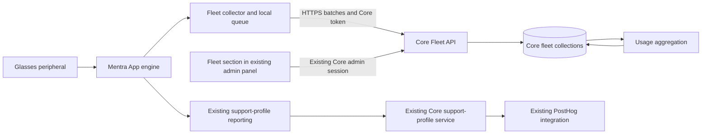

# Mentra Fleet Management

- Original product brief: [Mentra Fleet Management Plan](https://docs.google.com/document/d/1f951XX6q5p_ild8Fj6IlLOvccuXGjocnTCa6mBFRtdU/edit?usp=sharing).
- Delivery tracking: [Mentra Fleet Management in Linear](https://linear.app/mentralabs/project/mentra-fleet-management-36f3e6c31e4b/issues).
- Product DRI named in the brief: Philippe Ferreira De Sousa.
- Planning target from the brief: usable internally by **November 15, 2026**.
  This is an internal-readiness target, not a promise that every later feature or
  private-deployment configuration ships on that date.

This is the design and requirements source of truth for Mentra Fleet Management.
The architecture and product scope below are agreed; implementation has not
started. API names, storage layout, and reporting cadence are proposed contracts
to refine in an implementation plan referencing this spec.

## Product contract

Mentra Fleet Management starts as a **Fleet section in the existing Core admin
panel** (`cloud-v2/websites/admin`). Existing Core administrators use their
existing login to view all devices reporting to that particular Core. The Mentra
App sends observations to its configured Core. Core owns ingestion, persistence,
aggregation, and the Fleet admin API.

Mentra uses the same product for all devices using Mentra Core, including consumer
devices. It is not limited to Mentra employees. A customer hosting its own Core
gets the same functionality with its data stored in its own infrastructure.

The phone is the sole collector. Glasses are peripherals whose state the phone
observes. There is no glasses-side fleet journal, direct glasses-to-Core upload,
or reconstruction of activity that the phone did not observe. The phone does
buffer its own observations while Core is unreachable.

**Fleet displays actual device serial numbers.** Store the serial as a normal
device field and show/search it through the existing Core admin permissions.
There is no separate serial-number permission or protection system. Do not add
serials to existing PostHog exports as a side effect.

Existing PostHog, support-profile, and other analytics integrations continue to
operate under their existing configuration. Fleet adds phone-to-Core reporting
and durable storage. V1 does not introduce a reporting-policy service, separate
Fleet login, permission framework, or device-enrollment flow.

## Goals and boundaries

- Show which devices have reported to this Core, their associated users, battery,
  versions, connection state, and data freshness.
- Explain usage over time: connected duration, miniapps run, miniapp duration,
  phone-observed photo/video activity, and adoption trends.
- Make the same implementation useful to Mentra and private deployments.
- Preserve device history across account changes and different phones.
- Work with local miniapps and with cloud realtime features disabled.
- Provide trustworthy counts despite retries, late uploads, and process restarts.
- Make unsupported, missing, stale, and estimated information distinguishable from
  a measured zero.

The first version does not implement remote wipe, remote configuration, forced
updates, hardware attestation, warehouse inventory enrollment, or billing/license
enforcement. Licensing and richer asset-management fields are future extensions.
Existing inventory begins with devices that report; unopened or never-connected
devices cannot be discovered automatically.

## Ownership and deployment

| Deployment | Fleet destination | Visibility |
| --- | --- | --- |
| Mentra Core and Mentra Runtime | Mentra Core | Authorized Mentra Core administrators see all reporting devices. |
| Customer Core and customer Runtime | Customer Core | Customer Core administrators see their devices; no automatic fleet export to Mentra. |
| Mentra Core and customer Runtime | Mentra Core | Fleet observations are stored on Mentra infrastructure, following the phone's configured Core. |

The V1 product contract includes Fleet reporting to the selected Core. A future
customer requirement for hosted authentication without Fleet reporting can add a
Core setting or scoped control then; a policy API and configurable reporting
tiers are not prerequisites for the initial product.

Runtime does not gain Fleet ingestion or a Fleet database. Core uses its existing
MongoDB infrastructure with dedicated Fleet collections. No new database engine,
analytics vendor, or message broker is required for the initial implementation.

A Core means a logical deployment and its database, not one container. Multiple
Core replicas share the same fleet. Store authenticated tenant/user provenance
and, where available, a validated deployment/Runtime identifier for filtering.
Multiple Runtimes may use one Core; those identifiers do not create separate Core
fleets. Core administrators see the entire Core fleet. Customer-scoped viewer
roles on a shared Core are a future permission model, not an implicit grant to
ordinary customer users.

## Tracking catalog

V1 is the first-release scope. Later rows are product candidates, not required
infrastructure for V1. Fields depend on what the phone and connected hardware
actually expose; unavailable values must remain unavailable.

| Area | Information to track | Source and definition | Scope |
| --- | --- | --- | --- |
| Device identity | Fleet device ID, displayed serial number, manufacturer, model, hardware revision where available | Phone-observed peripheral identity; Core resolves the device record. | V1 |
| User association | Current/last associated account, email, association history | Core supplies trusted account identity; the phone reports the connected device. | V1 |
| Phone identity | Phone installation ID, manufacturer/model, platform, OS version | Mentra App installation; reinstall may create a new installation identity. | V1 |
| Mentra software | Mentra App version/build, engine version, Bluetooth SDK version | Installed phone software. | V1 |
| Glasses software | Glasses app version/build, MTK firmware, BES firmware, glasses OS version | Phone-observed versions, independently timestamped where necessary. | V1 |
| Deployment | Runtime/deployment identifier and release channel | Active phone configuration; Core validates any assignment to a registered deployment. | V1 |
| First and last seen | First registration, last phone contact, last confirmed glasses observation | Separate device observation time from phone upload time. | V1 |
| Connection state | Connected/disconnected/connecting, last connect/disconnect | Phone's peripheral connection state. | V1 |
| Battery | Glasses percentage and charging state; case/controller battery where supported | Latest observed value and observation time. | V1 |
| Battery history | Charge trend, low-battery occurrences, observed drain during usage | Sampled readings; drain estimates disclose their observation window. | Later |
| Glasses usage | Connected minutes, session count/duration, days active | Intervals when the active phone engine observes glasses connected. | V1 |
| Mentra App usage | Foreground duration, active engine duration, phone session count | Phone app/engine lifecycle; distinguish a visible app from background engine operation and from glasses-connected time. | V1 |
| Miniapp inventory | Installed packages and versions, observed install/update/remove times | Engine app registry; an initial inventory does not prove the original installation date. | V1 |
| Running miniapps | Packages, versions, execution start times | Actual engine lifecycle with freshness indicators. | V1 |
| Miniapp launches | Attempts, successful starts, failures, user starts versus automatic restarts | Engine outcomes, rather than UI button presses alone. | V1 |
| Miniapp duration | Running duration and running duration with glasses connected | Execution intervals intersected with device connection intervals. | V1 |
| Miniapp UI usage | Times opened, foreground duration | UI lifecycle, distinct from background execution. | Later |
| Photos | Requests, confirmed captures where observable, delivery successes, failures, initiating package | Phone-observed stages of one operation; capture and delivery remain distinct. | V1 |
| Video recording | Count, observed duration, failures, initiating package | Phone-observed recording start/stop/status. | V1 |
| Streaming and calls | Sessions, connected duration, failures, initiating package | Phone-observed stream/meeting lifecycle; no media content. | Later |
| Mentra Call outcomes | Calls created, successfully joined, connected call duration | Narrow typed feature outcomes observed by the phone, with client-side Mentra Call hooks where needed; count actual results, not button taps or credential requests. | V1 |
| Speech features | Transcription/translation duration, local/cloud mode, language | Phone-observed feature sessions; no transcript content. | Later |
| Gallery/storage | Reported media count, storage used/free where exposed, sync outcomes | Phone gallery/transfer services; stored media count is not historical capture count. | Later |
| Connectivity quality | Disconnect/reconnect counts, pairing failures, connection setup time | Connection transitions and normalized error categories. | V1 |
| Miniapp stability | Launch failures, crashes, automatic restarts, crash-loop stops | Engine lifecycle and crash controller. | V1 |
| Phone stability | Recovered unclean-shutdown indicators and serious runtime failures | Persisted local diagnostics reported after restart; do not infer every termination was a crash. | Later |
| Updates | Offered/started/completed/failed, component, old/new version, duration | Phone OTA lifecycle. | Later |
| Feature readiness | Missing permissions, unsupported capabilities, disabled required features | Phone/engine readiness checks. | Later |
| Support history | Related report IDs, recent report, unresolved count | Join Core incident records; indicate whether a report is user-associated or device-associated. | V1 |
| Adoption | Daily/weekly/monthly active devices and users, repeat usage, miniapp adoption | Core-derived summaries with the metric definitions below. | V1 |
| License status | Entitlements, activated seats/devices, expiration, license failures | Future authoritative Core licensing records; independent of optional analytics. | Later |
| Administrative metadata | Asset tag, site/team, notes, explicit assignee, retired status | Admin-entered facts, separate from observed account associations. | Later |
| Device whereabouts | Assigned site/team; potentially last phone-observed location | The brief asks where devices are. Site fields and any phone-location feature need separate scope decisions; permission, precision, freshness, and retention must be defined before collecting location. No independent glasses tracking is implied. | Later |
| Reporting quality | Last sync, observation age, collector version, metric capabilities, gaps | Phone and Core metadata; unavailable is distinct from zero. | V1 |

### Metric definitions

- **Connected time:** observed connection to an active Mentra App engine. It does
  not prove physical wear. Phone process termination stops confirmed measurement
  at its last checkpoint; elapsed time until the next launch is not usage.
- **Miniapp running time:** actual execution, including background execution.
  Record package version and execution session. Supported system/native miniapps
  need equivalent lifecycle hooks; the JavaScript running registry alone is not
  complete coverage. An optimistic UI running flag is not a successful start.
- **Miniapp time with glasses:** intersection of execution and observed glasses
  connection intervals. Phone-only execution has no fabricated glasses identity.
- **Mentra App time:** foreground intervals and active engine intervals are
  separate metrics. Neither a signed-in account nor a network heartbeat proves
  foreground use. Stop confirmed duration at the last lifecycle checkpoint.
- **Mentra Call outcomes:** use a stable phone-side operation/call-session ID to
  deduplicate create and successful-join outcomes. Count a successful join once
  per call session; reconnects do not create new joins. Measure connected call
  intervals separately from lobby time. If the engine cannot observe creation,
  add a narrow typed client hook from Mentra Call; do not infer it from requesting
  a meeting credential. Do not upload meeting URLs, participant lists, or content.
- **Device totals:** union overlapping device connection intervals across phone
  observations. Per-miniapp durations may overlap; two miniapps running for an
  hour produce two app-hours and one hour of device connected time.
- **Active device/user:** at least one observed positive-duration glasses
  connection interval or successful phone-observed glasses operation within the
  period. A background reporting heartbeat alone does not establish usage.
  Miniapp active users are users with observed execution for that miniapp.
- **Photos:** count unique logical operations at each observed stage. One request
  can have a confirmed capture and a failed delivery. Transport retries,
  thumbnails, uploads, and gallery downloads do not create extra captures.
  Do not infer capture failure from a delivery failure. If a path only confirms
  delivery, expose that metric and mark capture-stage coverage unavailable.
- **Video duration:** observed recording interval, with partial/estimated endings
  identified. Starting a request is not proof that recording began.
- **Account association:** the authenticated account associated with the phone at
  observation time. It is not proof of the physical wearer's identity or asset
  ownership. Explicit employee assignment is a later administrative field.

Support today, past seven days, past 30 days, and custom ranges. Core stores UTC
times and uses a configured reporting timezone. Define today as the current
local calendar day; the seven/30-day presets include today and the previous
six/29 local calendar days. Use actual timezone boundaries, including daylight
saving changes. Split duration intervals at report boundaries. Late accepted
records update the period when activity occurred, not the upload day.

## Identity and serial numbers

Maintain separate identifiers for the physical device, phone installation,
authenticated user, and each connection/execution session.

Core issues an opaque Fleet device ID. A manufacturer/product namespace plus the
canonical serial identifies a candidate hardware match; matching a serial does
not authorize joining another account's device record. Store the actual serial
for display and exact search. Preserve the reported canonical value; do not
silently normalize different serials into one identity.

The initial authenticated reporter creates a device record associated with its
Core account. Repeated observations, including a new phone installation under
that same account, can join that record. A different account reporting the same
serial creates a separately attributed, unresolved match. Its observations must
not change the established device's current state, account associations, or usage
totals merely because their timestamps are newer. Show the unresolved match
separately; exclude it from deduplicated physical-device totals and disclose that
coverage gap until resolved. This does not affect pairing or use of the glasses.

For a legitimate account transfer or shared device, an existing Core admin can
link the separately reported source to the device through the Fleet detail view.
Record the accepted source, effective association interval, and admin audit
entry. Reconcile the explicitly accepted history without double-counting or
rewriting the identity that originally reported it. An admin can also correct an
incorrect initial match. This uses the existing Core admin permission, not a new
device ownership/attestation system. Observations from an accepted account remain
client-reported data; Fleet does not guarantee their physical authenticity.

Blank, unknown, or known placeholder serials cannot identify hardware. Use a
persisted phone-local peripheral binding for a provisional device record, scoped
to that phone installation, and mark it provisional. Devices without a valid
serial cannot be deduplicated reliably across reinstall or another phone. Never
merge devices merely because they have the same model. A later valid serial can
reconcile a provisional record with audit/provenance and without counting its
history twice. Conflicting identity observations require explicit reconciliation
rather than silent merging.

Phone observations are authenticated claims, not hardware attestations. An
upload cannot arbitrarily overwrite another source's records by supplying a
Fleet device ID. Core resolves associations, retains observation provenance, and
derives current state using freshness and source/session ordering. Device
association changes preserve prior history; they do not rewrite old activity as
belonging to the current account.

Core derives tenant and user identity from the authenticated request. Email is a
display attribute resolved through a trusted account/identity-provider mapping,
not an event-supplied identity key. Private deployments need this mapping too;
the existing Mentra-only support email lookup is insufficient. If a trusted email
is unavailable, show the account ID and email-unavailable state.

## Phone collection and delivery

Add an engine-owned Fleet reporter. It observes curated device state, miniapp
inventory and actual lifecycle, connection transitions, media coordinators, and
normalized failures. Collection belongs inside the engine boundary so all hosts
can use it; do not add raw engine-store subscriptions throughout the host UI or
require each miniapp to integrate analytics separately.

General miniapp inventory/execution metrics come from the engine automatically.
Feature-specific outcomes such as Mentra Call creation may use a small registered
typed hook into this same phone collector. This does not introduce an arbitrary
miniapp analytics event API or another network destination.

Fleet operates independently of cloud audio, media upload, and the Runtime
WebSocket. Existing background infrastructure supports collection while the
Mentra App is active in the background. Do not require foreground screens, and
do not promise collection after the phone process stops executing.

### Records and cadence

| Record | Purpose | Initial reporting behavior |
| --- | --- | --- |
| Snapshot | Latest phone/device state, versions, battery, running miniapps | On startup/reconnect and meaningful changes, plus approximately every minute while the engine is active. |
| Activity event | Launch, failure, operation outcome, inventory change | Persist when observed and upload in bounded batches. |
| Usage checkpoint | Cumulative observed duration in one activity session | Approximately every minute while active, plus an end record when available. |

These cadence values are tuning targets subject to phone battery, background,
network, and fleet-volume validation. Coalesce rapid state changes over a short
debounce. Persist meaningful activity independently of the network request.
Do not upload per-frame media statistics or unchanged high-frequency state.

Each record carries a schema version, unique record ID, installation ID,
collector-session ID, session-local sequence, observation time, applicable device
binding, optional activity-session/operation ID, and a typed payload. Core adds
receipt time and authenticated identity. Metric capability/version information
lets the portal distinguish unsupported paths from measured inactivity.

### Durable queue and account boundaries

- Persist a bounded local queue and use capped exponential retry backoff with
  jitter. Reporting failures must not block pairing, miniapps, or media operations.
- Retain each record's original Core destination, account, and deployment context.
  Authenticate delivery as that same account to that same Core. Never replay old
  records under a newly signed-in user or send them to a newly selected Core.
- On logout/switch, stop the old producer and close locally observed intervals.
  Pending records can remain isolated until the original identity is available,
  subject to retention. Do not retain reusable old credentials just for upload.
- Coalesce superseded snapshots while preserving supported activity history
  within the queue bounds. Report expired/dropped records as coverage gaps.
- Delete accepted records after Core acknowledges durable storage. A lost
  response may cause a retry, which must have the same record identities.

### Proposed Core upload contract

Add `cloud.core.fleet.report()` to the Cloud Client and its engine adapter,
using the existing Core authentication lifecycle and HTTPS transport.

| Route | Access | Purpose |
| --- | --- | --- |
| `POST /api/client/fleet/report` | Core-authenticated client | Submit a bounded batch of snapshots, events, and usage checkpoints. |
| `GET /api/admin/fleet/devices` | Core administrator | Paginated list, serial/email search, filters, freshness. |
| `GET /api/admin/fleet/devices/:deviceId` | Core administrator | Device identity, associations, current state, history, related reports. |
| `POST /api/admin/fleet/devices/:deviceId/associations` | Core administrator | Resolve a matching-serial source for a legitimate transfer/shared device, using existing admin mutation protections and audit conventions. |
| `GET /api/admin/fleet/usage` | Core administrator | Time-bounded device/user/miniapp summaries. |

These routes are proposed, not existing APIs. Uploads use Core-audience tokens,
not Runtime tokens. Fleet reporting starts with the authenticated engine session.
If the report endpoint is unavailable on an older Core, mark Fleet unsupported
for that Core, stop queuing Fleet records, and recheck on a later authenticated
session. Keep this distinct from temporary connectivity failures, which retain
the bounded retry queue. Never fall back to a Mentra endpoint. Use versioned
schemas and documented batch/replay bounds without a separate policy-discovery
or policy-expiration protocol.

Core validates strict event schemas, request/record size limits, counts, time
windows, and association provenance; enforce per-account/installation rate limits.
Payloads contain allowed metadata only, not arbitrary miniapp event properties.
Normal client credentials never authorize Fleet reads or administrative writes.

Return per-record accepted, duplicate, retryable, or permanently rejected results
so one malformed event cannot strand a batch. Permanent rejection includes a
bounded reason code for coverage reporting. A duplicate must match the original
record content; reuse of an ID with different content is rejected. Acknowledgment
does not depend on aggregation, PostHog, or another external service succeeding.

## Core storage and aggregation

Use dedicated collections for devices, phone installations, user-device
association intervals, current observations, activity/session records, and daily
summaries. Reuse Core's MongoDB infrastructure and operational conventions.
Preserve authenticated tenant/source provenance even though Core administrators
have fleet-wide visibility.

Snapshots and history have different requirements. A delayed event can contribute
to history without replacing newer current state. Last phone contact with Core
must not refresh a cached glasses battery/version observation. Keep observation
and receipt timestamps separate, and expose age for individual fields where
necessary. Server receipt of a backlog is not evidence the glasses are online.

Idempotency is required across multiple Core replicas and worker restarts. Unique
record identities and durable deduplication precede acknowledgment. Aggregation
must be restartable and idempotent: replaying accepted records or retrying work
cannot increase totals twice. Use database-backed work/checkpoints or repeatable
recomputation; do not depend on an in-memory post-response callback for delivery.

Duration checkpoints are cumulative per session, not increments added blindly.
Reconcile by session identity and ordering, preserve interval boundaries needed
for calendar and overlap calculations, and cap an unfinished interval at its last
confirmed checkpoint. Include monotonic elapsed measurements for local duration;
wall-clock changes must not produce negative or unbounded usage. Bound acceptable
clock skew and flag uncertain calendar attribution instead of trusting future
client timestamps to supersede current state forever.

Daily summaries support the portal; arbitrary ranges may combine those summaries
with retained interval detail at the edges. Clearly advertise supported detail
after raw records expire. Raw history, deduplication receipts, aggregates, and
local queues need explicit retention settings. The deduplication retention must
cover every accepted retry/replay window. Expired retries are rejected rather
than becoming new usage after their receipts are deleted.

Retention and deletion apply to derived summaries and associations as well as raw
events. Define account-deletion/tombstone behavior before rollout so delayed
uploads cannot resurrect deleted personal history. A shared device may retain its
inventory record without retaining a deleted account's identity/usage linkage.

## Fleet in the existing Core admin panel

Add a Fleet navigation item to `cloud-v2/websites/admin/src/App.tsx`, alongside
the existing miniapp review, preinstalled miniapps, audit log, and incident pages.
Reuse its shell, login gate, `/api/admin/me` check, and Core `adminAuth`
middleware. Mount Fleet routes behind the same admin gate as existing admin
routes. No new website, login flow, role model, or serial-specific permission is
needed for Mentra's first release.

Build the device list and detail view first, then add the summary/usage views:

1. **Device list:** serial number, model, associated email/account, battery,
   connection state, last observation, and major software versions.
2. **Device detail:** displayed serial, phone/account association history,
   component versions, usage charts, running/installed miniapps, and related
   support reports with explicit association provenance. Show unresolved
   matching-serial sources for the admin to reconcile.
3. **Fleet overview:** device/user activity totals, freshness/coverage, version
   distribution, and filters by model, version, user, and deployment.
4. **Usage views:** device/user/miniapp breakdowns for the defined date ranges,
   with metric definitions and incomplete-data indicators.

Server-side Core admin authorization applies to every Fleet read/search, including
serials and emails. A normal phone token only authorizes uploading observations.
Follow the existing admin audit conventions.

Customer-hosted Core uses the same admin panel and Fleet backend. Qualifying that
deployment includes hosting the panel against the customer's Core and ensuring
customer Core administrators can sign in through their configured provider. The
current admin login uses the hosted console login; the phone's private OIDC flow
does not establish private browser admin support. Any required private-login
work belongs to the shared Core admin authentication layer, not a second Fleet
authentication system. This is a private-deployment packaging prerequisite and
does not block dogfooding Fleet in Mentra's existing admin panel.

## PostHog coexistence

The deployment's existing `telemetry` setting retains its meaning for external
Mentra analytics. Fleet reports to the configured Core and is not gated by whether
PostHog is enabled. A private Core receives local Fleet data while external
analytics remain disabled. This distinction requires separate delivery paths,
not a new enablement UI or reporting-policy service. Fleet collects operational
metadata, not photo/audio/transcript contents, media URLs, location histories,
network credentials, or arbitrary diagnostic payloads.

Preserve `SupportProfileSync`, its Core endpoint/schema, and existing PostHog
event/property definitions in the initial Fleet rollout. Pure extraction helpers
may be shared, but Fleet delivery must not depend on the support/PostHog path.
Do not replay Fleet history through that path or emit duplicate existing analytics
events from the new reporter. Any future export of selected Fleet metrics is a
separate explicit product/configuration change.

The support profile currently stores a bounded user-centric device history and
discards raw serials after deriving a device key. Its model-based fallback key is
not suitable for physical fleet inventory. Fleet's device-centric records and
serial-number storage are intentional additions, not a migration that weakens
the existing support export contract. Do not backfill precise historical usage or
merge devices from ambiguous old support records.

## Implementation areas and existing foundations

| Area | Responsibility / reference |
| --- | --- |
| `mobile/modules/engine` | New Fleet collector/queue and lifecycle integration. Existing [glasses facade](../../../mobile/modules/engine/src/facades/glasses.ts), [support sync](../../../mobile/modules/engine/src/services/SupportProfileSync.ts), and [miniapp running registry](../../../mobile/modules/engine/src/services/MiniappRunningRegistry.ts) provide source patterns. |
| `cloud-v2/packages/cloud-client` | Typed Fleet report client using existing Core auth and transport. See [current support-profile client](../../../cloud-v2/packages/cloud-client/src/modules/core/support-profile.ts). |
| `cloud-v2/packages/core` | Ingestion, device identity, collections, aggregation, and Fleet routes behind existing admin authentication. See [support-profile service](../../../cloud-v2/packages/core/src/services/support-profile.service.ts) and [admin authentication](../../../cloud-v2/packages/core/src/api/middleware/admin-auth.middleware.ts). |
| `cloud-v2/websites/admin` | Fleet section in the [existing admin panel](../../../cloud-v2/websites/admin/src/App.tsx), using its login and navigation. |
| Deployment configuration | Customer hosting of the shared admin panel, shared Core admin login, storage retention, and upgrades. See the [private deployment contract](../../../cloud-v2/deploy/private-deployment.md). |

No glasses firmware, Runtime persistence, or individual miniapp backend changes
are required by this design. Gaps in phone-observable metrics are represented as
coverage limits rather than introducing a glasses telemetry system.

## Testing strategy

The following tests validate the implementation; Markdown checks on this design
document do not substitute for them.

| Layer | What to exercise | Evidence required |
| --- | --- | --- |
| Phone collector unit tests | Snapshot projection, local queue/retry behavior, lifecycle intervals, account/Core switching, missing serials, normalized photo stages, miniapp/Call deduplication | Focused engine/mobile tests with deterministic clocks, fake storage/network, and lifecycle fixtures. |
| Core unit/integration tests | Schema limits, authentication/admin authorization, serial source reconciliation, duplicate/partial batches, concurrent replicas, interrupted aggregation, clock/calendar boundaries, retention/deletion | Bun tests under `cloud-v2/tests/` or relevant packages, with a real isolated MongoDB for persistence/concurrency cases and mocked external providers. |
| Admin UI checks | Existing login, Fleet navigation, serial/email search, list/detail views, usage filters, stale/unknown values, unresolved serial matches | UI tests where appropriate plus a browser walkthrough of the existing admin panel, with screenshots attached to the implementation PR. |
| End-to-end/device checks | Phone observation through Core storage to admin display; successful/failed photos, video, app usage, miniapp usage, and Call outcomes | iOS and Android device runs, including screen-off/background, force termination, reconnect, offline upload, and account/Core changes; retain scenario results and logs. |
| Compatibility and deployment | Existing PostHog event/property behavior, older Core without Fleet, private Core/admin hosting, configured customer admin login | Regression assertions and a private deployment run with Mentra endpoints blocked and external analytics disabled. |
| Capacity and overhead | Representative full-fleet ingestion, dashboard queries, database growth, phone battery/network overhead | Recorded load/device measurements; establish and meet agreed batch, cadence, retention, and latency budgets before rollout. |

For each phase, retain the relevant test results and implementation PRs in its
Linear ticket. Investigate gaps or unsupported hardware paths and surface them in
the portal; do not mark a metric complete based only on a successful upload.

## Definition of done

The project is done when the V1 tracking catalog and checks below work end to end
in Mentra's existing Core admin panel, and the same capability is qualified for a
customer-hosted Core. The internal-use milestone can complete before the private
packaging milestone. Later catalog rows, remote management, and licensing are
outside this completion gate.

- The Fleet section in Mentra's existing Core admin panel lists all reporting
  devices across its users, not just staff accounts or currently connected
  devices. Private Core demonstrates the same behavior with its own accounts
  and storage.
- Valid serial numbers are persisted, displayed, and searchable by Core admins.
  Two same-model devices with different serials stay separate; missing/placeholder
  serials stay provisional and never collapse into a model-wide record.
- Using the same identified glasses with another phone/account preserves device
  history and temporal account attribution. A new phone under the same account
  reconciles automatically. A different account remains separate until a Core
  admin confirms the transfer/shared-device association; reconciliation does not
  double-count.
- A different authenticated account submitting an established device's exact
  serial cannot change that device's state, associations, or totals before admin
  reconciliation, even with matching model data and newer valid timestamps.
- Unauthenticated clients cannot report. Ordinary Core clients cannot browse
  Fleet. Forged account/device identifiers cannot overwrite other source records.
  Existing Core admin sessions can read Fleet without another login. Private
  browser admin login is qualified before the customer-hosted release.
- Battery/version observations retain their age after disconnection or delayed
  upload. A recently contacted phone with old peripheral state does not make that
  peripheral appear freshly observed.
- Local miniapps and devices with Runtime realtime features disabled still report
  through Core. Capture/usage coverage honestly reflects what the phone observed.
- Mentra App foreground/engine time is distinguishable from glasses-connected
  time. Mentra Call created/joined counts and connected duration are verified with
  successful, failed, retried, and reconnected call scenarios.
- A lost network response, repeated batch, partial rejection, out-of-order event,
  Core replica change, or aggregation restart cannot inflate totals.
- Phone restart/termination closes confirmed measurement at the last checkpoint.
  Clock changes and sessions crossing midnight/timezone transitions have bounded,
  correctly attributed durations. Overlapping miniapps do not inflate device time.
- Account/Core switching, unsupported older Core versions, queue expiration,
  retention, and deletion are exercised without cross-account/Core uploads or
  resurrection of deleted history.
- Existing PostHog events and properties remain compatible and are not duplicated
  by Fleet. New serial-number storage never appears in those exports.
- With external analytics disabled, private Fleet collection, login, and queries
  work with Mentra endpoints blocked; Fleet emits no automatic external export.
- iOS and Android physical-device checks cover screen-off/background collection,
  brief BLE loss, internet loss/recovery, app termination, and representative photo
  and miniapp flows. Measure collector battery/network overhead and ingestion
  throughput before setting production cadence/retention defaults.

## Delivery sequence and next step

Write an implementation plan referencing this spec, with these incremental
deliverables:

1. **Device visibility in the existing admin panel.** Add Core device records and
   snapshot upload, then a Fleet list/detail view showing serial, model, email,
   battery, versions, and freshness. Use existing Core admin login throughout.
2. **Usage history.** Add durable phone events/checkpoints and reporting for
   connected time, Mentra App time, miniapp usage, observed photo/video activity,
   and the specified Mentra Call outcomes. Preserve existing PostHog behavior and
   validate the metric definitions above.
3. **Dogfooding and private deployment.** Use Mentra's full reporting fleet to
   validate usefulness, volume, and phone overhead. Package the same admin panel
   and Core module for customers, qualifying shared admin authentication and data
   locality. Resolve any private-login gap in Core admin infrastructure.

The first deliverable is intentionally useful before every V1 history/chart is
finished. No application implementation is part of this specification PR.

| Phase | Completion gate |
| --- | --- |
| Phase 1: device visibility | A Core admin uses the existing login to find a reporting device by serial/email and inspect accurate identity, battery, versions, account association, and freshness; authentication, identity, and snapshot tests pass. |
| Phase 2: usage history | Defined time ranges show verified device/user/app/miniapp activity and photo/video/Call outcomes; offline replay, duplicate events, restarts, and clock boundaries preserve correct counts/durations; PostHog regression checks pass. |
| Phase 3: dogfooding and private deployment | Mentra has used the reporting across its fleet with measured capacity/phone overhead; customer-hosted Core and the same admin panel pass local-login/data-locality checks; deployment/retention/upgrade guidance and validation evidence are recorded. |

An execution plan should settle bounded queue sizes, upload cadence/batch limits,
raw/aggregate retention defaults, clock-skew/replay windows, and database indexes/
aggregation strategy. The private-deployment deliverable should settle shared
administrator browser auth and panel hosting. Validate phone-observable
photo/video stages and system-miniapp hooks against supported devices before
promising complete metric coverage. These decisions refine implementation;
Core ownership, phone-only
collection, all-Core admin scope, displayed serial numbers, and PostHog
coexistence are fixed requirements.
