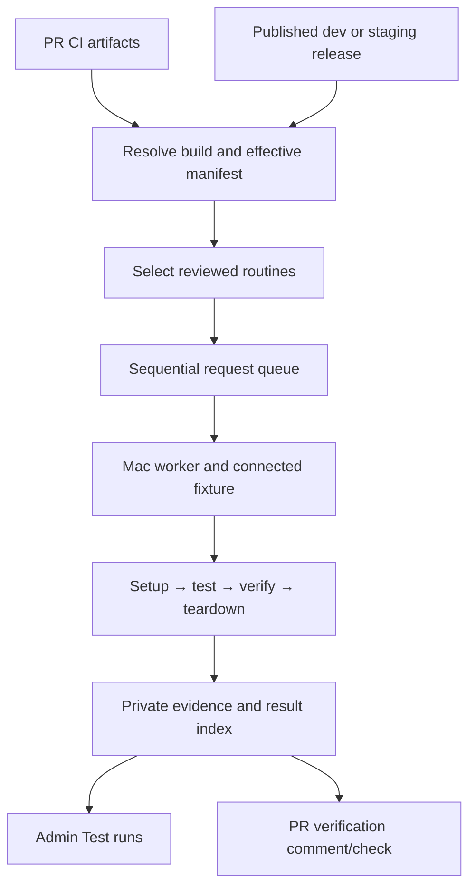

# CI routines and admin results

Select an immutable CI build, run applicable device routines and let reviewers
browse the result in the existing admin dashboard. Implement in MentraOS on the
current Mac first; moving orchestration and routines to a private repository is
deferred. Raw media, account data, fixture identities and firmware backups remain
private regardless of where runner source lives.

The initial PR request, local intake and admin viewer are implemented. They are
not an enabled nightly schedule, deployed service or passing device qualification.
See [lifecycle](2026-09-21-routine-lifecycle.md),
[orchestrator](2026-09-21-routine-orchestrator.md),
[Mac installation](2026-09-21-mac-test-host-installation.md) and the
[active implementation plan](../plans/2026-09-21-day1-ota-and-ci-routines.md).

## Existing foundations

The admin application already uses React, TanStack Query, a shared sidebar,
authenticated admin access and an Incident system. Incidents have Mongo metadata
and separate blob assets. Reuse that infrastructure with separate test records;
do not create customer incidents to store routine results. Existing incident
downloads read whole objects and are not a seekable MP4 delivery interface.

Coordinated release CI publishes app/OTA artifacts and release/publication
records. The inspected release producer publishes an IPA but no dedicated Mac
test ZIP. The PR Apple producer already publishes an IPA, Mac ZIP and versioned
receipt. Existing build notifications reconcile current-head artifacts; test
verification must be a separate result from build availability.

The harness already records English steps, screenshots, video and offline HTML.
Reuse its data and drivers rather than introduce another report or replay format.
The new [Mac CI importer](../../../tools/mentra-e2e/MAC-CI-SETUP.md) verifies an
explicitly selected PR artifact and supports opt-in installation with a pinned,
preinstalled launcher. Its implementation includes 20 focused unit tests; live
installation, launch, runtime identity and existing Bluetooth grant reuse passed
on the provisioned Mac. `e2e-setup-checks.yml` runs the guard tests on Ubuntu only,
without a hardware or nightly trigger. The importer does not yet resolve coordinated releases,
enforce final publication/OTA availability, certify permissions or acquire durable
fixture leases.

## Build selection interface

Separate producer, resolver and executor. Existing CI computes, builds and signs
the candidate and firmware selection. The resolver validates those published
outputs into one document without device mutation. The worker installs and tests
that selection; it does not rebuild it or choose firmware independently.

| Group | Resolved fields |
| --- | --- |
| Provenance | Repository, PR head/base/build SHA or release/channel/source SHA, producing runs and attempts. |
| Apps | Platform, artifact identity/URL, size/hash, package/bundle ID, build/version, signing/device compatibility and executable/JS identity where available. |
| Effective behavior | Backend/deployment, OTA pin, relevant feature flags and active engine/miniapp identity. |
| Firmware | Exact manifest bytes/hash, ASG/BES/MTK artifact identities and permitted legacy rescue chain. |
| Coverage | Routine IDs/versions, harness revision, lanes and selection reasons. |
| Execution | Fixture requirements, private credential references, time/stream budgets and request identity. |

The app's effective manifest defines both test targets and the normal return
profile. An individual routine may use a different setup baseline. Verify running
configuration as well as producer metadata: a saved override can change the
effective manifest. Reject mismatched hashes, unsupported signing/provisioning,
cross-release mixtures and missing required artifacts before device writes.

For PRs, retain the head, base and exact tested build/merge revision; a synthetic
merge build is not a head-only build. Reconcile compatible app and OTA producer
receipts by source/build identity, not by coincidental run time. Add a common
selection record where a producer lacks one. Resolve artifact URLs from receipts;
Slack download posts are human entry points, not a machine interface.

For releases, require a successful, non-dry-run published result and compatible
required artifacts. Retain immutable release metadata/digests beyond Actions
artifact expiration. Add a coordinated Mac companion ZIP/receipt from the same
archive where compatible. Do not assume an App Store IPA can run on the Mac;
record any separate export/re-signing, preserve executable/JS and OTA policy,
and verify derived identity.

A future local resolver may invoke the same build/OTA selection logic as CI and
emit this interface with local provenance. It is outside the initial scope.

## Nightly and PR requests

Use a repository CI schedule feeding the same request interface as manual PR
triggers. Proposed nightly time is 03:00 America/Los_Angeles; define UTC/DST
handling before activation. Create independent dev and staging requests.

At cutoff, choose each channel's newest eligible completed coordinated release.
Display its source age and any newer failed/in-progress release. Testing an older
valid release must not imply coverage of current branch HEAD. Missing eligible
artifacts produce `no-artifact`, not a pass. Repeat nightlies even when app hashes
are unchanged, recording actual backend/deployment identity because the live
backend is not frozen by the app artifact.

Select PR coverage with a reviewed path-to-routine map plus author-requested
additions. Authors may add existing routine IDs and propose new definitions in
review; the initial interface does not allow removing required mapped coverage.
Unknown/high-impact changes retain a small baseline suite and are flagged for
manual selection. Record selection reasons and explicitly list unsupported,
human-required or not-run coverage.

Start with qualified automatic routines. Admit day-one OTA only after setup,
customer update and teardown all pass qualification. Call remains separate from
OTA; a missing person cannot turn an audibility check into a pass. Deduplicate
requests by trigger generation, build selection and suite revision. Superseded
queued PR requests may be discarded; active firmware operations must settle safely.

Post one bot-owned **test verification** comment per PR, separate from the build
download comment. Include tested head/base/build identity, producer link, selected
coverage, queue/run state, test result, teardown/readiness, incomplete assertions
and an authenticated report link. Add an aggregate check when available; begin
advisory and make only reliable qualified subsets required later.

Before each publication, re-read current PR identity. Late results remain attached
to their historical attempt and cannot overwrite the current head's verification.
Serialize updates using a stable bot marker and request generation. Publish only
allowlisted summaries; no raw logs, meeting URLs, accounts or media in GitHub.

## Minimal execution service

The first implementation uses immutable GitHub Actions request artifacts as its
queue, an explicitly invoked local worker, and Mongo `test_runs` records for
results. It does not add a second backend request queue. Large media/logs live in
private object storage, with declarations and verified upload receipts in the run.

`request-e2e-routine.yml` accepts an explicit `day1-ota` request for a current PR.
After this workflow reaches `dev`, operators can use `workflow_dispatch` there.
Before merge, a same-repository PR with the `routine:day1-ota` label can publish
a request. This bootstrap does not grant the PR permission to control the Mac:
the host separately allowlists the exact reviewed head, base, merge checkout and
workflow revision. The request job has read-only repository permissions and no
hardware credentials. The host executes its reviewed local registry, never
commands or scripts supplied by request JSON.

The request resolver selects the current head's successful Mac producer, verifies
its receipt, and pins the archive and OTA manifest. Missing or incomplete
publication emits `no-artifact`, with no installation. A ready selection remains
`blocked-unqualified` at intake until the local day-one hardware adapter is
qualified and connected. Neither state passes a device test. A later workflow
attempt creates a new immutable request generation rather than editing history.

The worker verifies the authenticated Actions run, artifact digest, current PR
identity/label and source commit parents against its private trust policy. It
durably claims the request before dispatch and takes an exclusive worker lease.
An interrupted claim cannot be dispatched again automatically. Publishing a
terminal result or retrying its missing asset uploads is separate from execution.

Lease one compatible request at a time with heartbeat/checkpoints. An expired
lease during firmware mutation requires reconciliation, not dispatch to a second
worker. Persist unavailable fixture state across crashes. Finish active work;
service interactive PR jobs between nightly jobs while reserving nightly capacity.
Use configured storage, duration and stream-attempt limits.

The Mac executes trusted runner revisions, not arbitrary PR orchestration code.
Candidate apps are test inputs. Require trusted eligibility before executing
untrusted/fork artifacts on the physical host. Keep GitHub publication credentials
in the controller; grant workers only claim/report/upload capabilities. Do not run
unreviewed PR code through secret-bearing `pull_request_target` jobs.

Upload evidence idempotently and verify required sizes/hashes before finalization.
Keep local evidence until acknowledgement. Retry a failed upload without rerunning
hardware actions. Verified fixture readiness and incomplete remote evidence are
separate outcomes.

## Admin Test runs page

Add a Test runs navigation item using existing authentication and shell components,
with a separate page module. Filter by date, channel, PR/release, routine, platform,
outcome and fixture alias. Show latest dev/staging nightly status and selected-build
age. Do not switch the console backend implicitly when changing a channel filter.

Each run displays build/manifest provenance, setup/test/verification/teardown
outcomes, English chapter navigation, video, screenshots, expected/actual firmware
and active ASG hash, failure details, human assistance and restoration state.
Open a failed run at its failed step. Preserve authenticated deep links such as
`/?testRun=<id>&step=<step-id>` through login.

Use a trusted viewer over the existing report data. Retain `index.html` for offline
review, but do not execute uploaded HTML/JavaScript under the admin session's
origin. Private run-scoped media endpoints must support streaming, HEAD and HTTP
Range/206 for video seeking; do not buffer an entire MP4 through the current
whole-object incident endpoint. Authorize asset IDs rather than arbitrary paths.

Implemented APIs are admin list/detail/media routes under `/api/admin/test-runs`
and narrowly authenticated result/asset ingestion under `/api/internal/test-runs`.
The worker credential is `TEST_RUN_INGEST_TOKEN`; it grants ingestion, not admin
browsing. Terminal metadata is immutable and idempotent; individual asset uploads
verify declared size and SHA-256. Each asset is capped at 128 MiB, so longer video
must be segmented. HTML and SVG are not accepted as media. Rerun/cancel/recovery
controls require later audited server-side requests.

A central result index visible from the production admin console is recommended
so failed dev/staging backends do not hide evidence. Channel and backend remain
explicit data. Proposed retention is 14 days for passing media and 90 for failures,
with manual retention; confirm cost/privacy policy before enabling deletion.
Never expire unfinished-run or recovery-critical assets.

## Delivery and acceptance

1. Qualify local day-one setup, recorded update and recovery using the existing Mac.
2. Implement common build selection and PR/release resolvers; provide coordinated
   Mac artifacts and prove real artifact/configuration consistency.
3. Add one sequential worker, durable requests and private evidence upload.
4. Add authenticated admin browsing with working playback and chapter seeking.
5. Enable dev/staging nightlies, then advisory PR selection and verification.

Acceptance covers real PR and coordinated selections, missing/wrong assets rejected
before mutation, late PR results unable to overwrite current status, upload-only
retry, authenticated media seeking and restoration failure preventing fixture
reuse. Proposed schedules, retention and required-check policy are not activated
by committing this spec.

## Source pointers

- `cloud-v2/websites/admin/src/App.tsx`, `components/app-shell.tsx`
- `cloud-v2/packages/core/src/api/admin/reports.api.ts`
- `cloud-v2/packages/core/src/api/middleware/admin-auth.middleware.ts`
- `cloud-v2/packages/core/src/services/report.service.ts`, `storage/storage.service.ts`
- `.github/workflows/coordinated-release.yml`, `reusable-coordinated-mobile.yml`
- `.github/scripts/assemble-coordinated-release-results.mjs`, `coordinated-mobile-records.mjs`
- `.github/workflows/mentra-app-ios-build.yml`, `mentra-app-android-build.yml`
- `.github/scripts/notify-pr-builds.mjs`
- `tools/mentra-e2e/runner/report.ts`, `tools/mentra-e2e/view.ts`
